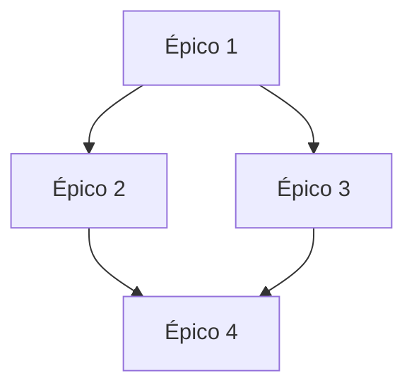
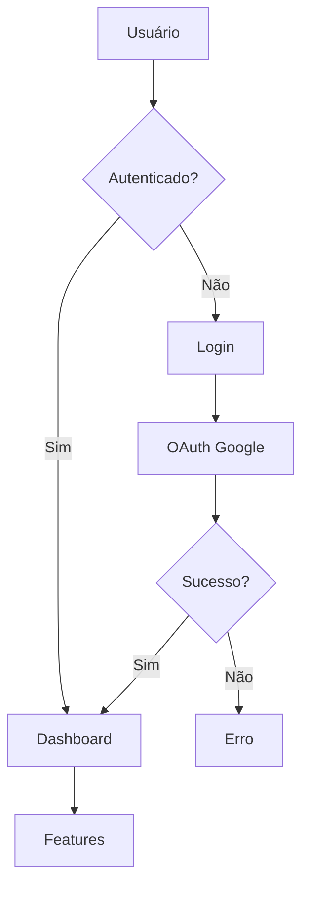
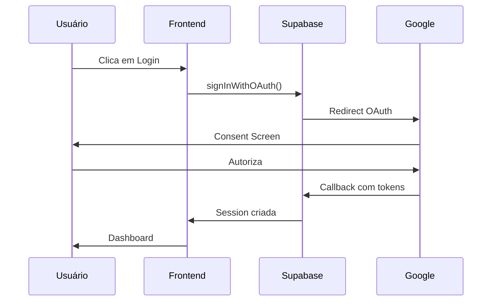
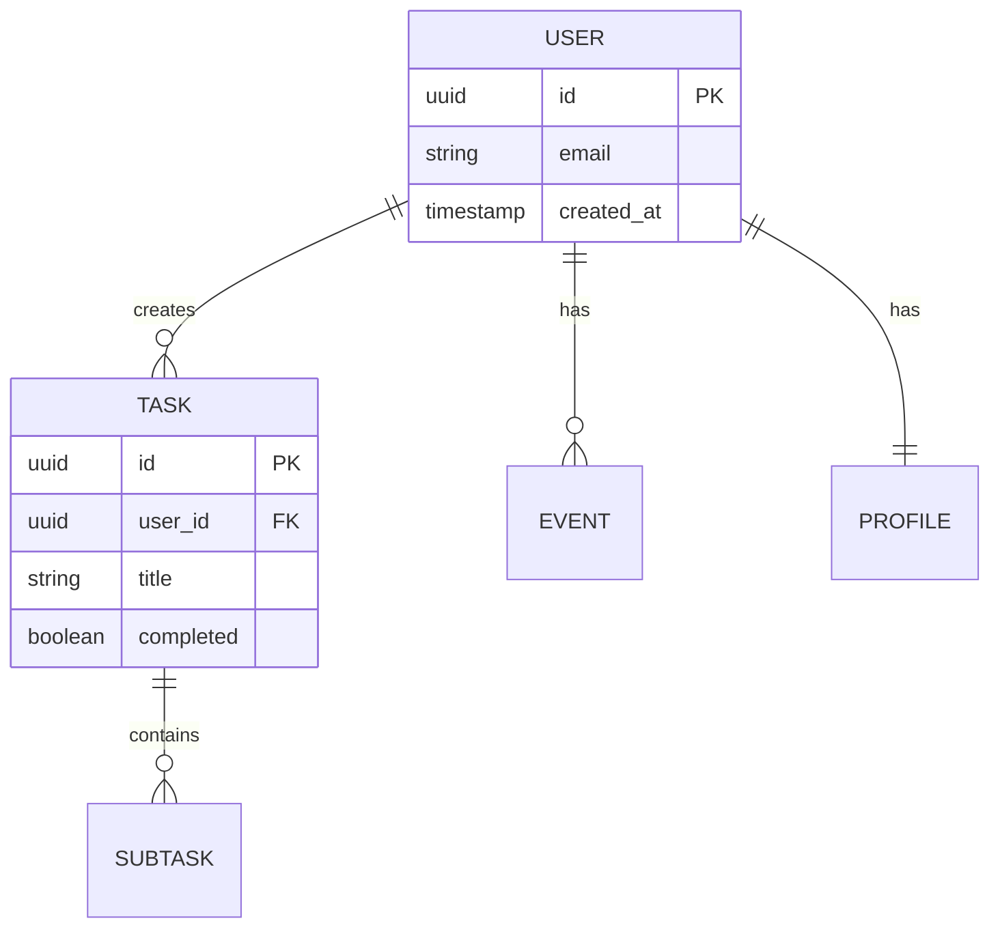

# Documentation Standards Skill

Skill para padronização de documentação de projetos, incluindo estrutura de épicos, issues, READMEs, changelogs e diagramas.

---

## Quando Usar Esta Skill

Use quando precisar:
- Criar documentação estruturada
- Escrever épicos e issues
- Manter READMEs atualizados
- Criar changelogs e release notes
- Documentar arquitetura com diagramas

---

## Estrutura de Épicos

### Template de Épico

```markdown
# ÉPICO: [Nome do Épico]

## Informações Gerais

| Campo | Valor |
|-------|-------|
| **Prioridade** | 🔴 Alta / 🟡 Média / 🟢 Baixa |
| **Esforço Estimado** | X horas/dias |
| **Responsável** | @username |
| **Status** | ⬜ Não iniciado / 🔄 Em progresso / ✅ Concluído |
| **Dependências** | Épico X, Épico Y |

## Descrição do Problema

[Descrever o problema ou necessidade que este épico resolve.
Incluir contexto, impacto e motivação.]

## Objetivos

- [ ] Objetivo 1
- [ ] Objetivo 2
- [ ] Objetivo 3

## Critérios de Aceitação

- [ ] Critério 1: [descrição específica e mensurável]
- [ ] Critério 2: [descrição específica e mensurável]
- [ ] Critério 3: [descrição específica e mensurável]

## Tarefas

### Fase 1: [Nome da Fase]
- [ ] Tarefa 1.1
- [ ] Tarefa 1.2

### Fase 2: [Nome da Fase]
- [ ] Tarefa 2.1
- [ ] Tarefa 2.2

## Arquivos Relacionados

| Arquivo | Ação |
|---------|------|
| `path/to/file.ts` | Modificar |
| `path/to/new-file.ts` | Criar |

## Métricas de Sucesso

- Métrica 1: [valor esperado]
- Métrica 2: [valor esperado]

## Riscos e Mitigações

| Risco | Probabilidade | Impacto | Mitigação |
|-------|---------------|---------|-----------|
| Risco 1 | Alta | Alto | Estratégia |

## Timeline

```
Semana 1: Fase 1
Semana 2: Fase 2
```

## Notas Adicionais

[Informações extras, links úteis, decisões de design, etc.]
```

### Diagrama de Dependências

```markdown
## Formato ASCII

```
┌──────────┐     ┌──────────┐
│ Épico 1  │────▶│ Épico 3  │
└──────────┘     └────┬─────┘
      │               │
      ▼               ▼
┌──────────┐     ┌──────────┐
│ Épico 2  │────▶│ Épico 4  │
└──────────┘     └──────────┘
```

## Formato Mermaid


```

---

## Estrutura de Issues

### Bug Report Template

```markdown
---
name: Bug Report
about: Reportar um bug ou comportamento inesperado
title: '[BUG] '
labels: bug
assignees: ''
---

## Descrição do Bug

[Descrição clara e concisa do bug]

## Passos para Reproduzir

1. Vá para '...'
2. Clique em '...'
3. Role até '...'
4. Veja o erro

## Comportamento Esperado

[O que deveria acontecer]

## Comportamento Atual

[O que está acontecendo]

## Screenshots

[Se aplicável, adicione screenshots]

## Ambiente

- OS: [ex: macOS 14.0]
- Browser: [ex: Chrome 120]
- Versão: [ex: 1.2.3]

## Contexto Adicional

[Qualquer informação adicional]

## Logs

```
[Cole logs relevantes aqui]
```
```

### Feature Request Template

```markdown
---
name: Feature Request
about: Sugerir nova funcionalidade
title: '[FEATURE] '
labels: enhancement
assignees: ''
---

## Problema

[Descreva o problema que esta feature resolve]

## Solução Proposta

[Descreva a solução que você gostaria]

## Alternativas Consideradas

[Outras soluções que você considerou]

## Contexto Adicional

[Informações adicionais, mockups, etc.]

## Critérios de Aceitação

- [ ] Critério 1
- [ ] Critério 2
```

### Documentation Template

```markdown
---
name: Documentation
about: Melhorias ou correções na documentação
title: '[DOCS] '
labels: documentation
assignees: ''
---

## Tipo de Mudança

- [ ] Nova documentação
- [ ] Atualização de documentação existente
- [ ] Correção de erro
- [ ] Melhoria de clareza

## Descrição

[O que precisa ser documentado/corrigido]

## Localização

[Arquivo(s) ou seção(ões) afetada(s)]

## Conteúdo Sugerido

[Rascunho do conteúdo ou mudanças sugeridas]
```

---

## Padrões de README

### Template de README Principal

```markdown
# Nome do Projeto

[](build-url)
[](license-url)

> Descrição curta e impactante do projeto (1-2 linhas)

## 🚀 Features

- ✅ Feature 1
- ✅ Feature 2
- ✅ Feature 3

## 📋 Pré-requisitos

- Node.js 20+
- npm ou yarn
- [Outras dependências]

## 🔧 Instalação

```bash
# Clone o repositório
git clone https://github.com/user/repo.git

# Entre no diretório
cd repo

# Instale dependências
npm install

# Configure variáveis de ambiente
cp .env.example .env
```

## ⚙️ Configuração

### Variáveis de Ambiente

| Variável | Descrição | Obrigatório |
|----------|-----------|-------------|
| `VAR_1` | Descrição | Sim |
| `VAR_2` | Descrição | Não |

## 🎮 Uso

```bash
# Desenvolvimento
npm run dev

# Build
npm run build

# Testes
npm run test
```

## 📁 Estrutura do Projeto

```
src/
├── components/    # Componentes reutilizáveis
├── pages/         # Páginas da aplicação
├── services/      # Serviços e APIs
└── utils/         # Utilitários
```

## 🧪 Testes

```bash
npm run test        # Unit tests
npm run test:e2e    # E2E tests
```

## 🚀 Deploy

[Instruções de deploy]

## 📖 Documentação

- [Guia de Contribuição](CONTRIBUTING.md)
- [Changelog](CHANGELOG.md)
- [Docs completas](docs/)

## 🤝 Contribuindo

1. Fork o projeto
2. Crie sua branch (`git checkout -b feature/AmazingFeature`)
3. Commit suas mudanças (`git commit -m 'Add AmazingFeature'`)
4. Push para a branch (`git push origin feature/AmazingFeature`)
5. Abra um Pull Request

## 📄 Licença

Este projeto está sob a licença [MIT](LICENSE).

## 📞 Contato

- Email: [email]
- Website: [url]
```

### README de Módulo/Componente

```markdown
# Nome do Módulo

## Visão Geral

[Descrição do propósito do módulo]

## Instalação

```bash
npm install @projeto/modulo
```

## API

### `funcaoPrincipal(params)`

Descrição da função.

**Parâmetros:**
| Nome | Tipo | Descrição |
|------|------|-----------|
| `param1` | `string` | Descrição |
| `param2` | `number` | Descrição |

**Retorno:** `Promise<Result>`

**Exemplo:**
```typescript
const result = await funcaoPrincipal('value', 123);
```

## Exemplos

### Exemplo Básico

```typescript
// Código de exemplo
```

### Exemplo Avançado

```typescript
// Código de exemplo avançado
```

## Configuração

[Opções de configuração]

## Troubleshooting

### Problema Comum 1

**Sintoma:** [descrição]
**Solução:** [descrição]
```

---

## Changelog e Versionamento

### Formato de CHANGELOG

```markdown
# Changelog

Todas as mudanças notáveis serão documentadas neste arquivo.

O formato é baseado em [Keep a Changelog](https://keepachangelog.com/pt-BR/1.0.0/),
e este projeto adere ao [Semantic Versioning](https://semver.org/lang/pt-BR/).

## [Unreleased]

### Added
- Nova feature X

### Changed
- Mudança em Y

### Deprecated
- Feature Z será removida

### Removed
- Removido suporte a W

### Fixed
- Correção de bug Q

### Security
- Vulnerabilidade P corrigida

## [1.2.0] - 2026-01-15

### Added
- Feature A (#123)
- Feature B (#124)

### Fixed
- Bug C (#125)

## [1.1.0] - 2026-01-01

### Added
- Feature inicial

[Unreleased]: https://github.com/user/repo/compare/v1.2.0...HEAD
[1.2.0]: https://github.com/user/repo/compare/v1.1.0...v1.2.0
[1.1.0]: https://github.com/user/repo/releases/tag/v1.1.0
```

### Semantic Versioning

```markdown
## MAJOR.MINOR.PATCH

### MAJOR (1.0.0 → 2.0.0)
- Breaking changes
- Mudanças incompatíveis com versões anteriores
- Remoção de features depreciadas

### MINOR (1.0.0 → 1.1.0)
- Novas features
- Mudanças compatíveis com versões anteriores
- Depreciation warnings

### PATCH (1.0.0 → 1.0.1)
- Bug fixes
- Correções de segurança
- Melhorias de performance

### Pre-release
- 1.0.0-alpha.1
- 1.0.0-beta.1
- 1.0.0-rc.1
```

### Commit Messages

```markdown
## Conventional Commits

### Formato
```
<type>(<scope>): <description>

[optional body]

[optional footer(s)]
```

### Types
- `feat`: Nova feature
- `fix`: Bug fix
- `docs`: Documentação
- `style`: Formatação
- `refactor`: Refatoração
- `perf`: Performance
- `test`: Testes
- `chore`: Manutenção
- `ci`: CI/CD

### Exemplos
```bash
feat(auth): add Google OAuth integration
fix(calendar): resolve sync timeout issue
docs(readme): update installation instructions
refactor(api): simplify error handling
```

### Breaking Changes
```bash
feat(api)!: change response format

BREAKING CHANGE: Response now returns array instead of object
```
```

---

## Diagramas e Visualizações

### Diagrama de Arquitetura (ASCII)

```
┌─────────────────────────────────────────────────────────────┐
│                        FRONTEND                              │
│  ┌──────────┐  ┌──────────┐  ┌──────────┐  ┌──────────┐    │
│  │  React   │  │ TailwindCSS│  │  Vite   │  │  Router  │    │
│  └────┬─────┘  └──────────┘  └──────────┘  └──────────┘    │
│       │                                                      │
│  ┌────▼─────────────────────────────────────────────────┐   │
│  │                    Services Layer                     │   │
│  └────┬─────────┬─────────┬─────────┬──────────────────┘   │
└───────│─────────│─────────│─────────│────────────────────────┘
        │         │         │         │
        ▼         ▼         ▼         ▼
   ┌─────────┐ ┌─────────┐ ┌─────────┐ ┌─────────┐
   │Supabase │ │ Gemini  │ │   n8n   │ │ Google  │
   │   DB    │ │   AI    │ │Webhooks │ │  APIs   │
   └─────────┘ └─────────┘ └─────────┘ └─────────┘
```

### Diagrama de Fluxo (Mermaid)

```markdown

```

### Diagrama de Sequência

```markdown

```

### Diagrama ER

```markdown

```

---

## Checklist de Documentação

```markdown
## Novo Projeto

- [ ] README.md principal
- [ ] CONTRIBUTING.md
- [ ] CHANGELOG.md
- [ ] LICENSE
- [ ] .env.example
- [ ] docs/ estrutura básica

## Nova Feature

- [ ] README do módulo (se aplicável)
- [ ] Docstrings/JSDoc no código
- [ ] Exemplos de uso
- [ ] Atualizar CHANGELOG

## Novo Release

- [ ] CHANGELOG atualizado
- [ ] Versão no package.json
- [ ] Tag de versão no Git
- [ ] Release notes no GitHub
```

---

## Ferramentas Recomendadas

### Geração de Docs
- **TypeDoc**: Documentação de TypeScript
- **Storybook**: Documentação de componentes
- **Docusaurus**: Sites de documentação

### Diagramas
- **Mermaid**: Diagramas em markdown
- **Draw.io**: Diagramas visuais
- **Excalidraw**: Diagramas hand-drawn

### Linting
- **markdownlint**: Lint de markdown
- **alex**: Linguagem inclusiva
- **write-good**: Sugestões de escrita
