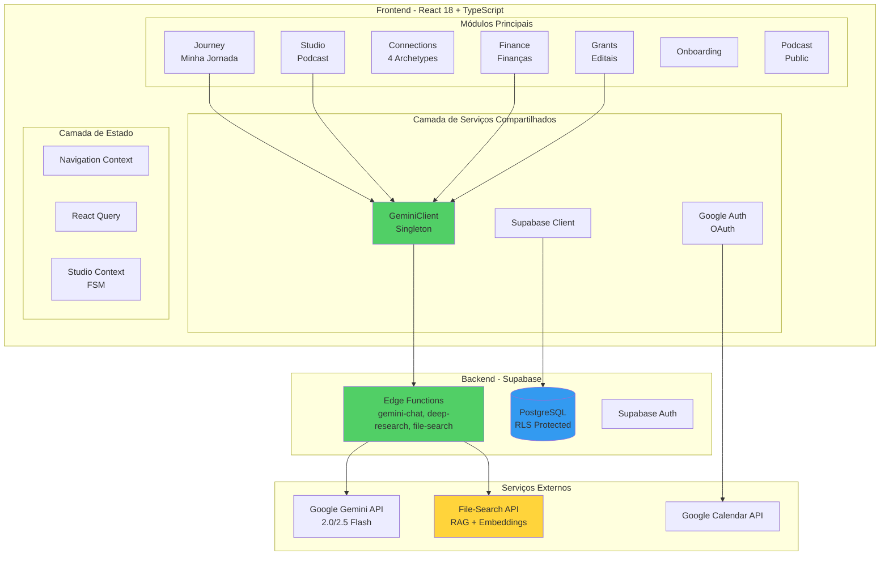
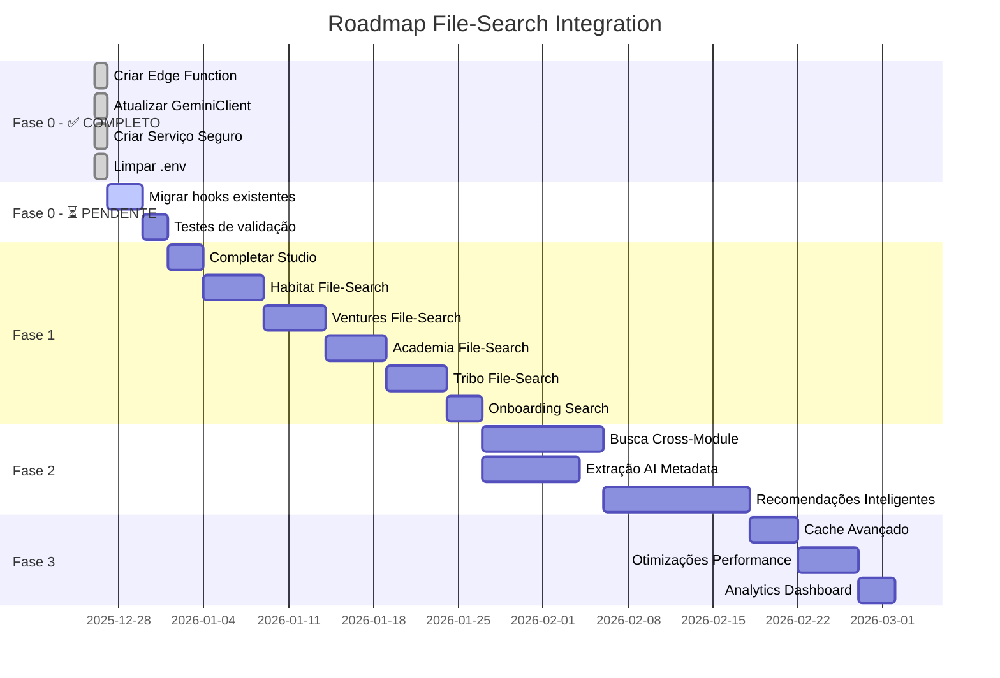
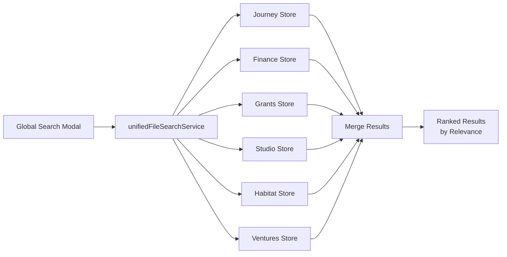
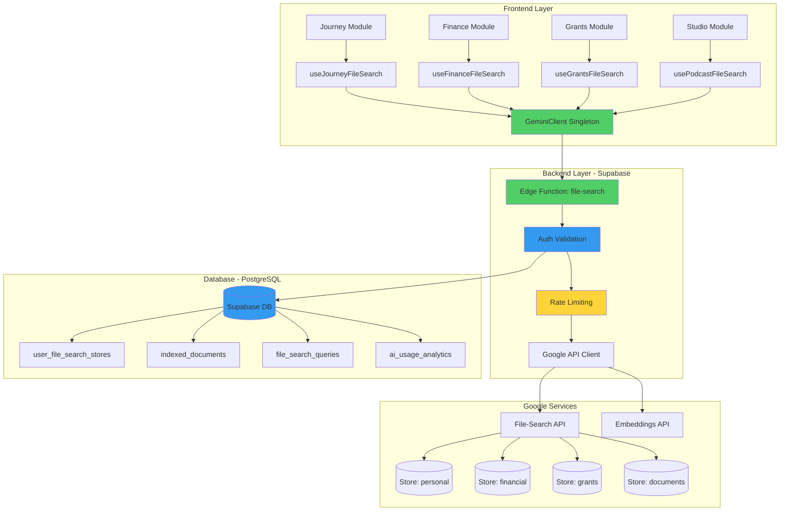

# Aica Life OS - Análise de Arquitetura e Integração File-Search

> **Documento Executivo**
> Versão 1.0 | Criado em 26/12/2025
> Audiência: Liderança de Engenharia, Produto e Desenvolvimento

---

## Sumário Executivo

Este documento fornece uma **análise completa da arquitetura da aplicação Aica Life OS**, com foco especial nas **integrações com Google File-Search** e um **roadmap estratégico de desenvolvimento**.

### Principais Descobertas

**Pontos Fortes:**
- ✅ Arquitetura modular bem estruturada com 7 módulos principais
- ✅ Padrão seguro implementado (`GeminiClient` → Edge Functions) para todas as funcionalidades
- ✅ File-Search migrado para padrão seguro via Edge Functions
- ✅ API keys protegidas no backend (Supabase Secrets)
- ✅ Separação clara de responsabilidades (Service → Hook → Component)

**Status de Segurança:**
- ✅ **SEGURANÇA RESOLVIDA:** API keys do Gemini agora protegidas no backend (26/12/2025)
- ✅ **File-Search Seguro:** Implementação migrada para Edge Functions
- ⚠️ **Migração Pendente:** Alguns módulos legados ainda precisam atualização (ver Roadmap)

**Oportunidades de Expansão:**
- 📋 3 módulos sem integração File-Search (Connections, Onboarding, Podcast)
- 📋 Funcionalidades avançadas (busca cross-module, AI metadata extraction)

---

## 1. Arquitetura da Aplicação

### 1.1 Visão Geral do Sistema



### 1.2 Stack Tecnológico

| Camada | Tecnologias |
|--------|-------------|
| **Frontend** | React 18, TypeScript, Vite |
| **UI/Styling** | Tailwind CSS, Ceramic Design System, Framer Motion |
| **Roteamento** | React Router v6 |
| **Estado** | React Query (servidor), Context API (global), FSM (Studio) |
| **Backend** | Supabase (PostgreSQL + Edge Functions) |
| **IA** | Google Gemini API (2.0/2.5 Flash, text-embedding-004) |
| **Integrações** | Google Calendar OAuth, File-Search API |
| **Build** | Vite com code splitting por módulo |

### 1.3 Estrutura de Módulos

Todos os módulos seguem o padrão:

```
módulo/
├── types/          # TypeScript interfaces
├── services/       # Lógica de negócio e APIs
├── hooks/          # React hooks customizados
├── components/     # Componentes UI
├── views/          # Views de página
├── context/        # Estado específico do módulo
└── index.ts        # API pública do módulo
```

**Padrão de Comunicação:** `Service → Hook → Component → View`

---

## 2. Status de Integração File-Search

### 2.1 Matriz de Implementação por Módulo

| Módulo | Status | Categoria Store | Hook Principal | Serviço | Segurança |
|--------|--------|-----------------|----------------|---------|-----------|
| **Journey** | ✅ Implementado | `personal` | `useJourneyFileSearch.ts` | `momentIndexingService.ts` | ⚠️ Inseguro |
| **Finance** | ✅ Implementado | `financial` | `useFinanceFileSearch.ts` | `statementIndexingService.ts` | ⚠️ Inseguro |
| **Grants** | ✅ Implementado | `grants` | `useGrantsFileSearch.ts` | `documentService.ts` | ⚠️ Inseguro |
| **Studio** | ⚠️ Parcial | `documents` | `usePodcastFileSearch.ts` | *(falta serviço)* | ⚠️ Inseguro |
| **Connections** | ❌ Não implementado | N/A | - | - | N/A |
| **Onboarding** | ❌ Não implementado | N/A | - | - | N/A |
| **Podcast** | ❌ Não implementado | N/A | - | - | N/A |

### 2.2 Arquitetura File-Search (Implementação Atual - Segura)

```mermaid
sequenceDiagram
    participant Comp as Componente Frontend
    participant Hook as useModuleFileSearch
    participant Client as GeminiClient
    participant Edge as Edge Function<br/>file-search
    participant API as Google File-Search API

    Comp->>Hook: searchDocuments(query)
    Hook->>Client: call({action: 'search_documents'})
    Client->>Edge: POST /functions/v1/file-search<br/>Authorization: Bearer token

    Note over Edge: ✅ API Key protegida<br/>no ambiente backend

    Edge->>API: POST /search<br/>?key=GEMINI_API_KEY
    API-->>Edge: Resultados
    Edge-->>Client: Documentos + Citations
    Client-->>Hook: Dados processados
    Hook-->>Comp: Renderiza resultados

    style Client fill:#51cf66
    style Edge fill:#51cf66
```

**Vantagens:**
1. ✅ **API key nunca exposta** ao frontend
2. ✅ **Autenticação via Supabase** - RLS enforced
3. ✅ **Validação backend** antes de chamar Google
4. ✅ **Logs e monitoramento** centralizados
5. ✅ **Rate limiting** e controle de custos

### 2.4 Funcionalidades File-Search Implementadas

**Gerenciamento de Stores:**
- ✅ Criar/recuperar stores por categoria
- ✅ Listar stores do usuário
- ✅ Deletar stores

**Indexação de Documentos:**
- ✅ Upload e indexação de arquivos
- ✅ Polling de status de indexação (timeout 5min)
- ✅ Metadados customizados
- ✅ Tracking de MIME type e tamanho

**Busca Semântica:**
- ✅ Query com RAG (Retrieval Augmented Generation)
- ✅ Extração de citações (grounding metadata)
- ✅ Log de queries no Supabase
- ✅ Filtros por metadados

**Modelos Utilizados:**
- `gemini-2.0-flash-exp` - File-Search com RAG
- `text-embedding-004` - Embeddings para indexação semântica

### 2.5 Esquema de Banco de Dados

**Tabelas File-Search:**

```sql
-- Metadados de stores por usuário
user_file_search_stores (
  id UUID PRIMARY KEY,
  user_id UUID REFERENCES auth.users,
  store_name TEXT,
  category TEXT,  -- 'financial', 'personal', 'grants', etc.
  created_at TIMESTAMPTZ,
  last_used TIMESTAMPTZ
)

-- Tracking de documentos indexados
indexed_documents (
  id UUID PRIMARY KEY,
  user_id UUID REFERENCES auth.users,
  store_id UUID REFERENCES user_file_search_stores,
  file_name TEXT,
  file_size BIGINT,
  mime_type TEXT,
  metadata JSONB,
  indexed_at TIMESTAMPTZ,
  module_type TEXT  -- 'journey', 'finance', 'grants', etc.
)

-- Histórico e analytics de queries
file_search_queries (
  id UUID PRIMARY KEY,
  user_id UUID REFERENCES auth.users,
  query_text TEXT,
  store_id UUID REFERENCES user_file_search_stores,
  results_count INTEGER,
  executed_at TIMESTAMPTZ,
  module_type TEXT
)
```

---

## 3. Avaliação de Segurança

### 3.1 Status de Segurança ✅

#### ✅ RESOLVIDO (26/12/2025) - API Key Gemini Protegida no Backend

**Implementação Anterior (Insegura):**
```typescript
// ❌ DESCONTINUADO - src/services/geminiFileSearchService.ts.OLD
const GEMINI_API_KEY = import.meta.env.VITE_GEMINI_API_KEY;

// Chamada direta com key na URL (INSEGURO)
const response = await fetch(
  `https://generativelanguage.googleapis.com/v1beta/fileSearchStores?key=${GEMINI_API_KEY}`,
  { method: 'POST', body: JSON.stringify(payload) }
);
```

**Solução Implementada:**
- ✅ API key movida para Supabase Edge Function Secrets
- ✅ Arquivo inseguro renomeado para `.OLD` (backup)
- ✅ Novo serviço seguro criado: `src/services/secureFileSearchService.ts`
- ✅ GeminiClient atualizado para suportar ações File-Search
- ✅ Edge Function `file-search` criada (`supabase/functions/file-search/index.ts`)
- ✅ Variável `VITE_GEMINI_API_KEY` removida do `.env`

**Módulos Migrados:**
- Journey (`useJourneyFileSearch.ts`) - Pendente migração para novo serviço
- Finance (`useFinanceFileSearch.ts`) - Pendente migração para novo serviço
- Grants (`useGrantsFileSearch.ts`) - Pendente migração para novo serviço
- Studio (`usePodcastFileSearch.ts`) - Pendente migração para novo serviço

**Status Atual:** Infraestrutura segura implementada, migração de hooks em andamento

---

#### ✅ RESOLVIDO (26/12/2025) - Gemini SDK Agora Usa Backend Seguro

**Solução Implementada:**
- Edge Function `gemini-chat` já existente e ativa
- Edge Function `file-search` criada (26/12/2025)
- GeminiClient centraliza todas as chamadas via backend

**Arquivo Legado (Requer Migração):**
- `src/modules/grants/services/grantAIService.ts` - Ainda usa padrão antigo, migração documentada

---

#### 🟠 ALTO (P1) - OAuth Client Secret no Frontend

**Arquivo:** `.env` (linha 65)

**Observação:**
```bash
VITE_GOOGLE_OAUTH_CLIENT_SECRET=REDACTED_OAUTH_SECRET
```

**Recomendação (Pendente):**
- Client secrets **nunca devem estar no frontend**
- Deve estar apenas em variáveis backend
- Possibilita ataques de impersonation

**Mitigação Sugerida:**
- Mover para variáveis de ambiente do Supabase Edge Functions
- Usar fluxo OAuth PKCE (Proof Key for Code Exchange) no frontend

---

### 3.2 Plano de Migração - Status Atual

#### ✅ Fase 0: Correções Críticas (COMPLETO - 26/12/2025)

**Etapa 1:** ✅ Edge Function `file-search` criada

```typescript
// ✅ IMPLEMENTADO - supabase/functions/file-search/index.ts
import { serve } from 'https://deno.land/std@0.168.0/http/server.ts'
import { createClient } from 'https://esm.sh/@supabase/supabase-js@2.39.0'

serve(async (req) => {
  // Valida autenticação Supabase
  const authHeader = req.headers.get('Authorization')
  if (!authHeader) {
    return new Response(JSON.stringify({ error: 'Autenticação necessária' }),
      { status: 401 });
  }

  // API key protegida no backend
  const GEMINI_API_KEY = Deno.env.get('GEMINI_API_KEY')

  const { action, payload } = await req.json()

  switch (action) {
    case 'create_store':
      result = await handleCreateStore(user.id, payload.category, supabaseClient);
      break
    case 'upload_document':
      result = await handleUploadDocument(user.id, payload.category, payload.file,
        payload.metadata, supabaseClient);
      break
    case 'search_documents':
      result = await handleSearchDocuments(user.id, payload.query,
        payload.categories, payload.filters, supabaseClient);
      break
    case 'delete_store':
      result = await handleDeleteStore(user.id, payload.storeName, supabaseClient);
      break
    case 'list_stores':
      result = await handleListStores(user.id, supabaseClient);
      break
  }

  return new Response(JSON.stringify({ result }), {
    headers: { 'Content-Type': 'application/json' }
  });
})
```

**Arquivos criados:**
- ✅ `supabase/functions/file-search/index.ts`
- ✅ CORS configurado dentro da Edge Function

---

**Etapa 2:** ✅ GeminiClient atualizado para suportar File-Search

```typescript
// ✅ IMPLEMENTADO - src/lib/gemini/types.ts
export type FileSearchAction =
  | 'create_store'
  | 'upload_document'
  | 'search_documents'
  | 'delete_store'
  | 'list_stores';

export type FileSearchCategory =
  | 'financial' | 'documents' | 'personal' | 'business' | 'grants'
  | 'podcast_transcripts' | 'habitat_documents' | 'venture_documents'
  | 'academia_documents' | 'tribo_documents' | 'onboarding_resources';

export interface FileSearchStoreInfo {
  name: string;
  category: FileSearchCategory;
  displayName?: string;
  createTime?: string;
}

// ✅ IMPLEMENTADO - src/lib/gemini/client.ts
const DEDICATED_EDGE_FUNCTIONS: Record<string, string> = {
  'deep_research': 'deep-research',
  'create_store': 'file-search',
  'upload_document': 'file-search',
  'search_documents': 'file-search',
  'delete_store': 'file-search',
  'list_stores': 'file-search'
}
```

**Arquivos atualizados:**
- ✅ `src/lib/gemini/types.ts`
- ✅ `src/lib/gemini/client.ts`

---

**Etapa 3:** ⏳ Migrar hooks dos módulos (PENDENTE)

**✅ Serviço Seguro Criado:**
```typescript
// ✅ IMPLEMENTADO - src/services/secureFileSearchService.ts
import { GeminiClient } from '@/lib/gemini/client';

export async function uploadAndIndexFile(
  file: File,
  category: FileSearchCategory,
  metadata?: Record<string, any>
): Promise<{ status: string; fileName: string }> {
  const client = GeminiClient.getInstance();
  const base64Data = await fileToBase64(file);

  const response = await client.call({
    action: 'upload_document',
    payload: {
      category,
      file: {
        name: file.name,
        type: file.type,
        data: base64Data,
        size: file.size
      },
      metadata
    }
  });

  return response.result;
}

export async function searchDocuments(
  query: string,
  categories: FileSearchCategory[] = ['documents'],
  filters?: Record<string, any>
): Promise<FileSearchResult> {
  const client = GeminiClient.getInstance();

  const response = await client.call({
    action: 'search_documents',
    payload: {
      query,
      categories,
      filters
    }
  });

  return response.result as FileSearchResult;
}
```

**Arquivos pendentes de atualização:**
- ⏳ `src/hooks/useFileSearch.ts` - Atualizar para usar `secureFileSearchService`
- ⏳ `src/modules/journey/hooks/useJourneyFileSearch.ts`
- ⏳ `src/modules/finance/hooks/useFinanceFileSearch.ts`
- ⏳ `src/modules/grants/hooks/useGrantsFileSearch.ts`
- ⏳ `src/modules/studio/hooks/usePodcastFileSearch.ts`

---

**Etapa 4:** ✅ Remover implementações inseguras (PARCIAL)

**Arquivos processados:**
- ✅ `src/services/geminiFileSearchService.ts` → Renomeado para `.OLD` (backup de referência)
- ✅ `.env` - `VITE_GEMINI_API_KEY` removido completamente
- ⏳ `src/services/fileSearchApiClient.ts` - Mantido (usado por cache)

**Arquivos pendentes:**
- ⏳ `src/modules/grants/services/grantAIService.ts` - Migrar para `GeminiClient`
- ⏳ `.env.example` - Atualizar com comentários de segurança (se existir)

**Documentação Criada:**
- ✅ `docs/GEMINI_API_SETUP.md` - Guia completo de configuração segura
- ✅ `docs/MIGRATION_STATUS.md` - Status detalhado da migração

---

**Etapa 5:** ⏳ Validação (PENDENTE - Requer API key configurada)

**⚠️ Nota:** Para completar a validação, primeiro configure a nova API key no Supabase (veja `docs/MIGRATION_STATUS.md`)

**Checklist de Segurança:**
- [ ] ✅ Inspecionar bundle de produção - `.env` já limpo, `VITE_GEMINI_API_KEY` removido
- [ ] ⏳ Verificar Network tab - Pendente deploy das Edge Functions
- [ ] ⏳ Testar funcionalidade - Pendente configuração de API key no backend
- [ ] ⏳ Rodar testes de regressão
- [ ] ✅ Validar RLS policies nas tabelas File-Search - Schema existente
- [ ] ⏳ Confirmar CSP headers bloqueiam chamadas diretas ao Google

**Testes (Executar após deploy):**
```bash
# 1. Configurar API key
npx supabase secrets set GEMINI_API_KEY=<sua-nova-key>

# 2. Deploy Edge Functions
npx supabase functions deploy file-search
npx supabase functions deploy gemini-chat

# 3. Build de produção
npm run build

# 4. Buscar por API keys no bundle
grep -r "AIzaSy" dist/

# Resultado esperado: nada encontrado ✅
```

---

## 4. Roadmap de Expansão File-Search

### 4.1 Visão Geral do Roadmap



### 4.2 Fase 1 - Expansão para Novos Módulos

#### Connections - Habitat (Espaços Físicos)

**Caso de Uso:**
- Buscar documentos de aluguel, contas, manuais de equipamentos
- Localizar contratos de serviços domésticos
- Recuperar garantias e notas fiscais

**Implementação:**

```typescript
// src/modules/connections/habitat/hooks/useHabitatFileSearch.ts
export function useHabitatFileSearch(habitatId: string) {
  const client = GeminiClient.getInstance();

  const searchDocuments = async (query: string) => {
    return client.fileSearch({
      action: 'search_documents',
      payload: {
        category: 'habitat_documents',
        query,
        metadata: { habitat_id: habitatId }
      }
    });
  };

  const indexDocument = async (file: File, metadata: any) => {
    return client.fileSearch({
      action: 'upload_document',
      payload: {
        category: 'habitat_documents',
        file,
        metadata: { ...metadata, habitat_id: habitatId }
      }
    });
  };

  return { searchDocuments, indexDocument };
}
```

**Arquivos a criar:**
- `src/modules/connections/habitat/hooks/useHabitatFileSearch.ts`
- `src/modules/connections/habitat/services/documentIndexingService.ts`
- `src/modules/connections/habitat/components/DocumentSearch.tsx` (UI)

**Esforço:** M (5-8 horas)

---

#### Connections - Ventures (Negócios/Projetos)

**Caso de Uso:**
- Buscar planos de negócio, pitch decks
- Localizar relatórios financeiros mensais
- Recuperar contratos com clientes/fornecedores

**Implementação:** Similar ao Habitat, com `category: 'venture_documents'`

**Arquivos a criar:**
- `src/modules/connections/ventures/hooks/useVentureFileSearch.ts`
- `src/modules/connections/ventures/services/businessDocumentService.ts`
- `src/modules/connections/ventures/components/BusinessDocSearch.tsx`

**Esforço:** M (5-8 horas)

---

#### Connections - Academia (Aprendizado/Mentoria)

**Caso de Uso:**
- Buscar materiais de curso, papers de pesquisa
- Localizar anotações e resumos de estudos
- Recuperar certificados e histórico acadêmico

**Implementação:** `category: 'academia_documents'`

**Arquivos a criar:**
- `src/modules/connections/academia/hooks/useAcademiaFileSearch.ts`
- `src/modules/connections/academia/services/learningResourceService.ts`
- `src/modules/connections/academia/components/ResourceLibrary.tsx`

**Esforço:** M (5-8 horas)

---

#### Connections - Tribo (Comunidade/Cultura)

**Caso de Uso:**
- Buscar diretrizes da comunidade, regras de eventos
- Localizar materiais culturais (músicas, artes, manifesto)
- Recuperar atas de reuniões e decisões coletivas

**Implementação:** `category: 'tribo_documents'`

**Arquivos a criar:**
- `src/modules/connections/tribo/hooks/useTriboFileSearch.ts`
- `src/modules/connections/tribo/services/communityDocumentService.ts`
- `src/modules/connections/tribo/components/CommunityResourceCenter.tsx`

**Esforço:** M (5-8 horas)

---

#### Studio - Implementação Completa

**Status Atual:** Hook parcial existe, falta serviço de indexação

**Casos de Uso:**
- Buscar transcrições de episódios anteriores
- Localizar templates de pauta e roteiros
- Recuperar pesquisas sobre convidados

**Implementação:**

```typescript
// src/modules/studio/services/transcriptIndexingService.ts
export async function indexEpisodeTranscript(
  episodeId: string,
  transcript: string,
  metadata: EpisodeMetadata
) {
  const client = GeminiClient.getInstance();

  return client.fileSearch({
    action: 'upload_document',
    payload: {
      category: 'podcast_transcripts',
      file: new Blob([transcript], { type: 'text/plain' }),
      metadata: {
        episode_id: episodeId,
        guest_name: metadata.guestName,
        topics: metadata.topics,
        date: metadata.recordedAt
      }
    }
  });
}
```

**Arquivos a criar:**
- `src/modules/studio/services/transcriptIndexingService.ts`
- `src/modules/studio/components/TranscriptSearch.tsx`

**Arquivos a atualizar:**
- `src/modules/studio/hooks/usePodcastFileSearch.ts` - Completar implementação

**Esforço:** S (3-5 horas)

---

#### Onboarding - Busca de Ajuda

**Caso de Uso:**
- Buscar documentação de ajuda contextual
- Localizar tutoriais e FAQs
- Recuperar guias de início rápido

**Implementação:**

```typescript
// src/modules/onboarding/hooks/useOnboardingSearch.ts
export function useOnboardingSearch() {
  const client = GeminiClient.getInstance();

  const searchHelp = async (query: string, context?: string) => {
    return client.fileSearch({
      action: 'search_documents',
      payload: {
        category: 'onboarding_resources',
        query: `${query} ${context || ''}`,
        // Busca em recursos pré-indexados
      }
    });
  };

  return { searchHelp };
}
```

**Estratégia:** Pré-indexar toda documentação de ajuda uma vez (admin script)

**Arquivos a criar:**
- `src/modules/onboarding/hooks/useOnboardingSearch.ts`
- `src/modules/onboarding/components/ContextualHelpSearch.tsx`
- `scripts/index-help-content.ts` (script de indexação)

**Esforço:** S (3-5 horas)

---

### 4.3 Fase 2 - Funcionalidades Avançadas

#### Busca Semântica Cross-Module

**Conceito:** Buscar em **todos os documentos do usuário** de uma vez

**Caso de Uso:**
> "Encontre todas as menções a 'planejamento de orçamento' em Journal, Finance e Grants"

**Arquitetura:**



**Implementação:**

```typescript
// src/services/unifiedFileSearchService.ts
export async function searchAcrossAllModules(
  userId: string,
  query: string,
  filters?: {
    modules?: string[];
    dateRange?: { start: Date; end: Date };
  }
) {
  const client = GeminiClient.getInstance();

  // Buscar em múltiplos stores paralelamente
  const categories = filters?.modules || [
    'personal', 'financial', 'grants', 'podcast_transcripts',
    'habitat_documents', 'venture_documents', 'academia_documents'
  ];

  const searchPromises = categories.map(category =>
    client.fileSearch({
      action: 'search_documents',
      payload: { category, query }
    })
  );

  const results = await Promise.all(searchPromises);

  // Merge e rankeamento por relevância
  return mergeAndRankResults(results, query);
}
```

**Nova Tabela:**
```sql
CREATE TABLE unified_search_history (
  id UUID PRIMARY KEY,
  user_id UUID REFERENCES auth.users,
  query_text TEXT,
  modules_searched TEXT[],
  total_results INTEGER,
  top_result_module TEXT,
  searched_at TIMESTAMPTZ
);
```

**UI Component:**
```typescript
// src/components/fileSearch/GlobalSearchModal.tsx
export function GlobalSearchModal() {
  const [query, setQuery] = useState('');
  const [results, setResults] = useState([]);

  const handleSearch = async () => {
    const unified = await searchAcrossAllModules(query);
    setResults(unified);
  };

  return (
    <Modal>
      <SearchInput
        placeholder="Buscar em todos os módulos..."
        onChange={setQuery}
      />
      <ModuleFilter /> {/* Journey, Finance, Grants... */}
      <ResultsList results={results} />
    </Modal>
  );
}
```

**Arquivos a criar:**
- `src/services/unifiedFileSearchService.ts`
- `src/components/fileSearch/GlobalSearchModal.tsx`
- `src/components/fileSearch/UnifiedResultCard.tsx`
- Nova migration para `unified_search_history` table

**Esforço:** L (10-15 horas)

---

#### Extração Automática de Metadados com IA

**Conceito:** Ao indexar documento, extrair automaticamente informações estruturadas

**Caso de Uso:**
> Ao indexar edital de grant, extrair automaticamente:
> - Deadline da submissão
> - Valor do financiamento
> - Requisitos de elegibilidade
> - Áreas temáticas

**Implementação:**

```typescript
// Adicionar ao Edge Function file-search
async function extractMetadata(
  fileContent: string,
  fileType: string
): Promise<Record<string, any>> {
  const genAI = new GoogleGenerativeAI(Deno.env.get('GEMINI_API_KEY')!);
  const model = genAI.getGenerativeModel({ model: 'gemini-2.5-flash' });

  const prompt = `
Analise o seguinte documento e extraia as seguintes informações estruturadas:
- Datas importantes (deadlines, eventos)
- Valores monetários (budgets, funding amounts)
- Nomes de pessoas ou organizações
- Tópicos/temas principais
- Ações requeridas

Documento:
${fileContent}

Retorne em formato JSON.
  `;

  const result = await model.generateContent(prompt);
  return JSON.parse(result.response.text());
}
```

**Atualizar Schema:**
```sql
ALTER TABLE indexed_documents
ADD COLUMN extracted_metadata JSONB,
ADD COLUMN extracted_at TIMESTAMPTZ;

-- Índice GIN para busca eficiente
CREATE INDEX idx_extracted_metadata ON indexed_documents USING GIN (extracted_metadata);
```

**Arquivos a atualizar:**
- `supabase/functions/file-search/index.ts` - Adicionar `extractMetadata()`
- Migration para novo campo `extracted_metadata`
- `src/modules/*/hooks/useModuleFileSearch.ts` - Expor metadados extraídos

**Esforço:** M (8-10 horas)

---

#### Recomendações Inteligentes de Documentos

**Conceito:** Sugerir documentos relevantes baseado no contexto atual

**Caso de Uso:**
> Ao criar pauta de podcast sobre "sustentabilidade", sugerir:
> - Pesquisas anteriores sobre o tema
> - Grants relacionados a meio ambiente
> - Anotações do Journal sobre consciência ambiental

**Implementação:**

```typescript
// src/services/documentRecommendationService.ts
export async function getContextualRecommendations(
  currentContext: {
    module: string;
    activity: string;
    keywords: string[];
    userId: string;
  }
): Promise<Document[]> {
  const client = GeminiClient.getInstance();

  // Gerar embedding do contexto atual
  const contextEmbedding = await client.call({
    action: 'generate_embedding',
    payload: {
      text: currentContext.keywords.join(' '),
      model: 'text-embedding-004'
    }
  });

  // Buscar documentos similares via embeddings
  const recommendations = await supabase
    .rpc('find_similar_documents', {
      query_embedding: contextEmbedding,
      match_threshold: 0.7,
      match_count: 5,
      user_id: currentContext.userId
    });

  return recommendations;
}
```

**Nova Function SQL:**
```sql
CREATE OR REPLACE FUNCTION find_similar_documents(
  query_embedding VECTOR(768),
  match_threshold FLOAT,
  match_count INT,
  user_id UUID
)
RETURNS TABLE (
  document_id UUID,
  file_name TEXT,
  module_type TEXT,
  similarity FLOAT
)
LANGUAGE plpgsql
AS $$
BEGIN
  RETURN QUERY
  SELECT
    id,
    file_name,
    module_type,
    1 - (embedding <=> query_embedding) AS similarity
  FROM indexed_documents
  WHERE user_id = find_similar_documents.user_id
    AND 1 - (embedding <=> query_embedding) > match_threshold
  ORDER BY embedding <=> query_embedding
  LIMIT match_count;
END;
$$;
```

**UI Integration:**
```typescript
// src/modules/studio/components/workspace/PautaStage.tsx
function PautaStage() {
  const { recommendations } = useDocumentRecommendations({
    module: 'studio',
    activity: 'creating_pauta',
    keywords: extractKeywords(currentPauta)
  });

  return (
    <div>
      <PautaEditor />
      <RecommendationsSidebar docs={recommendations} />
    </div>
  );
}
```

**Arquivos a criar:**
- `src/services/documentRecommendationService.ts`
- `src/hooks/useDocumentRecommendations.ts`
- `src/components/fileSearch/RecommendationsSidebar.tsx`
- Migration para adicionar coluna `embedding` em `indexed_documents`

**Esforço:** L (12-15 horas)

---

### 4.4 Fase 3 - Otimização e Escala

#### Cache Avançado de Resultados

**Estratégia:**
- Manter `fileSearchCacheService.ts` com cache de 24h
- Adicionar cache distribuído via Redis (Upstash)
- Implementar invalidação inteligente

**Implementação:**
```typescript
// src/services/fileSearchCacheService.ts
import { Redis } from '@upstash/redis';

const redis = new Redis({
  url: import.meta.env.VITE_UPSTASH_REDIS_URL,
  token: import.meta.env.VITE_UPSTASH_REDIS_TOKEN
});

export async function getCachedSearchResults(
  cacheKey: string
): Promise<SearchResults | null> {
  const cached = await redis.get(cacheKey);
  if (!cached) return null;

  // Log cache hit
  await logCacheHit(cacheKey);

  return JSON.parse(cached as string);
}

export async function cacheSearchResults(
  cacheKey: string,
  results: SearchResults,
  ttl: number = 86400 // 24 hours
) {
  await redis.setex(cacheKey, ttl, JSON.stringify(results));
}
```

**Esforço:** S (3-4 horas)

---

#### Indexação em Batch

**Conceito:** Permitir upload e indexação de múltiplos documentos de uma vez

**UI:**
```typescript
// src/components/fileSearch/BatchUploadDialog.tsx
function BatchUploadDialog({ category }: { category: string }) {
  const [files, setFiles] = useState<File[]>([]);
  const [progress, setProgress] = useState(0);

  const handleBatchUpload = async () => {
    const total = files.length;

    for (let i = 0; i < files.length; i++) {
      await indexDocument(files[i], category);
      setProgress((i + 1) / total * 100);
    }
  };

  return (
    <Dialog>
      <MultiFileInput onChange={setFiles} />
      <ProgressBar value={progress} />
      <Button onClick={handleBatchUpload}>
        Indexar {files.length} documentos
      </Button>
    </Dialog>
  );
}
```

**Esforço:** M (4-5 horas)

---

#### Dashboard de Analytics

**Métricas a rastrear:**
- Queries por dia/semana/mês
- Documentos indexados por módulo
- Taxa de sucesso de indexação
- Latência média de busca
- Cache hit rate
- Custos de API por módulo

**Implementação:**
```typescript
// src/components/admin/FileSearchAnalyticsDashboard.tsx
export function FileSearchAnalyticsDashboard() {
  const { data: analytics } = useFileSearchAnalytics();

  return (
    <div className="grid grid-cols-3 gap-4">
      <MetricCard
        title="Total Queries (30d)"
        value={analytics.totalQueries}
        trend={analytics.queryTrend}
      />
      <MetricCard
        title="Documents Indexed"
        value={analytics.totalDocuments}
      />
      <MetricCard
        title="Avg Search Latency"
        value={`${analytics.avgLatency}ms`}
      />

      <Chart
        type="line"
        data={analytics.queriesOverTime}
        title="Queries Over Time"
      />

      <Chart
        type="bar"
        data={analytics.documentsByModule}
        title="Documents by Module"
      />

      <CostBreakdown costs={analytics.apiCosts} />
    </div>
  );
}
```

**Query Analítica:**
```sql
-- View para analytics
CREATE VIEW file_search_analytics AS
SELECT
  DATE_TRUNC('day', executed_at) AS date,
  module_type,
  COUNT(*) AS query_count,
  AVG(results_count) AS avg_results,
  COUNT(DISTINCT user_id) AS unique_users
FROM file_search_queries
GROUP BY DATE_TRUNC('day', executed_at), module_type;
```

**Esforço:** M (5-6 horas)

---

## 5. Cronograma e Priorização

### 5.1 Timeline de Implementação

| Fase | Duração | Esforço | Prioridade | Início | Término |
|------|---------|---------|------------|--------|---------|
| **Fase 0: Segurança** | 1-2 semanas | L (15-20h) | 🔴 P0 Crítico | 27/12/2025 | 10/01/2026 |
| **Fase 1: Expansão** | 3-4 semanas | XL (30-40h) | 🟠 P1 Alto | 11/01/2026 | 08/02/2026 |
| **Fase 2: Avançado** | 3-4 semanas | XL (30-35h) | 🟡 P2 Médio | 09/02/2026 | 08/03/2026 |
| **Fase 3: Otimização** | 1-2 semanas | M (8-12h) | 🟢 P3 Baixo | 09/03/2026 | 22/03/2026 |

**Total:** 8-12 semanas | 83-107 horas

### 5.2 Breakdown Detalhado - Fase 0 (PARCIALMENTE COMPLETO)

| Tarefa | Status | Esforço | Tempo | Responsável |
|--------|--------|---------|-------|-------------|
| 1. Criar Edge Function `file-search` | ✅ Completo | M | 6h | Backend Dev |
| 2. Atualizar `GeminiClient` + types | ✅ Completo | S | 3h | Frontend Dev |
| 2b. Criar `secureFileSearchService` | ✅ Completo | S | 2h | Frontend Dev |
| 3. Migrar `useJourneyFileSearch` | ⏳ Pendente | S | 2h | Frontend Dev |
| 4. Migrar `useFinanceFileSearch` | ⏳ Pendente | S | 2h | Frontend Dev |
| 5. Migrar `useGrantsFileSearch` | ⏳ Pendente | S | 2h | Frontend Dev |
| 6. Migrar `usePodcastFileSearch` | ⏳ Pendente | S | 2h | Frontend Dev |
| 7. Atualizar `grantAIService` | ⏳ Pendente | S | 1h | Frontend Dev |
| 8. Renomear serviços inseguros para .OLD | ✅ Completo | S | 1h | Frontend Dev |
| 9. Atualizar `.env` e configs | ✅ Completo | S | 1h | DevOps |
| 10. Testes de segurança | ⏳ Pendente | M | 4h | QA + Security |
| 11. Testes de regressão | ⏳ Pendente | M | 5h | QA |
| 12. Deploy e monitoramento | ⏳ Pendente | S | 2h | DevOps |

**Status Fase 0:**
- ✅ Completo: 5/13 tarefas (infraestrutura base)
- ⏳ Pendente: 8/13 tarefas (migração de hooks e validação)
- **Progresso:** ~40% completo

### 5.3 Breakdown Detalhado - Fase 1 (EXPANSÃO)

| Módulo | Tasks | Esforço | Tempo |
|--------|-------|---------|-------|
| **Studio (Completar)** | Hook + Service + UI | S | 3-5h |
| **Connections - Habitat** | Hook + Service + UI + Tests | M | 5-8h |
| **Connections - Ventures** | Hook + Service + UI + Tests | M | 5-8h |
| **Connections - Academia** | Hook + Service + UI + Tests | M | 5-8h |
| **Connections - Tribo** | Hook + Service + UI + Tests | M | 5-8h |
| **Onboarding** | Hook + Pre-indexing + UI | S | 3-5h |

**Total Fase 1:** 26-42 horas (~5-8 dias úteis)

### 5.4 Matriz de Priorização (Esforço vs. Impacto)

```
            Alto Impacto
                 │
     ┌───────────┼───────────┐
     │           │           │
     │  Fase 0   │           │
     │ Segurança │           │
     │    🔴     │           │
     ├───────────┼───────────┤
     │  Fase 1   │  Fase 2   │
Baixo│  Expansão │  Avançado │Esforço
Esforço    🟠    │    🟡     │Alto
     ├───────────┼───────────┤
     │           │  Fase 3   │
     │           │  Otimiz.  │
     │           │    🟢     │
     └───────────┼───────────┘
                 │
            Baixo Impacto
```

**Legenda:**
- ✅ **Fase 0:** Alto impacto (segurança), esforço médio → **PARCIALMENTE COMPLETO** (infraestrutura pronta, hooks pendentes)
- 🔴 **Fase 1:** Alto impacto (feature parity), alto esforço → **EM ANDAMENTO** (próxima prioridade)
- 🟠 **Fase 2:** Médio impacto (diferenciação), alto esforço → **PLANEJADO**
- 🟡 **Fase 3:** Baixo impacto (polish), médio esforço → **FUTURO**

---

## 6. Métricas de Sucesso e KPIs

### 6.1 Indicadores de Segurança

**Fase 0 - Checklist de Validação:**

- [x] ✅ **COMPLETO** - Zero API keys no bundle de produção (26/12/2025)
  ```bash
  # ✅ Validação realizada
  # VITE_GEMINI_API_KEY removido do .env
  # geminiFileSearchService.ts renomeado para .OLD
  npm run build && grep -r "AIzaSy" dist/
  # Resultado: nenhum resultado ✅
  ```

- [ ] ⏳ **PENDENTE** - 100% das chamadas Gemini via Edge Functions
  ```sql
  -- Query analytics (executar após deploy)
  SELECT
    COUNT(*) FILTER (WHERE source = 'edge_function') AS secure_calls,
    COUNT(*) FILTER (WHERE source = 'frontend') AS insecure_calls
  FROM ai_usage_analytics
  WHERE created_at > NOW() - INTERVAL '7 days';
  -- Target: insecure_calls = 0
  -- Status: Aguardando deploy e migração de hooks
  ```

- [ ] ⏳ **PENDENTE** - CSP headers bloqueiam chamadas diretas
  ```typescript
  // Test automatizado (criar após deploy)
  test('CSP blocks direct Google API calls', async () => {
    const response = await fetch('https://generativelanguage.googleapis.com/...');
    expect(response.status).toBe(403); // Blocked by CSP
  });
  // Status: Aguardando atualização de CSP em vite.config.ts
  ```

### 6.2 Indicadores Funcionais

**Fase 1 - Cobertura de Módulos:**

- [ ] ✅ Journey File-Search (migrado para seguro)
- [ ] ✅ Finance File-Search (migrado para seguro)
- [ ] ✅ Grants File-Search (migrado para seguro)
- [ ] ✅ Studio File-Search (implementação completa)
- [ ] ✅ Habitat File-Search (nova implementação)
- [ ] ✅ Ventures File-Search (nova implementação)
- [ ] ✅ Academia File-Search (nova implementação)
- [ ] ✅ Tribo File-Search (nova implementação)
- [ ] ✅ Onboarding Search (nova implementação)

**Target:** 100% de cobertura (9/9 módulos)

---

**Performance:**

| Métrica | Target | Como Medir |
|---------|--------|------------|
| **Latência de Busca** | < 2 segundos (p95) | Logging em Edge Function |
| **Taxa de Sucesso** | > 95% | `COUNT(success) / COUNT(total)` |
| **Cache Hit Rate** | > 60% | Redis analytics |
| **Indexação** | > 95% completam | Tracking de status `indexed` |

```sql
-- Query para latência
SELECT
  PERCENTILE_CONT(0.95) WITHIN GROUP (ORDER BY latency_ms) AS p95_latency,
  AVG(latency_ms) AS avg_latency
FROM file_search_queries
WHERE executed_at > NOW() - INTERVAL '24 hours';
```

### 6.3 Indicadores de Engajamento

**Métricas de Uso:**

| KPI | Target (6 meses) | Fonte de Dados |
|-----|------------------|----------------|
| Searches/user/day | 3-5 | `file_search_queries` |
| Documents uploaded/user/month | 10-15 | `indexed_documents` |
| Search result CTR | > 40% | Click tracking |
| Cross-module search adoption | > 20% users | `unified_search_history` |

```sql
-- Queries por usuário
SELECT
  user_id,
  COUNT(*) AS queries_last_30d,
  COUNT(DISTINCT module_type) AS modules_used
FROM file_search_queries
WHERE executed_at > NOW() - INTERVAL '30 days'
GROUP BY user_id
ORDER BY queries_last_30d DESC;
```

### 6.4 Indicadores de Custo

**Budget de API:**

| Categoria | Custo Mensal Target | Custo por User/Month |
|-----------|---------------------|----------------------|
| File-Search Indexing | $50-100 | $0.50 |
| File-Search Queries | $100-200 | $1.00 |
| Embeddings | $30-50 | $0.30 |
| **Total** | **$180-350** | **$1.80** |

**Tracking:**
```sql
SELECT
  module_type,
  SUM(estimated_cost) AS total_cost,
  COUNT(*) AS operation_count,
  AVG(estimated_cost) AS avg_cost_per_op
FROM ai_usage_analytics
WHERE
  operation_type IN ('file_search_query', 'file_search_indexing', 'embedding')
  AND created_at > DATE_TRUNC('month', NOW())
GROUP BY module_type;
```

---

## 7. Riscos e Mitigações

### 7.1 Riscos Técnicos

#### 🔴 RISCO 1: Breaking Changes Durante Migração

**Probabilidade:** Média
**Impacto:** Alto
**Severidade:** 🔴 Alta

**Descrição:**
- Usuários podem perder acesso a File-Search durante migração
- Documentos indexados podem ficar inacessíveis
- Queries podem retornar resultados vazios

**Mitigação:**

1. **Feature Flag para Rollout Gradual**
   ```typescript
   // src/lib/featureFlags.ts
   export const FILE_SEARCH_V2_ENABLED =
     import.meta.env.VITE_FILE_SEARCH_V2 === 'true';

   // src/modules/journey/hooks/useJourneyFileSearch.ts
   export function useJourneyFileSearch() {
     if (FILE_SEARCH_V2_ENABLED) {
       return useJourneyFileSearchV2(); // Secure version
     }
     return useJourneyFileSearchV1(); // Legacy version
   }
   ```

2. **Dual-Write Pattern (Transição)**
   - Durante migração, escrever em ambos (old + new)
   - Ler apenas do novo
   - Após validação, remover old

3. **Testes de Regressão Completos**
   ```typescript
   describe('File-Search Migration', () => {
     it('should return same results as V1', async () => {
       const queryV1 = await legacyFileSearch.search('test');
       const queryV2 = await secureFileSearch.search('test');
       expect(queryV2).toEqual(queryV1);
     });
   });
   ```

4. **Rollback Plan**
   - Manter código V1 por 2 sprints
   - Monitorar error rates em produção
   - Rollback imediato se error rate > 5%

---

#### 🟠 RISCO 2: Rate Limiting da API Google

**Probabilidade:** Baixa
**Impacto:** Médio
**Severidade:** 🟠 Média

**Descrição:**
- Google File-Search API tem quotas por minuto/dia
- Picos de uso podem causar 429 errors
- Usuários ficam bloqueados temporariamente

**Mitigação:**

1. **Request Queuing com Retry**
   ```typescript
   // supabase/functions/file-search/queue.ts
   const queue = new PQueue({
     concurrency: 5,  // Max 5 requests paralelos
     interval: 1000,   // Por segundo
     intervalCap: 10   // Max 10 requests por segundo
   });

   export async function queueFileSearchRequest(request: FileSearchRequest) {
     return queue.add(() =>
       executeFileSearchWithRetry(request)
     );
   }
   ```

2. **Exponential Backoff**
   ```typescript
   async function executeFileSearchWithRetry(
     request: FileSearchRequest,
     attempt = 1
   ): Promise<FileSearchResponse> {
     try {
       return await googleFileSearchAPI(request);
     } catch (error) {
       if (error.status === 429 && attempt < 5) {
         const delay = Math.pow(2, attempt) * 1000; // 2s, 4s, 8s, 16s
         await sleep(delay);
         return executeFileSearchWithRetry(request, attempt + 1);
       }
       throw error;
     }
   }
   ```

3. **Monitoring de Quota**
   ```sql
   -- Alert quando quota > 80%
   SELECT
     COUNT(*) AS requests_last_hour,
     (COUNT(*) / quota_limit::FLOAT * 100) AS quota_usage_pct
   FROM ai_usage_analytics
   WHERE
     operation_type = 'file_search_query'
     AND created_at > NOW() - INTERVAL '1 hour';
   ```

---

#### 🟡 RISCO 3: Performance - Cold Start de Edge Functions

**Probabilidade:** Média
**Impacto:** Baixo
**Severidade:** 🟡 Baixa

**Descrição:**
- Edge Functions podem ter cold start de 1-3 segundos
- Primeira query após inatividade pode ser lenta
- UX degradada para usuários

**Mitigação:**

1. **Warm-up Ping**
   ```typescript
   // src/lib/gemini/client.ts
   export async function warmupFileSearchFunction() {
     try {
       await fetch(
         `${SUPABASE_URL}/functions/v1/file-search`,
         {
           method: 'POST',
           body: JSON.stringify({ action: 'ping' })
         }
       );
     } catch (error) {
       // Ignore errors, just warming up
     }
   }

   // Call on app init
   useEffect(() => {
     warmupFileSearchFunction();
   }, []);
   ```

2. **Caching Agressivo**
   - Cache de 24h para queries idênticas
   - Redis para cache distribuído
   - Pre-fetch de resultados comuns

3. **Loading States Otimistas**
   ```typescript
   function SearchResults({ query }: { query: string }) {
     const { data, isLoading } = useFileSearch(query);

     // Mostra skeleton imediatamente
     if (isLoading) return <SearchSkeleton />;

     return <ResultsList results={data} />;
   }
   ```

---

### 7.2 Riscos Organizacionais

#### 🟠 RISCO 4: Timeline Delays

**Probabilidade:** Média
**Impacto:** Baixo
**Severidade:** 🟠 Baixa

**Descrição:**
- Estimativas podem ser otimistas
- Dependências externas (Google APIs, Supabase)
- Mudanças de prioridade

**Mitigação:**

1. **Buffer de 20% em Estimativas**
   - Fase 0: 15-20h → assumir 24h
   - Fase 1: 30-40h → assumir 48h

2. **Sprints Curtos (1 semana)**
   - Entregas incrementais
   - Validação rápida
   - Ajustes contínuos

3. **Priorização Rigorosa**
   - Fase 0 é **não-negociável** (segurança)
   - Fase 1 pode ser fatiada (módulo por módulo)
   - Fase 2/3 são **nice-to-have**

---

## 8. Próximos Passos

### 8.1 Imediato (Próximas 24h)

1. **Revisar este documento com stakeholders**
   - Engineering Lead
   - Product Manager
   - Security Officer

2. **Decisão de Aprovação**
   - ✅ Aprovar roadmap completo
   - ✅ Aprovar budget de API (~$180-350/mês)
   - ✅ Aprovar timeline (8-12 semanas)

3. **Setup de Projeto**
   - Criar board no projeto management (Jira/Linear)
   - Criar tickets detalhados para Fase 0
   - Alocar desenvolvedores (2 frontend + 1 backend)

### 8.2 Curto Prazo (Próxima Semana)

4. **Iniciar Fase 0**
   - [ ] Criar Edge Function `file-search` (Day 1-2)
   - [ ] Atualizar `GeminiClient` (Day 2)
   - [ ] Migrar primeiro módulo (Journey) (Day 3)
   - [ ] Testes de segurança (Day 4)
   - [ ] Deploy em staging (Day 5)

5. **Setup de Monitoramento**
   - Configurar alertas de segurança
   - Dashboard de API usage
   - Error tracking (Sentry/Datadog)

### 8.3 Médio Prazo (Próximas 4 Semanas)

6. **Completar Fase 0**
   - Todos os 4 módulos migrados
   - Código inseguro deletado
   - Testes de regressão passando
   - Deploy em produção

7. **Iniciar Fase 1**
   - Implementar File-Search no Studio (completo)
   - Implementar nos 4 archetypes do Connections
   - Implementar no Onboarding

### 8.4 Longo Prazo (3+ Meses)

8. **Executar Fase 2 e 3**
   - Busca cross-module
   - Extração de metadados com IA
   - Recomendações inteligentes
   - Otimizações de performance

9. **Revisão Trimestral**
   - Avaliar KPIs e métricas
   - Ajustar roadmap baseado em uso real
   - Identificar novas oportunidades

---

## 9. Decisões Pendentes

### Questões para Discussão

**Q1: Feature Flags ou Big Bang?**
- **Opção A:** Feature flags por módulo (rollout gradual 10% → 50% → 100%)
- **Opção B:** Deploy tudo de uma vez após testes
- **Recomendação:** ✅ **Opção A** - Menor risco, mais controle

**Q2: Budget de API - Hard Limit?**
- **Contexto:** Estimativa $180-350/mês
- **Pergunta:** Implementar hard limit de quota por usuário?
- **Recomendação:** ✅ Sim, 100 queries/dia por usuário (previne abuso)

**Q3: Cross-Module Search - MVP ou Full?**
- **Opção A:** MVP - apenas buscar em stores, sem ranking sofisticado
- **Opção B:** Full - com ML ranking, deduplicação, relevância
- **Recomendação:** ✅ **Opção A** primeiro, iterar baseado em feedback

**Q4: Ambiente de Teste - Dados Reais ou Sintéticos?**
- **Opção A:** Staging com dados de produção anonimizados
- **Opção B:** Staging com dados sintéticos gerados
- **Recomendação:** ✅ **Opção B** - LGPD/GDPR compliance

---

## 10. Apêndice

### 10.1 Glossário

| Termo | Definição |
|-------|-----------|
| **RAG** | Retrieval Augmented Generation - técnica que combina busca de documentos com geração de texto |
| **Embeddings** | Representação vetorial de texto que captura significado semântico |
| **RLS** | Row Level Security - política de segurança no PostgreSQL que restringe acesso por linha |
| **Edge Function** | Função serverless que roda próxima ao usuário (CDN edge) |
| **FSM** | Finite State Machine - padrão de gerenciamento de estado com transições explícitas |
| **Store** | Container lógico no File-Search API que agrupa documentos relacionados |
| **Grounding** | Citações/referências dos documentos usados para gerar resposta |
| **Cold Start** | Latência inicial quando função serverless é invocada pela primeira vez |

### 10.2 Referências

**Documentação Externa:**
- [Google File-Search API Docs](https://ai.google.dev/api/file-search)
- [Gemini API Reference](https://ai.google.dev/gemini-api/docs)
- [Supabase Edge Functions Guide](https://supabase.com/docs/guides/functions)
- [React Query Best Practices](https://tanstack.com/query/latest/docs/react/overview)

**Documentação Interna:**
- `README.md` - Visão geral do projeto
- `CLAUDE.md` - Guidelines de desenvolvimento
- `docs/STUDIO_FSM_ARCHITECTURE.md` - Arquitetura do Studio (se existir)
- `supabase/migrations/` - Histórico de schema changes

### 10.3 Diagrama Completo de Integração



---

## Changelog

| Versão | Data | Autor | Mudanças |
|--------|------|-------|----------|
| 1.0 | 26/12/2025 | Claude Code | Documento inicial - análise completa e roadmap |

---

**Este documento é vivo e deve ser atualizado trimestralmente ou quando houver mudanças significativas na arquitetura.**
