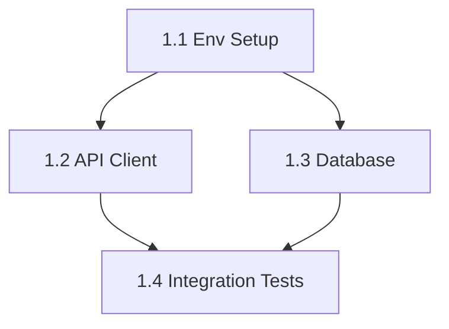

# Evolution API Integration - Sprint Plan
# Aica Life OS: WhatsApp Contact Network Integration

**Status:** Planning Phase
**Total Duration:** 3-4 weeks (15-20 working days)
**Priority:** High
**Issue:** #23 (People Unified Network)

---

## Executive Summary

This document breaks down the Evolution API integration into **4 executable sprints**, transforming the architectural plan into concrete, trackable tasks. Each sprint delivers a working increment that can be tested and validated.

### Integration Objectives
1. **Sync WhatsApp contacts** to `contact_network` table
2. **Calculate health scores** based on real message history
3. **Analyze communication patterns** using AI (Gemini)
4. **Provide 360° contact view** (Google + WhatsApp + Podcast)
5. **Enable real-time updates** via webhooks

### Architecture Decisions
- **Backend-first approach**: Supabase Edge Functions handle all Evolution API calls
- **Incremental sync**: Fetch new data periodically, not full dumps
- **RLS everywhere**: All queries filter by `user_id`
- **LGPD compliance**: Consent system already in place
- **Mobile-friendly**: All UI components responsive

---

## Sprint Overview

| Sprint | Duration | Focus | Deliverable |
|--------|----------|-------|-------------|
| **Sprint 1** | 3-4 days | Core Infrastructure | Evolution API client + Database schema |
| **Sprint 2** | 4-5 days | Contact Sync | WhatsApp → `contact_network` mapping |
| **Sprint 3** | 3-4 days | AI Analysis | Health scores + Sentiment analysis |
| **Sprint 4** | 3-4 days | Real-time + UI | Webhooks + Dashboard widgets |

### Parallel Execution Strategy
- **Sprint 1 Tasks 1.1-1.3**: Can run in parallel (setup tasks)
- **Sprint 2 Tasks 2.1-2.2**: Sequential (2.2 depends on 2.1)
- **Sprint 3 Tasks 3.1-3.3**: Can run in parallel after Sprint 2
- **Sprint 4**: Must wait for Sprint 3 completion

---

## Sprint 1: Core Infrastructure (Days 1-4)

**Objective:** Establish Evolution API client and database foundation

### Success Criteria
- [ ] Evolution API client can fetch contacts and messages
- [ ] Database tables support WhatsApp data
- [ ] Environment variables configured
- [ ] Basic error handling and logging

### Task Dependencies


---

### Task 1.1: Environment Variables Setup

**Type:** Configuration
**Dependencies:** None
**Duration:** 30 min

**Files to modify:**
- `.env.example`
- `docs/deployment/ENVIRONMENT_VARIABLES.md`

**Actions:**
```bash
# Add to .env.example
VITE_EVOLUTION_API_URL=https://evolution-evolution-api.w9jo16.easypanel.host
VITE_EVOLUTION_API_KEY=your_key_here
VITE_EVOLUTION_INSTANCE_NAME=Lucas_4569
VITE_EVOLUTION_WEBHOOK_SECRET=your_secret_here
```

**Validation:**
- [ ] Variables documented in ENVIRONMENT_VARIABLES.md
- [ ] Cloud Run secrets configured (production)
- [ ] Local `.env` file updated

**Estimated Time:** 30 minutes

---

### Task 1.2: Extend Evolution API Client

**Type:** Backend (Supabase Edge Function)
**Dependencies:** Task 1.1
**Duration:** 2-3 hours

**File:** `supabase/functions/_shared/evolution-client.ts`

**Implement missing endpoints:**

```typescript
/**
 * Fetch all contacts from WhatsApp
 */
export async function fetchAllContacts(
  instanceName: string
): Promise<WhatsAppContact[]> {
  const response = await makeRequest<{ contacts: WhatsAppContact[] }>(
    'GET',
    `/chat/fetchAllContacts/${instanceName}`
  )

  return response.contacts || []
}

/**
 * Fetch chat history with a contact
 */
export async function fetchChatMessages(
  instanceName: string,
  remoteJid: string,
  limit: number = 50
): Promise<WhatsAppMessage[]> {
  const response = await makeRequest<{ messages: WhatsAppMessage[] }>(
    'GET',
    `/chat/fetchMessages/${instanceName}?remoteJid=${remoteJid}&limit=${limit}`
  )

  return response.messages || []
}

/**
 * Fetch group metadata
 */
export async function fetchGroupMetadata(
  instanceName: string,
  groupJid: string
): Promise<GroupMetadata> {
  const response = await makeRequest<GroupMetadata>(
    'GET',
    `/group/metadata/${instanceName}?groupJid=${groupJid}`
  )

  return response
}

// Type definitions
export interface WhatsAppContact {
  id: string
  name: string | null
  pushName: string | null
  profilePicUrl: string | null
  isGroup: boolean
  isMyContact: boolean
  lastMessageTimestamp?: number
}

export interface GroupMetadata {
  id: string
  subject: string
  owner: string
  creation: number
  participants: Array<{
    id: string
    admin: 'admin' | 'superadmin' | null
  }>
  desc?: string
  descOwner?: string
}
```

**Error Handling:**
```typescript
// Add retry logic with exponential backoff
async function makeRequestWithRetry<T>(
  method: string,
  endpoint: string,
  body?: any,
  maxRetries = 3
): Promise<T> {
  let lastError: Error

  for (let attempt = 0; attempt < maxRetries; attempt++) {
    try {
      return await makeRequest<T>(method, endpoint, body)
    } catch (error) {
      lastError = error as Error

      // Don't retry on 4xx errors (client errors)
      if (error instanceof Error && error.message.includes('4')) {
        throw error
      }

      // Exponential backoff: 1s, 2s, 4s
      const delay = Math.pow(2, attempt) * 1000
      await new Promise(resolve => setTimeout(resolve, delay))
    }
  }

  throw lastError!
}
```

**Validation:**
- [ ] `fetchAllContacts()` returns contact list
- [ ] `fetchChatMessages()` returns message history
- [ ] `fetchGroupMetadata()` returns group info
- [ ] Error 401: Throws authentication error
- [ ] Error 429: Retries with backoff
- [ ] Error 500: Retries up to 3 times

**Estimated Time:** 2-3 hours

---

### Task 1.3: Database Schema Extensions

**Type:** Database Migration
**Dependencies:** None
**Duration:** 1-2 hours

**File:** `supabase/migrations/20260108_whatsapp_contact_network.sql`

**Create new columns in `contact_network`:**

```sql
-- Add WhatsApp-specific columns to contact_network
ALTER TABLE contact_network
ADD COLUMN IF NOT EXISTS whatsapp_phone VARCHAR(20) UNIQUE,
ADD COLUMN IF NOT EXISTS whatsapp_name VARCHAR(255),
ADD COLUMN IF NOT EXISTS whatsapp_profile_pic_url TEXT,
ADD COLUMN IF NOT EXISTS whatsapp_last_message_at TIMESTAMPTZ,
ADD COLUMN IF NOT EXISTS whatsapp_message_count INTEGER DEFAULT 0,
ADD COLUMN IF NOT EXISTS whatsapp_sentiment_avg NUMERIC(3,2),
ADD COLUMN IF NOT EXISTS whatsapp_sync_status VARCHAR(20) DEFAULT 'pending'
  CHECK (whatsapp_sync_status IN ('pending', 'syncing', 'synced', 'failed')),
ADD COLUMN IF NOT EXISTS whatsapp_synced_at TIMESTAMPTZ;

-- Create index for WhatsApp phone lookups
CREATE INDEX IF NOT EXISTS idx_contact_network_whatsapp_phone
ON contact_network(whatsapp_phone) WHERE whatsapp_phone IS NOT NULL;

-- Create index for sync status queries
CREATE INDEX IF NOT EXISTS idx_contact_network_whatsapp_sync
ON contact_network(user_id, whatsapp_sync_status, whatsapp_synced_at);

-- Add comment for documentation
COMMENT ON COLUMN contact_network.whatsapp_phone IS
'WhatsApp phone number in E.164 format (e.g., +5521999999999)';
COMMENT ON COLUMN contact_network.whatsapp_sentiment_avg IS
'Average sentiment score from message analysis (-1 to 1)';
```

**Create WhatsApp sync log table:**

```sql
-- Track sync operations for debugging and auditing
CREATE TABLE IF NOT EXISTS whatsapp_sync_logs (
  id UUID PRIMARY KEY DEFAULT gen_random_uuid(),
  user_id UUID NOT NULL REFERENCES auth.users(id) ON DELETE CASCADE,
  sync_type VARCHAR(50) NOT NULL
    CHECK (sync_type IN ('full_sync', 'incremental_sync', 'single_contact')),
  contacts_fetched INTEGER DEFAULT 0,
  contacts_created INTEGER DEFAULT 0,
  contacts_updated INTEGER DEFAULT 0,
  messages_analyzed INTEGER DEFAULT 0,
  status VARCHAR(20) NOT NULL
    CHECK (status IN ('running', 'completed', 'failed', 'cancelled')),
  error_message TEXT,
  started_at TIMESTAMPTZ NOT NULL DEFAULT NOW(),
  completed_at TIMESTAMPTZ,
  duration_ms INTEGER,
  metadata JSONB DEFAULT '{}'::jsonb,
  created_at TIMESTAMPTZ NOT NULL DEFAULT NOW()
);

-- RLS for sync logs
ALTER TABLE whatsapp_sync_logs ENABLE ROW LEVEL SECURITY;

CREATE POLICY "Users can view their own sync logs"
ON whatsapp_sync_logs FOR SELECT
USING (auth.uid() = user_id);

-- Index for recent logs queries
CREATE INDEX idx_whatsapp_sync_logs_user_date
ON whatsapp_sync_logs(user_id, started_at DESC);
```

**Validation:**
- [ ] Migration runs without errors
- [ ] New columns exist in `contact_network`
- [ ] Indexes created successfully
- [ ] RLS policies work correctly
- [ ] Query: `SELECT whatsapp_phone FROM contact_network LIMIT 1;` (no error)

**Estimated Time:** 1-2 hours

---

### Task 1.4: Integration Tests

**Type:** Testing
**Dependencies:** Tasks 1.2, 1.3
**Duration:** 1-2 hours

**File:** `supabase/functions/tests/evolution-client.test.ts`

**Test cases:**

```typescript
import { assertEquals, assertExists } from 'https://deno.land/std@0.208.0/assert/mod.ts'
import { fetchAllContacts, fetchChatMessages } from '../_shared/evolution-client.ts'

Deno.test('fetchAllContacts returns contact list', async () => {
  const contacts = await fetchAllContacts('Lucas_4569')

  assertExists(contacts)
  assertEquals(Array.isArray(contacts), true)

  if (contacts.length > 0) {
    assertExists(contacts[0].id)
    assertExists(contacts[0].name || contacts[0].pushName)
  }
})

Deno.test('fetchChatMessages returns message history', async () => {
  // Use a known contact for testing
  const testRemoteJid = '5521999999999@s.whatsapp.net'
  const messages = await fetchChatMessages('Lucas_4569', testRemoteJid, 10)

  assertExists(messages)
  assertEquals(Array.isArray(messages), true)
})

Deno.test('API client handles rate limiting', async () => {
  // Make 5 rapid requests to trigger rate limit
  const promises = Array(5).fill(null).map(() =>
    fetchAllContacts('Lucas_4569')
  )

  // Should not throw, should retry automatically
  const results = await Promise.all(promises)
  assertEquals(results.length, 5)
})
```

**Run tests:**
```bash
cd supabase/functions
deno test --allow-net --allow-env tests/evolution-client.test.ts
```

**Validation:**
- [ ] All tests pass
- [ ] No network errors
- [ ] Rate limiting handled gracefully

**Estimated Time:** 1-2 hours

---

## Sprint 2: Contact Synchronization (Days 5-9)

**Objective:** Map WhatsApp contacts to `contact_network` and sync bidirectionally

### Success Criteria
- [ ] WhatsApp contacts appear in `contact_network` table
- [ ] Google Contacts and WhatsApp data merged correctly
- [ ] Sync can run incrementally (not full refresh)
- [ ] Sync Edge Function deployed and tested

---

### Task 2.1: Create Contact Sync Edge Function

**Type:** Backend (Supabase Edge Function)
**Dependencies:** Sprint 1 complete
**Duration:** 3-4 hours

**File:** `supabase/functions/sync-whatsapp-contacts/index.ts`

**Implementation:**

```typescript
import { serve } from 'https://deno.land/std@0.208.0/http/server.ts'
import { createClient } from 'https://esm.sh/@supabase/supabase-js@2.39.0'
import { fetchAllContacts } from '../_shared/evolution-client.ts'

interface SyncRequest {
  userId: string
  instanceName?: string
  syncType?: 'full' | 'incremental'
}

interface SyncResponse {
  success: boolean
  contactsFetched: number
  contactsCreated: number
  contactsUpdated: number
  syncLogId: string
  error?: string
}

serve(async (req) => {
  // CORS preflight
  if (req.method === 'OPTIONS') {
    return new Response('ok', { headers: corsHeaders })
  }

  try {
    // Get user from auth header
    const authHeader = req.headers.get('Authorization')
    if (!authHeader) {
      throw new Error('Missing Authorization header')
    }

    const supabase = createClient(
      Deno.env.get('SUPABASE_URL')!,
      Deno.env.get('SUPABASE_ANON_KEY')!,
      {
        global: { headers: { Authorization: authHeader } }
      }
    )

    const { data: { user }, error: userError } = await supabase.auth.getUser()
    if (userError || !user) {
      throw new Error('Unauthorized')
    }

    // Parse request body
    const body: SyncRequest = await req.json()
    const instanceName = body.instanceName || Deno.env.get('EVOLUTION_INSTANCE_NAME')!
    const syncType = body.syncType || 'incremental'

    // Create sync log
    const { data: syncLog, error: logError } = await supabase
      .from('whatsapp_sync_logs')
      .insert({
        user_id: user.id,
        sync_type: syncType === 'full' ? 'full_sync' : 'incremental_sync',
        status: 'running',
        started_at: new Date().toISOString()
      })
      .select('id')
      .single()

    if (logError) throw logError

    // Fetch contacts from Evolution API
    console.log(`[sync-contacts] Fetching contacts for instance ${instanceName}`)
    const whatsappContacts = await fetchAllContacts(instanceName)

    console.log(`[sync-contacts] Fetched ${whatsappContacts.length} contacts`)

    let contactsCreated = 0
    let contactsUpdated = 0

    // Process each contact
    for (const contact of whatsappContacts) {
      // Skip groups for now
      if (contact.isGroup) continue

      // Extract phone number from JID
      const phone = contact.id.split('@')[0]
      const formattedPhone = formatPhoneE164(phone)

      // Check if contact exists
      const { data: existing } = await supabase
        .from('contact_network')
        .select('id, whatsapp_synced_at')
        .eq('user_id', user.id)
        .eq('whatsapp_phone', formattedPhone)
        .maybeSingle()

      const contactData = {
        user_id: user.id,
        whatsapp_phone: formattedPhone,
        whatsapp_name: contact.name || contact.pushName,
        whatsapp_profile_pic_url: contact.profilePicUrl,
        whatsapp_last_message_at: contact.lastMessageTimestamp
          ? new Date(contact.lastMessageTimestamp * 1000).toISOString()
          : null,
        whatsapp_sync_status: 'synced',
        whatsapp_synced_at: new Date().toISOString(),
        // If no name from Google, use WhatsApp name
        name: contact.name || contact.pushName || formattedPhone,
        source: 'whatsapp' as const
      }

      if (existing) {
        // Update existing contact
        await supabase
          .from('contact_network')
          .update(contactData)
          .eq('id', existing.id)

        contactsUpdated++
      } else {
        // Create new contact
        await supabase
          .from('contact_network')
          .insert(contactData)

        contactsCreated++
      }
    }

    // Update sync log
    const completedAt = new Date()
    const startedAt = new Date(syncLog.started_at)
    const durationMs = completedAt.getTime() - startedAt.getTime()

    await supabase
      .from('whatsapp_sync_logs')
      .update({
        status: 'completed',
        contacts_fetched: whatsappContacts.length,
        contacts_created: contactsCreated,
        contacts_updated: contactsUpdated,
        completed_at: completedAt.toISOString(),
        duration_ms: durationMs
      })
      .eq('id', syncLog.id)

    const response: SyncResponse = {
      success: true,
      contactsFetched: whatsappContacts.length,
      contactsCreated,
      contactsUpdated,
      syncLogId: syncLog.id
    }

    return new Response(JSON.stringify(response), {
      headers: { ...corsHeaders, 'Content-Type': 'application/json' }
    })

  } catch (error) {
    console.error('[sync-contacts] Error:', error)

    return new Response(
      JSON.stringify({
        success: false,
        error: error instanceof Error ? error.message : 'Unknown error'
      }),
      {
        status: 500,
        headers: { ...corsHeaders, 'Content-Type': 'application/json' }
      }
    )
  }
})

// Helper: Format phone to E.164
function formatPhoneE164(phone: string): string {
  const digits = phone.replace(/\D/g, '')

  // Already has country code
  if (digits.length >= 11) {
    return `+${digits}`
  }

  // Assume Brazil (+55)
  return `+55${digits}`
}

const corsHeaders = {
  'Access-Control-Allow-Origin': '*',
  'Access-Control-Allow-Headers': 'authorization, x-client-info, apikey, content-type',
}
```

**Deploy:**
```bash
npx supabase functions deploy sync-whatsapp-contacts
```

**Validation:**
- [ ] Function deploys successfully
- [ ] Can fetch contacts from Evolution API
- [ ] Contacts inserted into `contact_network`
- [ ] Sync log created with correct stats
- [ ] Error handling works (invalid auth, API down)

**Estimated Time:** 3-4 hours

---

### Task 2.2: Frontend Sync Service

**Type:** Frontend Service
**Dependencies:** Task 2.1
**Duration:** 1-2 hours

**File:** `src/services/whatsappContactSyncService.ts`

**Implementation:**

```typescript
import { supabase } from '@/lib/supabase'
import { edgeFunctionService } from './edgeFunctionService'

export interface SyncResult {
  success: boolean
  contactsFetched: number
  contactsCreated: number
  contactsUpdated: number
  syncLogId: string
  error?: string
}

export interface SyncLog {
  id: string
  sync_type: string
  contacts_fetched: number
  contacts_created: number
  contacts_updated: number
  status: 'running' | 'completed' | 'failed'
  error_message: string | null
  started_at: string
  completed_at: string | null
  duration_ms: number | null
}

/**
 * Trigger WhatsApp contact sync
 */
export async function syncWhatsAppContacts(
  syncType: 'full' | 'incremental' = 'incremental'
): Promise<SyncResult> {
  const { data: { user } } = await supabase.auth.getUser()
  if (!user) throw new Error('Not authenticated')

  const result = await edgeFunctionService.invoke<SyncResult>(
    'sync-whatsapp-contacts',
    {
      userId: user.id,
      syncType
    }
  )

  return result
}

/**
 * Get recent sync logs
 */
export async function getSyncLogs(limit: number = 10): Promise<SyncLog[]> {
  const { data, error } = await supabase
    .from('whatsapp_sync_logs')
    .select('*')
    .order('started_at', { ascending: false })
    .limit(limit)

  if (error) throw error
  return data as SyncLog[]
}

/**
 * Get last successful sync timestamp
 */
export async function getLastSyncTime(): Promise<Date | null> {
  const { data, error } = await supabase
    .from('whatsapp_sync_logs')
    .select('completed_at')
    .eq('status', 'completed')
    .order('completed_at', { ascending: false })
    .limit(1)
    .maybeSingle()

  if (error || !data) return null
  return new Date(data.completed_at)
}

/**
 * Check if sync is recommended (last sync > 24h ago)
 */
export async function shouldSync(): Promise<boolean> {
  const lastSync = await getLastSyncTime()
  if (!lastSync) return true

  const hoursSinceSync = (Date.now() - lastSync.getTime()) / (1000 * 60 * 60)
  return hoursSinceSync > 24
}

export default {
  syncWhatsAppContacts,
  getSyncLogs,
  getLastSyncTime,
  shouldSync
}
```

**Validation:**
- [ ] `syncWhatsAppContacts()` triggers sync successfully
- [ ] `getSyncLogs()` returns recent sync history
- [ ] `shouldSync()` returns true if stale data

**Estimated Time:** 1-2 hours

---

### Task 2.3: UI Sync Button in Connections Module

**Type:** Frontend (React Component)
**Dependencies:** Task 2.2
**Duration:** 2 hours

**File:** `src/modules/connections/components/WhatsAppSyncButton.tsx`

**Implementation:**

```typescript
import { useState } from 'react'
import { RefreshCw } from 'lucide-react'
import { syncWhatsAppContacts, shouldSync } from '@/services/whatsappContactSyncService'
import { toast } from 'sonner'

export function WhatsAppSyncButton() {
  const [isSyncing, setIsSyncing] = useState(false)
  const [lastSync, setLastSync] = useState<Date | null>(null)

  const handleSync = async () => {
    setIsSyncing(true)

    try {
      const result = await syncWhatsAppContacts('incremental')

      if (result.success) {
        toast.success(
          `Sync complete: ${result.contactsCreated} new, ${result.contactsUpdated} updated`
        )
        setLastSync(new Date())
      } else {
        toast.error(`Sync failed: ${result.error}`)
      }
    } catch (error) {
      console.error('[WhatsAppSyncButton] Error:', error)
      toast.error('Failed to sync WhatsApp contacts')
    } finally {
      setIsSyncing(false)
    }
  }

  return (
    <button
      onClick={handleSync}
      disabled={isSyncing}
      className="flex items-center gap-2 px-4 py-2 bg-green-600 text-white rounded-lg
                 hover:bg-green-700 disabled:opacity-50 disabled:cursor-not-allowed
                 transition-colors"
    >
      <RefreshCw className={`w-4 h-4 ${isSyncing ? 'animate-spin' : ''}`} />
      {isSyncing ? 'Syncing...' : 'Sync WhatsApp'}
    </button>
  )
}
```

**Add to:** `src/modules/connections/views/ConnectionsView.tsx`

```typescript
import { WhatsAppSyncButton } from '../components/WhatsAppSyncButton'

// Inside the component JSX:
<div className="flex items-center justify-between mb-6">
  <h1 className="text-2xl font-bold">Connections</h1>
  <WhatsAppSyncButton />
</div>
```

**Validation:**
- [ ] Sync button visible in Connections page
- [ ] Button shows loading state during sync
- [ ] Success toast shows contact counts
- [ ] Error toast shows if sync fails

**Estimated Time:** 2 hours

---

## Sprint 3: AI Analysis & Health Scoring (Days 10-13)

**Objective:** Analyze message history and calculate health scores automatically

### Success Criteria
- [ ] Sentiment analysis runs on message history
- [ ] Health scores calculated from real data
- [ ] Contact cards show WhatsApp insights
- [ ] AI suggestions for follow-ups

---

### Task 3.1: Message History Analysis Edge Function

**Type:** Backend (Supabase Edge Function)
**Dependencies:** Sprint 2 complete
**Duration:** 3-4 hours

**File:** `supabase/functions/analyze-whatsapp-contact/index.ts`

**Implementation:**

```typescript
import { serve } from 'https://deno.land/std@0.208.0/http/server.ts'
import { createClient } from 'https://esm.sh/@supabase/supabase-js@2.39.0'
import { fetchChatMessages } from '../_shared/evolution-client.ts'
import { GoogleGenerativeAI } from 'https://esm.sh/@google/generative-ai@0.1.3'

interface AnalysisRequest {
  contactId: string
  forceRefresh?: boolean
}

interface AnalysisResponse {
  success: boolean
  contact_id: string
  health_score: number
  sentiment_avg: number
  insights: {
    last_interaction_days: number
    message_frequency: string // 'daily', 'weekly', 'monthly', 'rare'
    engagement_trend: string // 'increasing', 'stable', 'decreasing'
    suggested_action: string
  }
  error?: string
}

serve(async (req) => {
  if (req.method === 'OPTIONS') {
    return new Response('ok', { headers: corsHeaders })
  }

  try {
    // Auth
    const authHeader = req.headers.get('Authorization')
    if (!authHeader) throw new Error('Missing Authorization')

    const supabase = createClient(
      Deno.env.get('SUPABASE_URL')!,
      Deno.env.get('SUPABASE_ANON_KEY')!,
      { global: { headers: { Authorization: authHeader } } }
    )

    const { data: { user }, error: userError } = await supabase.auth.getUser()
    if (userError || !user) throw new Error('Unauthorized')

    // Parse request
    const { contactId, forceRefresh }: AnalysisRequest = await req.json()

    // Get contact
    const { data: contact, error: contactError } = await supabase
      .from('contact_network')
      .select('*')
      .eq('id', contactId)
      .eq('user_id', user.id)
      .single()

    if (contactError || !contact) throw new Error('Contact not found')

    // Check if analysis is recent (< 24h) and force refresh not requested
    if (!forceRefresh && contact.whatsapp_synced_at) {
      const lastAnalysis = new Date(contact.whatsapp_synced_at)
      const hoursSince = (Date.now() - lastAnalysis.getTime()) / (1000 * 60 * 60)

      if (hoursSince < 24) {
        return new Response(
          JSON.stringify({
            success: true,
            contact_id: contactId,
            health_score: contact.health_score,
            sentiment_avg: contact.whatsapp_sentiment_avg,
            message: 'Using cached analysis (< 24h old)'
          }),
          { headers: { ...corsHeaders, 'Content-Type': 'application/json' } }
        )
      }
    }

    // Fetch message history from Evolution API
    const instanceName = Deno.env.get('EVOLUTION_INSTANCE_NAME')!
    const remoteJid = `${contact.whatsapp_phone.replace(/\D/g, '')}@s.whatsapp.net`

    console.log(`[analyze-contact] Fetching messages for ${remoteJid}`)
    const messages = await fetchChatMessages(instanceName, remoteJid, 100)

    if (messages.length === 0) {
      // No messages to analyze
      return new Response(
        JSON.stringify({
          success: true,
          contact_id: contactId,
          health_score: 50, // Neutral score
          sentiment_avg: 0,
          insights: {
            last_interaction_days: -1,
            message_frequency: 'none',
            engagement_trend: 'unknown',
            suggested_action: 'Start a conversation to build connection'
          }
        }),
        { headers: { ...corsHeaders, 'Content-Type': 'application/json' } }
      )
    }

    // Analyze with Gemini
    const gemini = new GoogleGenerativeAI(Deno.env.get('GEMINI_API_KEY')!)
    const model = gemini.getGenerativeModel({ model: 'gemini-1.5-flash' })

    const prompt = `Analyze this WhatsApp conversation history and provide:
1. Average sentiment score (-1 to 1, where -1=very negative, 0=neutral, 1=very positive)
2. Message frequency pattern (daily/weekly/monthly/rare)
3. Engagement trend (increasing/stable/decreasing)
4. Days since last interaction
5. Suggested follow-up action

Messages (most recent first):
${messages.slice(0, 50).map(m =>
  `[${m.fromMe ? 'ME' : 'THEM'}] ${m.message?.conversation || m.message?.extendedTextMessage?.text || '[media]'}`
).join('\n')}

Respond ONLY with valid JSON:
{
  "sentiment_avg": number,
  "message_frequency": string,
  "engagement_trend": string,
  "last_interaction_days": number,
  "suggested_action": string
}
`

    const result = await model.generateContent(prompt)
    const responseText = result.response.text()

    // Parse JSON from response (handle markdown code blocks)
    const jsonMatch = responseText.match(/\{[\s\S]*\}/)
    if (!jsonMatch) throw new Error('Invalid AI response format')

    const analysis = JSON.parse(jsonMatch[0])

    // Calculate health score (0-100)
    const healthScore = calculateHealthScore({
      sentimentAvg: analysis.sentiment_avg,
      daysSinceLastMessage: analysis.last_interaction_days,
      messageFrequency: analysis.message_frequency,
      engagementTrend: analysis.engagement_trend
    })

    // Update contact with analysis
    await supabase
      .from('contact_network')
      .update({
        health_score: healthScore,
        whatsapp_sentiment_avg: analysis.sentiment_avg,
        whatsapp_message_count: messages.length,
        whatsapp_last_message_at: messages[0]?.messageTimestamp
          ? new Date(messages[0].messageTimestamp * 1000).toISOString()
          : null,
        whatsapp_synced_at: new Date().toISOString()
      })
      .eq('id', contactId)

    const response: AnalysisResponse = {
      success: true,
      contact_id: contactId,
      health_score: healthScore,
      sentiment_avg: analysis.sentiment_avg,
      insights: {
        last_interaction_days: analysis.last_interaction_days,
        message_frequency: analysis.message_frequency,
        engagement_trend: analysis.engagement_trend,
        suggested_action: analysis.suggested_action
      }
    }

    return new Response(JSON.stringify(response), {
      headers: { ...corsHeaders, 'Content-Type': 'application/json' }
    })

  } catch (error) {
    console.error('[analyze-contact] Error:', error)
    return new Response(
      JSON.stringify({
        success: false,
        error: error instanceof Error ? error.message : 'Unknown error'
      }),
      {
        status: 500,
        headers: { ...corsHeaders, 'Content-Type': 'application/json' }
      }
    )
  }
})

function calculateHealthScore(params: {
  sentimentAvg: number
  daysSinceLastMessage: number
  messageFrequency: string
  engagementTrend: string
}): number {
  let score = 50 // Base score

  // Sentiment impact (±20 points)
  score += params.sentimentAvg * 20

  // Recency impact (±30 points)
  if (params.daysSinceLastMessage < 7) score += 30
  else if (params.daysSinceLastMessage < 30) score += 15
  else if (params.daysSinceLastMessage < 90) score += 0
  else score -= 20

  // Frequency impact (±10 points)
  const frequencyBonus = {
    daily: 10,
    weekly: 5,
    monthly: 0,
    rare: -10
  }
  score += frequencyBonus[params.messageFrequency as keyof typeof frequencyBonus] || 0

  // Trend impact (±10 points)
  const trendBonus = {
    increasing: 10,
    stable: 0,
    decreasing: -10
  }
  score += trendBonus[params.engagementTrend as keyof typeof trendBonus] || 0

  // Clamp to 0-100
  return Math.max(0, Math.min(100, Math.round(score)))
}

const corsHeaders = {
  'Access-Control-Allow-Origin': '*',
  'Access-Control-Allow-Headers': 'authorization, x-client-info, apikey, content-type',
}
```

**Deploy:**
```bash
npx supabase functions deploy analyze-whatsapp-contact
```

**Validation:**
- [ ] Function analyzes contact successfully
- [ ] Health score between 0-100
- [ ] Sentiment score between -1 and 1
- [ ] Suggested action makes sense
- [ ] Contact record updated in database

**Estimated Time:** 3-4 hours

---

### Task 3.2: Batch Analysis for All Contacts

**Type:** Backend (Supabase Edge Function)
**Dependencies:** Task 3.1
**Duration:** 2 hours

**File:** `supabase/functions/analyze-all-whatsapp-contacts/index.ts`

**Implementation:**

```typescript
import { serve } from 'https://deno.land/std@0.208.0/http/server.ts'
import { createClient } from 'https://esm.sh/@supabase/supabase-js@2.39.0'

interface BatchAnalysisResponse {
  success: boolean
  total_contacts: number
  analyzed: number
  failed: number
  errors: string[]
}

serve(async (req) => {
  if (req.method === 'OPTIONS') {
    return new Response('ok', { headers: corsHeaders })
  }

  try {
    const authHeader = req.headers.get('Authorization')
    if (!authHeader) throw new Error('Missing Authorization')

    const supabase = createClient(
      Deno.env.get('SUPABASE_URL')!,
      Deno.env.get('SUPABASE_ANON_KEY')!,
      { global: { headers: { Authorization: authHeader } } }
    )

    const { data: { user }, error: userError } = await supabase.auth.getUser()
    if (userError || !user) throw new Error('Unauthorized')

    // Get all WhatsApp contacts for user
    const { data: contacts, error: contactsError } = await supabase
      .from('contact_network')
      .select('id, whatsapp_phone, whatsapp_synced_at')
      .eq('user_id', user.id)
      .not('whatsapp_phone', 'is', null)

    if (contactsError) throw contactsError

    console.log(`[batch-analysis] Analyzing ${contacts.length} contacts`)

    const errors: string[] = []
    let analyzed = 0

    // Analyze in batches to avoid rate limits
    const BATCH_SIZE = 5
    for (let i = 0; i < contacts.length; i += BATCH_SIZE) {
      const batch = contacts.slice(i, i + BATCH_SIZE)

      const results = await Promise.allSettled(
        batch.map(async (contact) => {
          const response = await fetch(
            `${Deno.env.get('SUPABASE_URL')}/functions/v1/analyze-whatsapp-contact`,
            {
              method: 'POST',
              headers: {
                'Authorization': authHeader,
                'Content-Type': 'application/json'
              },
              body: JSON.stringify({ contactId: contact.id })
            }
          )

          if (!response.ok) {
            throw new Error(`Failed to analyze ${contact.id}`)
          }

          return response.json()
        })
      )

      // Count successes and failures
      results.forEach((result, idx) => {
        if (result.status === 'fulfilled') {
          analyzed++
        } else {
          errors.push(`Contact ${batch[idx].id}: ${result.reason}`)
        }
      })

      // Wait 2s between batches to respect rate limits
      if (i + BATCH_SIZE < contacts.length) {
        await new Promise(resolve => setTimeout(resolve, 2000))
      }
    }

    const response: BatchAnalysisResponse = {
      success: true,
      total_contacts: contacts.length,
      analyzed,
      failed: errors.length,
      errors
    }

    return new Response(JSON.stringify(response), {
      headers: { ...corsHeaders, 'Content-Type': 'application/json' }
    })

  } catch (error) {
    console.error('[batch-analysis] Error:', error)
    return new Response(
      JSON.stringify({
        success: false,
        error: error instanceof Error ? error.message : 'Unknown error'
      }),
      {
        status: 500,
        headers: { ...corsHeaders, 'Content-Type': 'application/json' }
      }
    )
  }
})

const corsHeaders = {
  'Access-Control-Allow-Origin': '*',
  'Access-Control-Allow-Headers': 'authorization, x-client-info, apikey, content-type',
}
```

**Deploy:**
```bash
npx supabase functions deploy analyze-all-whatsapp-contacts
```

**Validation:**
- [ ] Function processes multiple contacts
- [ ] Respects rate limits (batches with delays)
- [ ] Returns success/failure counts
- [ ] Errors logged for debugging

**Estimated Time:** 2 hours

---

### Task 3.3: Frontend Analysis Service

**Type:** Frontend Service
**Dependencies:** Tasks 3.1, 3.2
**Duration:** 1 hour

**File:** `src/services/whatsappAnalysisService.ts`

**Implementation:**

```typescript
import { edgeFunctionService } from './edgeFunctionService'

export interface ContactAnalysis {
  success: boolean
  contact_id: string
  health_score: number
  sentiment_avg: number
  insights: {
    last_interaction_days: number
    message_frequency: string
    engagement_trend: string
    suggested_action: string
  }
  error?: string
}

export interface BatchAnalysisResult {
  success: boolean
  total_contacts: number
  analyzed: number
  failed: number
  errors: string[]
}

/**
 * Analyze a single contact's WhatsApp history
 */
export async function analyzeContact(
  contactId: string,
  forceRefresh = false
): Promise<ContactAnalysis> {
  return edgeFunctionService.invoke<ContactAnalysis>(
    'analyze-whatsapp-contact',
    { contactId, forceRefresh }
  )
}

/**
 * Analyze all WhatsApp contacts for current user
 */
export async function analyzeAllContacts(): Promise<BatchAnalysisResult> {
  return edgeFunctionService.invoke<BatchAnalysisResult>(
    'analyze-all-whatsapp-contacts',
    {}
  )
}

export default {
  analyzeContact,
  analyzeAllContacts
}
```

**Validation:**
- [ ] `analyzeContact()` returns analysis data
- [ ] `analyzeAllContacts()` processes batch
- [ ] Error handling works

**Estimated Time:** 1 hour

---

## Sprint 4: Real-time Updates & UI (Days 14-17)

**Objective:** Enable webhooks for real-time sync and build dashboard UI

### Success Criteria
- [ ] Webhooks update contacts in real-time
- [ ] Dashboard shows WhatsApp insights
- [ ] Health score cards display correctly
- [ ] User can trigger manual sync and analysis

---

### Task 4.1: Webhook Handler for Contact Updates

**Type:** Backend (Supabase Edge Function)
**Dependencies:** Sprint 3 complete
**Duration:** 2-3 hours

**File:** `supabase/functions/webhook-evolution/index.ts` (extend existing)

**Add contact update handler:**

```typescript
// Add to existing webhook handler
async function handleMessageUpsert(data: any, supabase: any, userId: string) {
  const message = data.message
  const remoteJid = message.key.remoteJid

  // Extract phone number
  const phone = remoteJid.split('@')[0]
  const formattedPhone = formatPhoneE164(phone)

  // Update or create contact
  const { data: contact } = await supabase
    .from('contact_network')
    .select('id')
    .eq('user_id', userId)
    .eq('whatsapp_phone', formattedPhone)
    .maybeSingle()

  const contactData = {
    user_id: userId,
    whatsapp_phone: formattedPhone,
    whatsapp_name: message.pushName,
    whatsapp_last_message_at: new Date().toISOString(),
    whatsapp_message_count: contact
      ? (contact.whatsapp_message_count || 0) + 1
      : 1,
    whatsapp_sync_status: 'synced'
  }

  if (contact) {
    // Update existing
    await supabase
      .from('contact_network')
      .update(contactData)
      .eq('id', contact.id)
  } else {
    // Create new
    await supabase
      .from('contact_network')
      .insert({
        ...contactData,
        name: message.pushName || formattedPhone,
        source: 'whatsapp'
      })
  }

  // Trigger async analysis if contact has enough messages
  if (contactData.whatsapp_message_count >= 10) {
    // Call analyze-whatsapp-contact in background (fire-and-forget)
    fetch(
      `${Deno.env.get('SUPABASE_URL')}/functions/v1/analyze-whatsapp-contact`,
      {
        method: 'POST',
        headers: {
          'Authorization': `Bearer ${Deno.env.get('SUPABASE_SERVICE_ROLE_KEY')}`,
          'Content-Type': 'application/json'
        },
        body: JSON.stringify({ contactId: contact.id })
      }
    ).catch(err => console.error('[webhook] Background analysis failed:', err))
  }
}
```

**Validation:**
- [ ] Webhook receives messages
- [ ] Contact updated in real-time
- [ ] Message count increments
- [ ] Analysis triggered for active contacts

**Estimated Time:** 2-3 hours

---

### Task 4.2: WhatsApp Insights Card Component

**Type:** Frontend (React Component)
**Dependencies:** Sprint 3
**Duration:** 2-3 hours

**File:** `src/modules/connections/components/WhatsAppInsightsCard.tsx`

**Implementation:**

```typescript
import { useEffect, useState } from 'react'
import { MessageCircle, TrendingUp, TrendingDown, Minus } from 'lucide-react'
import { analyzeContact } from '@/services/whatsappAnalysisService'
import type { ContactAnalysis } from '@/services/whatsappAnalysisService'

interface Props {
  contactId: string
  whatsappPhone: string | null
}

export function WhatsAppInsightsCard({ contactId, whatsappPhone }: Props) {
  const [analysis, setAnalysis] = useState<ContactAnalysis | null>(null)
  const [isLoading, setIsLoading] = useState(false)

  useEffect(() => {
    if (!whatsappPhone) return

    loadAnalysis()
  }, [contactId, whatsappPhone])

  const loadAnalysis = async () => {
    setIsLoading(true)
    try {
      const result = await analyzeContact(contactId)
      setAnalysis(result)
    } catch (error) {
      console.error('[WhatsAppInsightsCard] Error:', error)
    } finally {
      setIsLoading(false)
    }
  }

  if (!whatsappPhone) {
    return (
      <div className="bg-gray-50 rounded-lg p-4 border border-gray-200">
        <p className="text-sm text-gray-500">
          No WhatsApp data available for this contact
        </p>
      </div>
    )
  }

  if (isLoading || !analysis) {
    return (
      <div className="bg-white rounded-lg p-4 border border-gray-200 animate-pulse">
        <div className="h-4 bg-gray-200 rounded w-1/2 mb-2"></div>
        <div className="h-4 bg-gray-200 rounded w-3/4"></div>
      </div>
    )
  }

  const getTrendIcon = (trend: string) => {
    switch (trend) {
      case 'increasing': return <TrendingUp className="w-4 h-4 text-green-600" />
      case 'decreasing': return <TrendingDown className="w-4 h-4 text-red-600" />
      default: return <Minus className="w-4 h-4 text-gray-400" />
    }
  }

  const getHealthColor = (score: number) => {
    if (score >= 70) return 'text-green-600 bg-green-50'
    if (score >= 40) return 'text-yellow-600 bg-yellow-50'
    return 'text-red-600 bg-red-50'
  }

  const getSentimentEmoji = (sentiment: number) => {
    if (sentiment > 0.3) return '😊'
    if (sentiment > 0) return '🙂'
    if (sentiment > -0.3) return '😐'
    return '😟'
  }

  return (
    <div className="bg-white rounded-lg p-6 border border-gray-200 space-y-4">
      <div className="flex items-center justify-between">
        <h3 className="font-semibold flex items-center gap-2">
          <MessageCircle className="w-5 h-5 text-green-600" />
          WhatsApp Insights
        </h3>
        <button
          onClick={loadAnalysis}
          className="text-sm text-blue-600 hover:text-blue-700"
        >
          Refresh
        </button>
      </div>

      {/* Health Score */}
      <div className="flex items-center justify-between">
        <span className="text-sm text-gray-600">Health Score</span>
        <span className={`font-bold text-lg px-3 py-1 rounded ${getHealthColor(analysis.health_score)}`}>
          {analysis.health_score}/100
        </span>
      </div>

      {/* Sentiment */}
      <div className="flex items-center justify-between">
        <span className="text-sm text-gray-600">Average Sentiment</span>
        <span className="text-lg">
          {getSentimentEmoji(analysis.sentiment_avg)}
        </span>
      </div>

      {/* Message Frequency */}
      <div className="flex items-center justify-between">
        <span className="text-sm text-gray-600">Message Frequency</span>
        <span className="text-sm font-medium capitalize">
          {analysis.insights.message_frequency}
        </span>
      </div>

      {/* Engagement Trend */}
      <div className="flex items-center justify-between">
        <span className="text-sm text-gray-600">Engagement Trend</span>
        <div className="flex items-center gap-1">
          {getTrendIcon(analysis.insights.engagement_trend)}
          <span className="text-sm font-medium capitalize">
            {analysis.insights.engagement_trend}
          </span>
        </div>
      </div>

      {/* Last Interaction */}
      <div className="flex items-center justify-between">
        <span className="text-sm text-gray-600">Last Interaction</span>
        <span className="text-sm font-medium">
          {analysis.insights.last_interaction_days === 0
            ? 'Today'
            : analysis.insights.last_interaction_days === 1
            ? 'Yesterday'
            : `${analysis.insights.last_interaction_days} days ago`}
        </span>
      </div>

      {/* Suggested Action */}
      {analysis.insights.suggested_action && (
        <div className="mt-4 p-3 bg-blue-50 rounded-lg">
          <p className="text-sm text-blue-800">
            <strong>Suggestion:</strong> {analysis.insights.suggested_action}
          </p>
        </div>
      )}
    </div>
  )
}
```

**Validation:**
- [ ] Card displays for WhatsApp contacts
- [ ] Health score color-coded correctly
- [ ] Sentiment emoji matches score
- [ ] Refresh button triggers re-analysis

**Estimated Time:** 2-3 hours

---

### Task 4.3: Integrate Insights into Contact Detail View

**Type:** Frontend Integration
**Dependencies:** Task 4.2
**Duration:** 1-2 hours

**File:** `src/modules/connections/views/ContactDetailView.tsx` (or similar)

**Add WhatsApp Insights Card:**

```typescript
import { WhatsAppInsightsCard } from '../components/WhatsAppInsightsCard'

// Inside component JSX, after contact information:
{contact.whatsapp_phone && (
  <div className="mt-6">
    <WhatsAppInsightsCard
      contactId={contact.id}
      whatsappPhone={contact.whatsapp_phone}
    />
  </div>
)}
```

**Validation:**
- [ ] Insights card appears in contact detail view
- [ ] Only shows for contacts with WhatsApp data
- [ ] Data loads correctly

**Estimated Time:** 1-2 hours

---

### Task 4.4: Dashboard Widget for Health Score Distribution

**Type:** Frontend (React Component)
**Dependencies:** Sprint 3
**Duration:** 2 hours

**File:** `src/modules/connections/components/HealthScoreDistributionWidget.tsx`

**Implementation:**

```typescript
import { useEffect, useState } from 'react'
import { supabase } from '@/lib/supabase'
import { BarChart3 } from 'lucide-react'

interface HealthScoreStats {
  excellent: number // 80-100
  good: number      // 60-79
  fair: number      // 40-59
  poor: number      // 0-39
}

export function HealthScoreDistributionWidget() {
  const [stats, setStats] = useState<HealthScoreStats | null>(null)
  const [isLoading, setIsLoading] = useState(true)

  useEffect(() => {
    loadStats()
  }, [])

  const loadStats = async () => {
    setIsLoading(true)
    try {
      const { data, error } = await supabase
        .from('contact_network')
        .select('health_score')
        .not('whatsapp_phone', 'is', null)

      if (error) throw error

      const distribution: HealthScoreStats = {
        excellent: 0,
        good: 0,
        fair: 0,
        poor: 0
      }

      data.forEach(contact => {
        const score = contact.health_score || 0
        if (score >= 80) distribution.excellent++
        else if (score >= 60) distribution.good++
        else if (score >= 40) distribution.fair++
        else distribution.poor++
      })

      setStats(distribution)
    } catch (error) {
      console.error('[HealthScoreWidget] Error:', error)
    } finally {
      setIsLoading(false)
    }
  }

  if (isLoading || !stats) {
    return (
      <div className="bg-white rounded-lg p-6 border border-gray-200 animate-pulse">
        <div className="h-4 bg-gray-200 rounded w-1/2 mb-4"></div>
        <div className="space-y-2">
          <div className="h-8 bg-gray-200 rounded"></div>
          <div className="h-8 bg-gray-200 rounded"></div>
        </div>
      </div>
    )
  }

  const total = stats.excellent + stats.good + stats.fair + stats.poor

  const getPercentage = (count: number) => {
    return total > 0 ? Math.round((count / total) * 100) : 0
  }

  return (
    <div className="bg-white rounded-lg p-6 border border-gray-200">
      <h3 className="font-semibold flex items-center gap-2 mb-4">
        <BarChart3 className="w-5 h-5 text-blue-600" />
        Health Score Distribution
      </h3>

      <div className="space-y-3">
        {/* Excellent */}
        <div>
          <div className="flex items-center justify-between mb-1">
            <span className="text-sm font-medium text-green-700">Excellent (80-100)</span>
            <span className="text-sm text-gray-600">{stats.excellent}</span>
          </div>
          <div className="w-full bg-gray-200 rounded-full h-2">
            <div
              className="bg-green-600 h-2 rounded-full transition-all"
              style={{ width: `${getPercentage(stats.excellent)}%` }}
            />
          </div>
        </div>

        {/* Good */}
        <div>
          <div className="flex items-center justify-between mb-1">
            <span className="text-sm font-medium text-blue-700">Good (60-79)</span>
            <span className="text-sm text-gray-600">{stats.good}</span>
          </div>
          <div className="w-full bg-gray-200 rounded-full h-2">
            <div
              className="bg-blue-600 h-2 rounded-full transition-all"
              style={{ width: `${getPercentage(stats.good)}%` }}
            />
          </div>
        </div>

        {/* Fair */}
        <div>
          <div className="flex items-center justify-between mb-1">
            <span className="text-sm font-medium text-yellow-700">Fair (40-59)</span>
            <span className="text-sm text-gray-600">{stats.fair}</span>
          </div>
          <div className="w-full bg-gray-200 rounded-full h-2">
            <div
              className="bg-yellow-600 h-2 rounded-full transition-all"
              style={{ width: `${getPercentage(stats.fair)}%` }}
            />
          </div>
        </div>

        {/* Poor */}
        <div>
          <div className="flex items-center justify-between mb-1">
            <span className="text-sm font-medium text-red-700">Needs Attention (0-39)</span>
            <span className="text-sm text-gray-600">{stats.poor}</span>
          </div>
          <div className="w-full bg-gray-200 rounded-full h-2">
            <div
              className="bg-red-600 h-2 rounded-full transition-all"
              style={{ width: `${getPercentage(stats.poor)}%` }}
            />
          </div>
        </div>
      </div>

      <div className="mt-4 pt-4 border-t border-gray-200">
        <div className="flex items-center justify-between text-sm">
          <span className="text-gray-600">Total Contacts</span>
          <span className="font-semibold">{total}</span>
        </div>
      </div>
    </div>
  )
}
```

**Add to Dashboard:**

```typescript
// In src/modules/connections/views/ConnectionsDashboard.tsx
import { HealthScoreDistributionWidget } from '../components/HealthScoreDistributionWidget'

<div className="grid grid-cols-1 lg:grid-cols-3 gap-6">
  <HealthScoreDistributionWidget />
  {/* Other widgets */}
</div>
```

**Validation:**
- [ ] Widget shows health score distribution
- [ ] Progress bars reflect percentages
- [ ] Total contacts count correct

**Estimated Time:** 2 hours

---

## Post-Sprint: Testing & Documentation

### Final Validation Checklist

**Sprint 1:**
- [ ] Evolution API client deployed and functional
- [ ] Database schema supports WhatsApp data
- [ ] Environment variables configured

**Sprint 2:**
- [ ] WhatsApp contacts sync to `contact_network`
- [ ] Incremental sync works (doesn't duplicate)
- [ ] Sync button in UI triggers sync successfully

**Sprint 3:**
- [ ] Individual contact analysis works
- [ ] Batch analysis processes all contacts
- [ ] Health scores calculated correctly

**Sprint 4:**
- [ ] Webhooks update contacts in real-time
- [ ] WhatsApp insights card displays correctly
- [ ] Dashboard widgets show data

### Performance Targets

- **Sync time:** < 30s for 100 contacts
- **Analysis time:** < 5s per contact
- **Batch analysis:** < 2 min for 50 contacts
- **Webhook latency:** < 2s from message to DB update

### Documentation Updates

Update the following docs:
1. `docs/modules/connections/WHATSAPP_INTEGRATION.md` - User guide
2. `docs/architecture/EVOLUTION_API_CLIENT.md` - Technical reference
3. `CLAUDE.md` - Add WhatsApp sync commands
4. API documentation for Edge Functions

---

## Risk Mitigation

### Potential Blockers

| Risk | Impact | Mitigation |
|------|--------|------------|
| Evolution API rate limits | High | Implement exponential backoff, batch requests |
| Gemini API quota exceeded | Medium | Cache analysis results, use flash model |
| Large message history (1000+) | Medium | Limit to last 100 messages, paginate |
| Webhook fails silently | High | Add monitoring, retry logic, dead letter queue |
| Contact phone format mismatch | Medium | Normalize all phones to E.164 format |

### Rollback Plan

If integration fails:
1. **Keep existing system running** - Don't break Contact Network
2. **Feature flag:** Add `ENABLE_WHATSAPP_SYNC` env var
3. **Soft launch:** Enable for testing user only
4. **Monitor logs:** Track Edge Function errors
5. **Disable webhook:** If webhook causes issues

---

## Next Steps After Completion

### Phase 2 Features (Optional)
1. **Group Support:** Sync WhatsApp groups as "Team" spaces
2. **Message Search:** Full-text search across WhatsApp messages
3. **Sentiment Timeline:** Graph sentiment over time
4. **Automated Follow-ups:** Send reminders for stale contacts
5. **Export Reports:** CSV export of health scores

### Integration Opportunities
1. **Journey Module:** Create moments from WhatsApp conversations
2. **Studio Module:** Link podcast guests to WhatsApp contacts
3. **Atlas Module:** Task creation via WhatsApp commands
4. **Gamification:** XP for maintaining contact health scores

---

**Document Version:** 1.0
**Last Updated:** 2026-01-08
**Next Review:** After Sprint 1 completion
