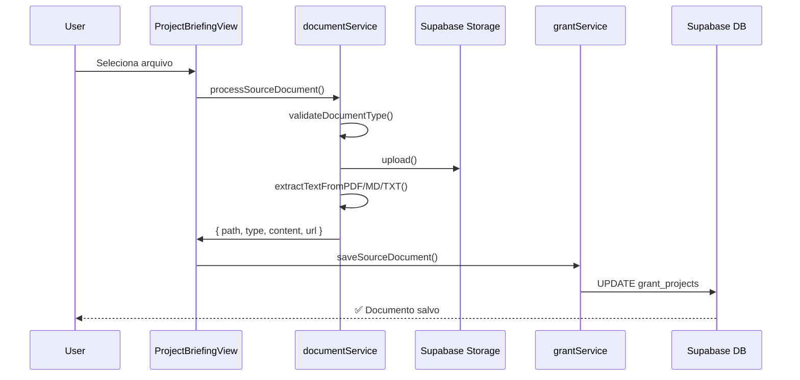
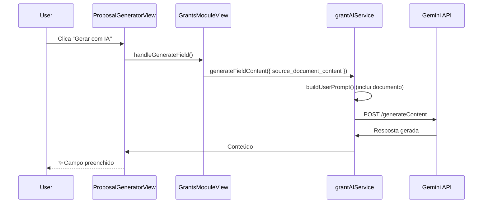

# Documento Fonte - Módulo Captação

## 📄 Visão Geral

Feature que permite aos usuários fazer upload de documentos fonte (.md, .pdf, .docx, .txt) contendo informações detalhadas do projeto. Este documento serve como **"fonte de verdade"** que a IA utiliza como referência principal ao gerar respostas para os campos do formulário de inscrição.

**Status:** ✅ Implementado (08/12/2025)

---

## 🎯 Objetivo

Aumentar a precisão e qualidade das respostas geradas pela IA, permitindo que o usuário forneça contexto detalhado através de documentos estruturados, em vez de apenas preencher o briefing manual.

### Casos de Uso:

1. **Empresa possui documento técnico do projeto** → Upload do PDF/DOCX com especificações completas
2. **Empresa já escreveu proposta anterior** → Reutilizar conteúdo em formato Markdown
3. **Informações extensas não cabem no briefing** → Upload de documento com detalhes completos
4. **Múltiplas propostas a partir da mesma base** → Um documento fonte, vários editais

---

## 🏗️ Arquitetura

### 1. **Storage Bucket (`project_sources`)**

```sql
-- Bucket criado em: 08/12/2025
{
  "id": "project_sources",
  "name": "project_sources",
  "public": false,
  "file_size_limit": 10485760, -- 10MB
  "allowed_mime_types": [
    "application/pdf",
    "text/markdown",
    "text/plain",
    "application/vnd.openxmlformats-officedocument.wordprocessingml.document",
    "application/msword"
  ]
}
```

### 2. **RLS Policies**

```sql
-- Policy: Upload
CREATE POLICY "Users can upload project source documents"
ON storage.objects FOR INSERT TO authenticated
WITH CHECK (
  bucket_id = 'project_sources'
  AND (storage.foldername(name))[1] = auth.uid()::text
);

-- Policy: Read
CREATE POLICY "Users can read their own project source documents"
ON storage.objects FOR SELECT TO authenticated
USING (
  bucket_id = 'project_sources'
  AND (storage.foldername(name))[1] = auth.uid()::text
);

-- Policy: Delete
CREATE POLICY "Users can delete their own project source documents"
ON storage.objects FOR DELETE TO authenticated
USING (
  bucket_id = 'project_sources'
  AND (storage.foldername(name))[1] = auth.uid()::text
);
```

**Estrutura de Path:**
```
{user_id}/{project_id}/{timestamp}_{filename}
```

### 3. **Database Schema**

Migration: `20251208_add_project_source_document.sql`

```sql
-- Campos adicionados à tabela grant_projects
ALTER TABLE grant_projects
ADD COLUMN source_document_path TEXT NULL,
ADD COLUMN source_document_type VARCHAR(10) NULL,
ADD COLUMN source_document_content TEXT NULL,
ADD COLUMN source_document_uploaded_at TIMESTAMPTZ NULL;

-- Índice para busca eficiente
CREATE INDEX idx_grant_projects_source_document
ON grant_projects(source_document_path)
WHERE source_document_path IS NOT NULL;

-- Função helper
CREATE FUNCTION has_source_document(project_record grant_projects)
RETURNS BOOLEAN AS $$
BEGIN
  RETURN project_record.source_document_path IS NOT NULL;
END;
$$ LANGUAGE plpgsql IMMUTABLE;
```

---

## 📁 Arquivos Implementados

### **Services**

#### `documentService.ts`
```typescript
export async function processSourceDocument(
  file: File,
  projectId: string
): Promise<ProcessedDocument> {
  // 1. Validar tipo (.md, .pdf, .docx, .txt)
  // 2. Upload para bucket 'project_sources'
  // 3. Extrair texto baseado no tipo
  // 4. Retornar { path, type, content, url }
}

export function validateDocumentType(file: File): {
  valid: boolean;
  type: DocumentType | null;
  error?: string;
}

async function extractTextFromPDF(file: File): Promise<string>
async function extractTextFromMarkdown(file: File): Promise<string>
async function extractTextFromTxt(file: File): Promise<string>
async function extractTextFromDocx(file: File): Promise<string> // TODO
```

**Suporte por Formato:**
| Formato | Status | Biblioteca | Observações |
|---------|--------|------------|-------------|
| `.md` | ✅ Completo | Nativa (file.text()) | Extração perfeita |
| `.pdf` | ✅ Completo | pdfjs-dist 5.4.449 | Mesmo usado no edital |
| `.txt` | ✅ Completo | Nativa (file.text()) | Extração perfeita |
| `.docx` | ⚠️ Parcial | N/A | Retorna mensagem TODO |

**Validações:**
- Tipo de arquivo: Apenas extensões suportadas
- Tamanho: Máximo 10MB
- Sanitização: Nome do arquivo normalizado

#### `grantService.ts` (Novas Funções)
```typescript
export async function saveSourceDocument(
  projectId: string,
  documentData: {
    path: string;
    type: string;
    content: string;
  }
): Promise<GrantProject>

export async function removeSourceDocument(
  projectId: string
): Promise<GrantProject>
```

#### `grantAIService.ts` (Modificações)

**Antes:**
```typescript
function buildUserPrompt(
  fieldConfig: FormField,
  briefing: BriefingData,
  previousResponses?: Record<string, string>
): string
```

**Depois:**
```typescript
function buildUserPrompt(
  fieldConfig: FormField,
  briefing: BriefingData,
  previousResponses?: Record<string, string>,
  sourceDocumentContent?: string | null  // 🆕 NOVO
): string {
  // ...

  if (sourceDocumentContent && sourceDocumentContent.trim().length > 0) {
    prompt += `**📄 DOCUMENTO FONTE DO PROJETO:**

${sourceDocumentContent.substring(0, 15000)}

⚠️ IMPORTANTE: Este é o documento oficial fornecido pelo usuário.
Use as informações acima como base principal para sua resposta.

`
  }

  // ... restante do briefing
}
```

**Priorização na IA:**
1. **Documento Fonte** (se disponível) - Máxima prioridade
2. **Briefing Manual** - Complementar
3. **Respostas Anteriores** - Coesão
4. **Critérios do Edital** - Maximizar pontuação

### **Components**

#### `ProjectBriefingView.tsx`

**Estado Adicionado:**
```typescript
interface SourceDocumentState {
  path: string | null;
  type: string | null;
  fileName: string | null;
  isUploading: boolean;
}

const [sourceDocument, setSourceDocument] = useState<SourceDocumentState>({
  path: sourceDocumentPath || null,
  type: sourceDocumentType || null,
  fileName: sourceDocumentPath ? sourceDocumentPath.split('/').pop() : null,
  isUploading: false
});
```

**Handlers:**
```typescript
const handleSourceDocumentUpload = async (event: React.ChangeEvent<HTMLInputElement>) => {
  // 1. Validar tipo
  // 2. Upload e extração (processSourceDocument)
  // 3. Salvar no banco (saveSourceDocument)
  // 4. Atualizar estado local
}

const handleRemoveSourceDocument = async () => {
  // 1. Confirmação
  // 2. Remover do banco (removeSourceDocument)
  // 3. Limpar estado
}
```

**UI - Estado Vazio:**
```tsx
<div className="ceramic-card p-4">
  <Upload icon />
  <p>Documento Fonte (Opcional)</p>
  <p>Upload de .md, .pdf, .docx ou .txt com informações do projeto</p>
  <button>Escolher Arquivo</button>
</div>
```

**UI - Com Documento:**
```tsx
<div className="ceramic-card p-4">
  <FileCheck icon (green) />
  <p>Documento Fonte Carregado</p>
  <p>{fileName} ({type})</p>
  <button onClick={handleRemove}>X</button>
</div>
```

### **Types**

#### `types.ts` (Modificações)

```typescript
export interface GrantProject {
  // ... campos existentes

  // Source Document (Fonte de Verdade)
  source_document_path?: string | null;
  source_document_type?: string | null;
  source_document_content?: string | null;
  source_document_uploaded_at?: string | null;
}

export interface GenerateFieldPayload {
  field_id: string;
  edital_text: string;
  evaluation_criteria: EvaluationCriterion[];
  field_config: FormField;
  briefing: BriefingData;
  previous_responses?: Record<string, string>;
  source_document_content?: string | null; // 🆕 NOVO
}
```

---

## 🔄 Fluxo Completo

### **1. Upload do Documento**



### **2. Geração de Resposta (Com Documento Fonte)**



---

## 🧪 Como Testar

### **Pré-requisitos:**
1. ✅ Bucket `project_sources` criado
2. ✅ RLS policies aplicadas
3. ⏳ Migration aplicada (aguardando criação das tabelas grant_*)
4. ✅ `VITE_GEMINI_API_KEY` configurada

### **Teste 1: Upload de PDF**
1. Criar um projeto no módulo de captação
2. Abrir "Briefing do Projeto"
3. Clicar em "Escolher Arquivo"
4. Selecionar um PDF (máx 10MB)
5. ✅ Aguardar upload e extração (spinner "Processando...")
6. ✅ Verificar card verde com nome do arquivo
7. ✅ Verificar no banco: `source_document_content` populado

### **Teste 2: Upload de Markdown**
1. Criar arquivo `projeto.md` com conteúdo
2. Fazer upload
3. ✅ Verificar extração completa do texto

### **Teste 3: Remoção de Documento**
1. Com documento carregado, clicar no ícone "X"
2. ✅ Confirmar diálogo
3. ✅ Verificar que card volta ao estado vazio
4. ✅ Verificar no banco: campos `source_document_*` = NULL

### **Teste 4: Geração com IA (Com Documento)**
1. Fazer upload de documento fonte
2. Preencher briefing (opcional)
3. Avançar para "Geração de Proposta"
4. Clicar "Gerar com IA" em algum campo
5. ✅ Verificar que resposta usa informações do documento
6. ✅ Comparar com geração sem documento (deve ser mais precisa)

### **Teste 5: Geração sem Documento**
1. Não fazer upload de documento
2. Apenas preencher briefing
3. Gerar campo com IA
4. ✅ Funciona normalmente (backward compatible)

---

## 🐛 Troubleshooting

### **Erro: "Tipo de arquivo não suportado"**
- **Causa:** Extensão não está em [.md, .pdf, .docx, .txt]
- **Solução:** Converter arquivo ou usar formato suportado

### **Erro: "Arquivo muito grande"**
- **Causa:** Arquivo > 10MB
- **Solução:** Comprimir PDF ou dividir conteúdo

### **Erro: "Falha no upload"**
- **Causa:** RLS policy bloqueando ou bucket inexistente
- **Solução:** Verificar que bucket `project_sources` existe e policies estão aplicadas

### **Erro: "Falha ao processar PDF"**
- **Causa:** PDF corrompido ou com senha
- **Solução:** Usar PDF válido e sem proteção

### **DOCX não extrai texto**
- **Comportamento Esperado:** Retorna mensagem de TODO
- **Solução Futura:** Implementar com biblioteca `mammoth` ou similar

---

## 📊 Métricas e Logs

### **Logs Importantes:**

```typescript
// Upload
console.log('[Document] Uploading:', fileName);
console.log('[Document] Processing complete:', { path, type, contentLength });

// IA Generation
console.log('[AI] Source document detected, length:', content.length);
console.log('[AI] Generating field with source document context');
```

### **Dados no Supabase:**

```sql
-- Verificar documentos carregados
SELECT
  id,
  project_name,
  source_document_type,
  LENGTH(source_document_content) as content_length,
  source_document_uploaded_at
FROM grant_projects
WHERE source_document_path IS NOT NULL;

-- Estatísticas
SELECT
  source_document_type,
  COUNT(*) as total,
  AVG(LENGTH(source_document_content)) as avg_length
FROM grant_projects
WHERE source_document_path IS NOT NULL
GROUP BY source_document_type;
```

---

## 🚀 Próximos Passos

### **Melhorias Planejadas:**

1. **✅ Completar Extração DOCX**
   - Integrar biblioteca `mammoth` ou `docx-preview`
   - Preservar formatação básica

2. **📊 Preview do Documento**
   - Mostrar preview do conteúdo extraído
   - Modal com texto formatado
   - Permitir edição manual do texto extraído

3. **🔄 Versionamento de Documentos**
   - Permitir múltiplas versões do documento
   - Histórico de uploads
   - Comparação entre versões

4. **🎨 Suporte a Imagens (OCR)**
   - Extrair texto de imagens dentro de PDFs
   - Integrar Tesseract.js ou Gemini Vision API

5. **📝 Validação de Conteúdo**
   - IA verifica se documento tem informações relevantes
   - Sugere seções faltantes

6. **🔐 Compartilhamento Seguro**
   - Permitir compartilhar documento entre membros do projeto
   - RLS policy considerando `project_members`

---

## ✅ Checklist de Deployment

- [x] Bucket `project_sources` criado
- [x] RLS policies aplicadas
- [x] Migration preparada (`20251208_add_project_source_document.sql`)
- [ ] Migration aplicada (aguardando tabelas grant_*)
- [x] Service layer implementado
- [x] UI implementada
- [x] IA integrada
- [x] Types atualizados
- [x] Build passando
- [ ] Testes E2E (a fazer)
- [x] Documentação completa

---

## 📚 Referências

- **Migration:** `supabase/migrations/20251208_add_project_source_document.sql`
- **Service:** `src/modules/grants/services/documentService.ts`
- **AI Integration:** `src/modules/grants/services/grantAIService.ts`
- **UI Component:** `src/modules/grants/components/ProjectBriefingView.tsx`
- **Types:** `src/modules/grants/types.ts`

---

**Implementado por:** Claude Code
**Data:** 08/12/2025
**Versão:** 1.0.0
**Status:** ✅ Pronto para uso (aguardando tabelas grant_*)
