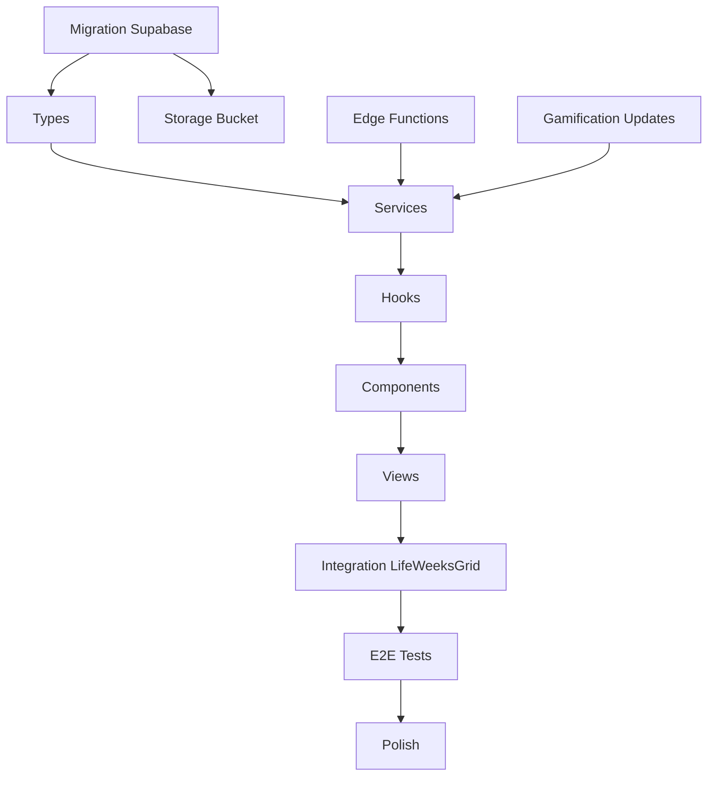

# Plano de Implementacao: Reformulacao Completa do Card "Minha Jornada"

> **Data**: 2025-12-06
> **Arquiteto**: Master Architect Agent
> **Duracao Estimada**: 10-14 dias
> **Branch**: `feature/journey-redesign`

---

## Sumario Executivo

Este documento detalha a transformacao do card "Minha Jornada" de um simples grid de semanas para o **nucleo central de consciencia do usuario** - um diario de vida inteligente com captura de momentos, analise de sentimentos em tempo real, resumos semanais automaticos e sistema de gamificacao proprio (Consciousness Points - CP).

---

## Pre-requisitos Verificados

| Componente | Status | Localizacao |
|------------|--------|-------------|
| GeminiClient | OK | `src/lib/gemini/client.ts` |
| Edge Functions | OK | `supabase/functions/gemini-chat/` |
| Gamification Service | OK | `src/services/gamificationService.ts` |
| Supabase RLS | OK | Migrations existentes |
| Framer Motion | OK | Ja instalado |
| Recharts | OK | Ja instalado |

---

## Arquitetura de Arquivos Final

```
src/modules/journey/
├── types/
│   ├── index.ts                    # Re-exports
│   ├── moment.ts                   # Moment, MomentType, MomentCapture
│   ├── sentiment.ts                # SentimentAnalysis, EmotionType
│   ├── weeklySummary.ts           # WeeklySummary, EmotionalTrend
│   └── consciousness.ts           # CP, Level, Question
│
├── services/
│   ├── momentService.ts           # CRUD de momentos
│   ├── weeklySummaryService.ts    # Geracao/fetch resumos
│   ├── consciousnessPointsService.ts # CP management
│   ├── questionService.ts         # Perguntas rotativas
│   └── sentimentService.ts        # Analise de sentimento
│
├── hooks/
│   ├── useMoments.ts              # Lista, cria, atualiza momentos
│   ├── useWeeklySummary.ts        # Busca resumo semanal
│   ├── useConsciousnessPoints.ts  # CP, nivel, streak
│   ├── useAudioRecorder.ts        # Gravacao com Web Audio API
│   ├── useSentimentAnalysis.ts    # Analise em tempo real
│   └── useDailyQuestion.ts        # Pergunta do dia
│
├── components/
│   ├── capture/
│   │   ├── MomentCapture.tsx      # Container principal
│   │   ├── AudioRecorder.tsx      # Gravacao com waveform
│   │   ├── EmotionPicker.tsx      # Emoji wheel selector
│   │   └── TagInput.tsx           # Tags com autocomplete
│   │
│   ├── timeline/
│   │   ├── MomentTimeline.tsx     # Lista virtual infinita
│   │   ├── MomentCard.tsx         # Card individual
│   │   ├── TimelineFilters.tsx    # Filtros de periodo/emocao/tag
│   │   └── WeekSeparator.tsx      # Divisor com resumo
│   │
│   ├── insights/
│   │   ├── WeeklySummaryCard.tsx  # Card de resumo
│   │   ├── EmotionalGraph.tsx     # Grafico oscilacao
│   │   ├── PatternDetector.tsx    # Padroes identificados
│   │   └── DailyQuestionCard.tsx  # Pergunta do dia
│   │
│   └── gamification/
│       ├── ConsciousnessScore.tsx # Score CP com nivel
│       ├── LevelBadge.tsx         # Badge de nivel
│       ├── StreakIndicator.tsx    # Indicador de streak
│       └── PointsAnimation.tsx    # Animacao +CP
│
└── views/
    ├── JourneyCardCollapsed.tsx   # Estado colapsado (dashboard)
    └── JourneyFullScreen.tsx      # Estado expandido (tela cheia)
```

---

## Fase 1: Database Schema e Backend (Dias 1-2)

### 1.1 Migration Supabase

**Arquivo**: `supabase/migrations/20251207_journey_moments.sql`

**Delegacao**: Backend Architect Agent

```sql
-- =====================================================
-- JOURNEY MODULE: MOMENTS & CONSCIOUSNESS
-- =====================================================

-- 1. Moments Table
CREATE TABLE IF NOT EXISTS moments (
  id UUID PRIMARY KEY DEFAULT uuid_generate_v4(),
  user_id UUID REFERENCES auth.users(id) ON DELETE CASCADE NOT NULL,

  -- Content
  type TEXT NOT NULL CHECK (type IN ('audio', 'text', 'mixed')),
  content TEXT, -- Texto ou transcricao
  audio_url TEXT, -- URL no Supabase Storage
  audio_duration_seconds INTEGER,

  -- Emotion & Sentiment
  emotion TEXT, -- Emocao selecionada pelo usuario
  sentiment_score DECIMAL(4,3), -- -1.000 a 1.000
  sentiment_label TEXT CHECK (sentiment_label IN ('very_positive', 'positive', 'neutral', 'negative', 'very_negative')),
  detected_emotions TEXT[], -- Array de emocoes detectadas
  energy_level INTEGER CHECK (energy_level BETWEEN 0 AND 100),

  -- Metadata
  tags TEXT[] DEFAULT '{}',
  location TEXT, -- Cidade/local opcional
  week_number INTEGER, -- Semana de vida (calculada)

  -- AI Processing
  embedding VECTOR(1536), -- Para busca semantica
  ai_insights JSONB, -- Insights gerados
  transcription_status TEXT DEFAULT 'pending' CHECK (transcription_status IN ('pending', 'processing', 'completed', 'failed')),

  -- Timestamps
  moment_date DATE NOT NULL DEFAULT CURRENT_DATE,
  created_at TIMESTAMPTZ DEFAULT NOW(),
  updated_at TIMESTAMPTZ DEFAULT NOW()
);

-- 2. Weekly Summaries Table
CREATE TABLE IF NOT EXISTS weekly_summaries (
  id UUID PRIMARY KEY DEFAULT uuid_generate_v4(),
  user_id UUID REFERENCES auth.users(id) ON DELETE CASCADE NOT NULL,

  -- Period
  week_number INTEGER NOT NULL,
  year INTEGER NOT NULL,
  period_start DATE NOT NULL,
  period_end DATE NOT NULL,

  -- Summary Content
  emotional_trend TEXT CHECK (emotional_trend IN ('ascending', 'stable', 'descending', 'volatile')),
  dominant_emotions TEXT[] DEFAULT '{}',
  average_sentiment DECIMAL(4,3),

  -- AI Generated
  summary_text TEXT, -- Resumo em texto
  key_moments UUID[] DEFAULT '{}', -- IDs dos momentos destacados
  insights TEXT[] DEFAULT '{}', -- Insights gerados
  suggested_focus TEXT, -- Sugestao para proxima semana
  patterns_detected JSONB, -- Padroes identificados

  -- User Reflection
  user_reflection TEXT, -- Reflexao adicional do usuario

  -- Status
  status TEXT DEFAULT 'pending' CHECK (status IN ('pending', 'generating', 'completed', 'failed')),

  -- Timestamps
  generated_at TIMESTAMPTZ,
  created_at TIMESTAMPTZ DEFAULT NOW(),
  updated_at TIMESTAMPTZ DEFAULT NOW(),

  UNIQUE(user_id, week_number, year)
);

-- 3. Daily Questions Table
CREATE TABLE IF NOT EXISTS daily_questions (
  id UUID PRIMARY KEY DEFAULT uuid_generate_v4(),

  question_text TEXT NOT NULL,
  question_text_en TEXT, -- Versao em ingles
  category TEXT NOT NULL CHECK (category IN ('reflection', 'gratitude', 'energy', 'learning', 'goals', 'relationships')),

  -- Config
  is_active BOOLEAN DEFAULT TRUE,
  weight INTEGER DEFAULT 1, -- Peso para rotacao

  created_at TIMESTAMPTZ DEFAULT NOW()
);

-- 4. Question Responses Table
CREATE TABLE IF NOT EXISTS question_responses (
  id UUID PRIMARY KEY DEFAULT uuid_generate_v4(),
  user_id UUID REFERENCES auth.users(id) ON DELETE CASCADE NOT NULL,
  question_id UUID REFERENCES daily_questions(id) ON DELETE CASCADE NOT NULL,

  response_text TEXT NOT NULL,
  sentiment_score DECIMAL(4,3),

  -- Gamification
  cp_awarded INTEGER DEFAULT 10,

  responded_at TIMESTAMPTZ DEFAULT NOW(),

  UNIQUE(user_id, question_id, DATE(responded_at))
);

-- 5. Consciousness Points Log Table
CREATE TABLE IF NOT EXISTS consciousness_points_log (
  id UUID PRIMARY KEY DEFAULT uuid_generate_v4(),
  user_id UUID REFERENCES auth.users(id) ON DELETE CASCADE NOT NULL,

  points INTEGER NOT NULL,
  reason TEXT NOT NULL CHECK (reason IN (
    'moment_created',
    'daily_question_answered',
    'weekly_reflection',
    'streak_7_days',
    'streak_30_days',
    'first_moment',
    'consistent_week'
  )),

  -- Reference
  reference_id UUID, -- ID do momento/resposta/etc
  reference_type TEXT, -- 'moment', 'question_response', etc

  created_at TIMESTAMPTZ DEFAULT NOW()
);

-- 6. User Consciousness Stats (extends user_stats)
ALTER TABLE user_stats ADD COLUMN IF NOT EXISTS consciousness_points INTEGER DEFAULT 0;
ALTER TABLE user_stats ADD COLUMN IF NOT EXISTS consciousness_level INTEGER DEFAULT 1;
ALTER TABLE user_stats ADD COLUMN IF NOT EXISTS journey_streak INTEGER DEFAULT 0;
ALTER TABLE user_stats ADD COLUMN IF NOT EXISTS journey_longest_streak INTEGER DEFAULT 0;
ALTER TABLE user_stats ADD COLUMN IF NOT EXISTS last_moment_date DATE;
ALTER TABLE user_stats ADD COLUMN IF NOT EXISTS total_moments INTEGER DEFAULT 0;

-- =====================================================
-- RLS POLICIES
-- =====================================================

-- Moments
ALTER TABLE moments ENABLE ROW LEVEL SECURITY;

CREATE POLICY "Users can view own moments"
  ON moments FOR SELECT
  USING (auth.uid() = user_id);

CREATE POLICY "Users can create own moments"
  ON moments FOR INSERT
  WITH CHECK (auth.uid() = user_id);

CREATE POLICY "Users can update own moments"
  ON moments FOR UPDATE
  USING (auth.uid() = user_id);

CREATE POLICY "Users can delete own moments"
  ON moments FOR DELETE
  USING (auth.uid() = user_id);

-- Weekly Summaries
ALTER TABLE weekly_summaries ENABLE ROW LEVEL SECURITY;

CREATE POLICY "Users can view own summaries"
  ON weekly_summaries FOR SELECT
  USING (auth.uid() = user_id);

CREATE POLICY "Users can create own summaries"
  ON weekly_summaries FOR INSERT
  WITH CHECK (auth.uid() = user_id);

CREATE POLICY "Users can update own summaries"
  ON weekly_summaries FOR UPDATE
  USING (auth.uid() = user_id);

-- Daily Questions (public read)
ALTER TABLE daily_questions ENABLE ROW LEVEL SECURITY;

CREATE POLICY "Anyone can view active questions"
  ON daily_questions FOR SELECT
  USING (is_active = TRUE);

-- Question Responses
ALTER TABLE question_responses ENABLE ROW LEVEL SECURITY;

CREATE POLICY "Users can view own responses"
  ON question_responses FOR SELECT
  USING (auth.uid() = user_id);

CREATE POLICY "Users can create own responses"
  ON question_responses FOR INSERT
  WITH CHECK (auth.uid() = user_id);

-- CP Log
ALTER TABLE consciousness_points_log ENABLE ROW LEVEL SECURITY;

CREATE POLICY "Users can view own CP log"
  ON consciousness_points_log FOR SELECT
  USING (auth.uid() = user_id);

CREATE POLICY "Users can create own CP log"
  ON consciousness_points_log FOR INSERT
  WITH CHECK (auth.uid() = user_id);

-- =====================================================
-- TRIGGERS
-- =====================================================

CREATE TRIGGER update_moments_updated_at
  BEFORE UPDATE ON moments
  FOR EACH ROW
  EXECUTE FUNCTION update_updated_at_column();

CREATE TRIGGER update_weekly_summaries_updated_at
  BEFORE UPDATE ON weekly_summaries
  FOR EACH ROW
  EXECUTE FUNCTION update_updated_at_column();

-- =====================================================
-- INDEXES
-- =====================================================

CREATE INDEX idx_moments_user_id ON moments(user_id);
CREATE INDEX idx_moments_moment_date ON moments(moment_date DESC);
CREATE INDEX idx_moments_week_number ON moments(week_number);
CREATE INDEX idx_moments_sentiment ON moments(sentiment_label);
CREATE INDEX idx_moments_tags ON moments USING GIN(tags);

CREATE INDEX idx_weekly_summaries_user_id ON weekly_summaries(user_id);
CREATE INDEX idx_weekly_summaries_period ON weekly_summaries(year, week_number);

CREATE INDEX idx_question_responses_user_id ON question_responses(user_id);
CREATE INDEX idx_consciousness_points_log_user_id ON consciousness_points_log(user_id);

-- =====================================================
-- SEED: DAILY QUESTIONS
-- =====================================================

INSERT INTO daily_questions (question_text, category, weight) VALUES
-- Reflection
('O que te trouxe energia essa semana?', 'reflection', 2),
('Se pudesse mudar uma coisa hoje, o que seria?', 'reflection', 1),
('Qual foi o momento mais significativo das ultimas 24 horas?', 'reflection', 2),
('O que voce aprendeu sobre si mesmo recentemente?', 'reflection', 1),

-- Gratitude
('Por quais 3 coisas voce e grato hoje?', 'gratitude', 2),
('Quem fez diferenca positiva na sua vida recentemente?', 'gratitude', 1),
('Qual pequena alegria passou despercebida ontem?', 'gratitude', 1),

-- Energy
('Como esta sua energia agora, de 1 a 10?', 'energy', 2),
('O que drenou sua energia ultimamente?', 'energy', 1),
('O que te recarrega quando esta esgotado?', 'energy', 1),

-- Learning
('Qual foi seu maior aprendizado recente?', 'learning', 2),
('O que voce gostaria de saber fazer melhor?', 'learning', 1),
('Que erro te ensinou algo valioso?', 'learning', 1),

-- Goals
('Qual e seu foco principal para esta semana?', 'goals', 2),
('Esta mais perto ou mais longe dos seus objetivos?', 'goals', 1),
('O que esta te impedindo de avancar?', 'goals', 1),

-- Relationships
('Com quem voce gostaria de se conectar mais?', 'relationships', 1),
('Qual conversa importante voce esta evitando?', 'relationships', 1),
('Como voce pode ser mais presente para alguem hoje?', 'relationships', 1)

ON CONFLICT DO NOTHING;
```

### 1.2 Storage Bucket para Audio

**Delegacao**: Backend Architect Agent

```sql
-- Criar bucket para audios de momentos
INSERT INTO storage.buckets (id, name, public)
VALUES ('journey-audio', 'journey-audio', false)
ON CONFLICT (id) DO NOTHING;

-- Policy: usuarios podem fazer upload do proprio audio
CREATE POLICY "Users can upload own audio"
ON storage.objects FOR INSERT
WITH CHECK (
  bucket_id = 'journey-audio' AND
  auth.uid()::text = (storage.foldername(name))[1]
);

-- Policy: usuarios podem ler proprio audio
CREATE POLICY "Users can read own audio"
ON storage.objects FOR SELECT
USING (
  bucket_id = 'journey-audio' AND
  auth.uid()::text = (storage.foldername(name))[1]
);

-- Policy: usuarios podem deletar proprio audio
CREATE POLICY "Users can delete own audio"
ON storage.objects FOR DELETE
USING (
  bucket_id = 'journey-audio' AND
  auth.uid()::text = (storage.foldername(name))[1]
);
```

### 1.3 Edge Function: analyze_moment_sentiment

**Arquivo**: `supabase/functions/analyze-moment-sentiment/index.ts`

**Delegacao**: AI Integration Agent

```typescript
import { serve } from 'https://deno.land/std@0.168.0/http/server.ts'
import { GoogleGenerativeAI } from 'npm:@google/generative-ai'

const corsHeaders = {
  'Access-Control-Allow-Origin': '*',
  'Access-Control-Allow-Headers': 'authorization, x-client-info, apikey, content-type',
}

serve(async (req) => {
  if (req.method === 'OPTIONS') {
    return new Response('ok', { headers: corsHeaders })
  }

  try {
    const { content, type } = await req.json()

    if (!content) {
      throw new Error('Content is required')
    }

    const genAI = new GoogleGenerativeAI(Deno.env.get('GEMINI_API_KEY')!)
    const model = genAI.getGenerativeModel({ model: 'gemini-2.0-flash-001' })

    const prompt = `Analise o seguinte texto e retorne um JSON com:

{
  "sentiment_score": number (-1 a 1, onde -1 e muito negativo e 1 e muito positivo),
  "sentiment_label": "very_positive" | "positive" | "neutral" | "negative" | "very_negative",
  "emotions": string[] (lista de emocoes detectadas em portugues, max 5),
  "energy_level": number (0 a 100),
  "triggers": string[] (gatilhos emocionais identificados, max 3),
  "brief_insight": string (insight de 1 frase sobre o estado emocional)
}

Texto para analise:
"${content}"

Responda APENAS com o JSON, sem markdown ou explicacoes.`

    const result = await model.generateContent(prompt)
    const responseText = result.response.text()

    // Parse JSON (remove possivel markdown)
    const cleanJson = responseText.replace(/```json\n?|\n?```/g, '').trim()
    const analysis = JSON.parse(cleanJson)

    return new Response(JSON.stringify(analysis), {
      headers: { ...corsHeaders, 'Content-Type': 'application/json' },
      status: 200,
    })
  } catch (error) {
    return new Response(JSON.stringify({ error: error.message }), {
      headers: { ...corsHeaders, 'Content-Type': 'application/json' },
      status: 500,
    })
  }
})
```

### 1.4 Edge Function: generate_weekly_summary

**Arquivo**: `supabase/functions/generate-weekly-summary/index.ts`

**Delegacao**: AI Integration Agent

```typescript
import { serve } from 'https://deno.land/std@0.168.0/http/server.ts'
import { createClient } from 'npm:@supabase/supabase-js'
import { GoogleGenerativeAI } from 'npm:@google/generative-ai'

const corsHeaders = {
  'Access-Control-Allow-Origin': '*',
  'Access-Control-Allow-Headers': 'authorization, x-client-info, apikey, content-type',
}

serve(async (req) => {
  if (req.method === 'OPTIONS') {
    return new Response('ok', { headers: corsHeaders })
  }

  try {
    const authHeader = req.headers.get('Authorization')!
    const supabase = createClient(
      Deno.env.get('SUPABASE_URL')!,
      Deno.env.get('SUPABASE_ANON_KEY')!,
      { global: { headers: { Authorization: authHeader } } }
    )

    const { data: { user } } = await supabase.auth.getUser()
    if (!user) throw new Error('Unauthorized')

    const { week_number, year } = await req.json()

    // Buscar momentos da semana
    const startDate = getWeekStart(week_number, year)
    const endDate = getWeekEnd(week_number, year)

    const { data: moments, error: momentsError } = await supabase
      .from('moments')
      .select('*')
      .eq('user_id', user.id)
      .gte('moment_date', startDate)
      .lte('moment_date', endDate)
      .order('moment_date', { ascending: true })

    if (momentsError) throw momentsError
    if (!moments || moments.length === 0) {
      return new Response(JSON.stringify({
        error: 'No moments found for this week'
      }), {
        headers: { ...corsHeaders, 'Content-Type': 'application/json' },
        status: 400,
      })
    }

    // Gerar resumo com Gemini
    const genAI = new GoogleGenerativeAI(Deno.env.get('GEMINI_API_KEY')!)
    const model = genAI.getGenerativeModel({ model: 'gemini-2.0-flash-001' })

    const momentsText = moments.map(m =>
      `[${m.moment_date}] Emocao: ${m.emotion || 'N/A'} | Sentimento: ${m.sentiment_label || 'N/A'}\n"${m.content}"`
    ).join('\n\n')

    const prompt = `Voce e um coach de autoconsciencia analisando os momentos registrados de uma pessoa durante a semana.

Momentos da semana (${startDate} a ${endDate}):

${momentsText}

Gere um resumo semanal em JSON:

{
  "emotional_trend": "ascending" | "stable" | "descending" | "volatile",
  "dominant_emotions": string[] (top 3 emocoes mais frequentes),
  "average_sentiment": number (-1 a 1),
  "summary_text": string (resumo de 2-3 paragrafos, empatico e perspicaz),
  "insights": string[] (3-5 insights sobre padroes observados),
  "suggested_focus": string (uma sugestao para a proxima semana),
  "patterns_detected": {
    "time_patterns": string | null (ex: "mais energetico pela manha"),
    "emotion_triggers": string[] (gatilhos recorrentes),
    "growth_areas": string[] (areas de crescimento)
  },
  "key_moment_indices": number[] (indices dos 2-3 momentos mais significativos)
}

Seja empatico, perspicaz e construtivo. Evite julgamentos.
Responda APENAS com o JSON.`

    const result = await model.generateContent(prompt)
    const responseText = result.response.text()
    const cleanJson = responseText.replace(/```json\n?|\n?```/g, '').trim()
    const summary = JSON.parse(cleanJson)

    // Extrair IDs dos momentos destacados
    const keyMomentIds = (summary.key_moment_indices || [])
      .filter((i: number) => moments[i])
      .map((i: number) => moments[i].id)

    // Salvar resumo no banco
    const { data: savedSummary, error: saveError } = await supabase
      .from('weekly_summaries')
      .upsert({
        user_id: user.id,
        week_number,
        year,
        period_start: startDate,
        period_end: endDate,
        emotional_trend: summary.emotional_trend,
        dominant_emotions: summary.dominant_emotions,
        average_sentiment: summary.average_sentiment,
        summary_text: summary.summary_text,
        key_moments: keyMomentIds,
        insights: summary.insights,
        suggested_focus: summary.suggested_focus,
        patterns_detected: summary.patterns_detected,
        status: 'completed',
        generated_at: new Date().toISOString(),
      }, { onConflict: 'user_id,week_number,year' })
      .select()
      .single()

    if (saveError) throw saveError

    return new Response(JSON.stringify(savedSummary), {
      headers: { ...corsHeaders, 'Content-Type': 'application/json' },
      status: 200,
    })
  } catch (error) {
    return new Response(JSON.stringify({ error: error.message }), {
      headers: { ...corsHeaders, 'Content-Type': 'application/json' },
      status: 500,
    })
  }
})

function getWeekStart(weekNumber: number, year: number): string {
  const jan1 = new Date(year, 0, 1)
  const days = (weekNumber - 1) * 7
  const weekStart = new Date(jan1.getTime() + days * 24 * 60 * 60 * 1000)
  // Adjust to Monday
  const dayOfWeek = weekStart.getDay()
  const diff = dayOfWeek === 0 ? -6 : 1 - dayOfWeek
  weekStart.setDate(weekStart.getDate() + diff)
  return weekStart.toISOString().split('T')[0]
}

function getWeekEnd(weekNumber: number, year: number): string {
  const start = new Date(getWeekStart(weekNumber, year))
  start.setDate(start.getDate() + 6)
  return start.toISOString().split('T')[0]
}
```

---

## Fase 2: Types e Services (Dias 2-3)

### 2.1 Types

**Delegacao**: General-purpose Agent (Frontend)

**Arquivo**: `src/modules/journey/types/moment.ts`

```typescript
export type MomentType = 'audio' | 'text' | 'mixed'

export type SentimentLabel =
  | 'very_positive'
  | 'positive'
  | 'neutral'
  | 'negative'
  | 'very_negative'

export interface Moment {
  id: string
  user_id: string

  // Content
  type: MomentType
  content: string | null
  audio_url: string | null
  audio_duration_seconds: number | null

  // Emotion & Sentiment
  emotion: string | null
  sentiment_score: number | null
  sentiment_label: SentimentLabel | null
  detected_emotions: string[]
  energy_level: number | null

  // Metadata
  tags: string[]
  location: string | null
  week_number: number | null

  // AI
  ai_insights: Record<string, unknown> | null
  transcription_status: 'pending' | 'processing' | 'completed' | 'failed'

  // Timestamps
  moment_date: string
  created_at: string
  updated_at: string
}

export interface MomentInput {
  type: MomentType
  content?: string
  audio_url?: string
  audio_duration_seconds?: number
  emotion?: string
  tags?: string[]
  location?: string
}

export interface MomentFilters {
  startDate?: string
  endDate?: string
  sentiment?: SentimentLabel[]
  emotions?: string[]
  tags?: string[]
  type?: MomentType[]
}
```

**Arquivo**: `src/modules/journey/types/sentiment.ts`

```typescript
export interface SentimentAnalysis {
  sentiment_score: number // -1 to 1
  sentiment_label: 'very_positive' | 'positive' | 'neutral' | 'negative' | 'very_negative'
  emotions: string[]
  energy_level: number // 0-100
  triggers: string[]
  brief_insight: string
}
```

**Arquivo**: `src/modules/journey/types/weeklySummary.ts`

```typescript
export type EmotionalTrend = 'ascending' | 'stable' | 'descending' | 'volatile'

export interface WeeklySummary {
  id: string
  user_id: string

  // Period
  week_number: number
  year: number
  period_start: string
  period_end: string

  // Summary
  emotional_trend: EmotionalTrend | null
  dominant_emotions: string[]
  average_sentiment: number | null

  // AI Generated
  summary_text: string | null
  key_moments: string[] // UUIDs
  insights: string[]
  suggested_focus: string | null
  patterns_detected: {
    time_patterns?: string
    emotion_triggers?: string[]
    growth_areas?: string[]
  } | null

  // User
  user_reflection: string | null

  // Status
  status: 'pending' | 'generating' | 'completed' | 'failed'
  generated_at: string | null

  // Timestamps
  created_at: string
  updated_at: string
}
```

**Arquivo**: `src/modules/journey/types/consciousness.ts`

```typescript
export type CPReason =
  | 'moment_created'
  | 'daily_question_answered'
  | 'weekly_reflection'
  | 'streak_7_days'
  | 'streak_30_days'
  | 'first_moment'
  | 'consistent_week'

export const CP_REWARDS: Record<CPReason, number> = {
  moment_created: 5,
  daily_question_answered: 10,
  weekly_reflection: 20,
  streak_7_days: 50,
  streak_30_days: 200,
  first_moment: 25,
  consistent_week: 30,
}

export type ConsciousnessLevel =
  | 'observer'      // 0-100 CP
  | 'aware'         // 100-500 CP
  | 'reflective'    // 500-1500 CP
  | 'integrated'    // 1500-5000 CP
  | 'master'        // 5000+ CP

export const LEVEL_THRESHOLDS: Record<ConsciousnessLevel, number> = {
  observer: 0,
  aware: 100,
  reflective: 500,
  integrated: 1500,
  master: 5000,
}

export interface ConsciousnessStats {
  total_cp: number
  level: ConsciousnessLevel
  level_progress: number // 0-100 percentage
  journey_streak: number
  longest_streak: number
  total_moments: number
  last_moment_date: string | null
}

export interface DailyQuestion {
  id: string
  question_text: string
  category: 'reflection' | 'gratitude' | 'energy' | 'learning' | 'goals' | 'relationships'
}

export interface QuestionResponse {
  id: string
  user_id: string
  question_id: string
  response_text: string
  sentiment_score: number | null
  cp_awarded: number
  responded_at: string
}
```

### 2.2 Services

**Arquivo**: `src/modules/journey/services/momentService.ts`

**Delegacao**: General-purpose Agent (Frontend)

```typescript
import { supabase } from '@/services/supabaseClient'
import { GeminiClient } from '@/lib/gemini'
import type { Moment, MomentInput, MomentFilters, SentimentAnalysis } from '../types'

const gemini = GeminiClient.getInstance()

export const momentService = {
  /**
   * Create a new moment
   */
  async create(userId: string, input: MomentInput): Promise<Moment> {
    // 1. Analyze sentiment if content exists
    let sentimentData: Partial<Moment> = {}
    if (input.content) {
      try {
        const analysis = await this.analyzeSentiment(input.content)
        sentimentData = {
          sentiment_score: analysis.sentiment_score,
          sentiment_label: analysis.sentiment_label,
          detected_emotions: analysis.emotions,
          energy_level: analysis.energy_level,
          ai_insights: { triggers: analysis.triggers, insight: analysis.brief_insight },
        }
      } catch (error) {
        console.error('[MomentService] Sentiment analysis failed:', error)
      }
    }

    // 2. Calculate week number from birth date
    const weekNumber = await this.calculateWeekNumber(userId)

    // 3. Insert moment
    const { data, error } = await supabase
      .from('moments')
      .insert({
        user_id: userId,
        ...input,
        ...sentimentData,
        week_number: weekNumber,
        transcription_status: input.audio_url ? 'pending' : 'completed',
      })
      .select()
      .single()

    if (error) throw error
    return data as Moment
  },

  /**
   * List moments with filters
   */
  async list(userId: string, filters?: MomentFilters, limit = 50, offset = 0): Promise<Moment[]> {
    let query = supabase
      .from('moments')
      .select('*')
      .eq('user_id', userId)
      .order('moment_date', { ascending: false })
      .order('created_at', { ascending: false })
      .range(offset, offset + limit - 1)

    if (filters?.startDate) {
      query = query.gte('moment_date', filters.startDate)
    }
    if (filters?.endDate) {
      query = query.lte('moment_date', filters.endDate)
    }
    if (filters?.sentiment?.length) {
      query = query.in('sentiment_label', filters.sentiment)
    }
    if (filters?.tags?.length) {
      query = query.overlaps('tags', filters.tags)
    }
    if (filters?.type?.length) {
      query = query.in('type', filters.type)
    }

    const { data, error } = await query
    if (error) throw error
    return data as Moment[]
  },

  /**
   * Get moments for a specific week
   */
  async getByWeek(userId: string, weekNumber: number, year: number): Promise<Moment[]> {
    const { data, error } = await supabase
      .from('moments')
      .select('*')
      .eq('user_id', userId)
      .eq('week_number', weekNumber)
      .order('moment_date', { ascending: true })

    if (error) throw error
    return data as Moment[]
  },

  /**
   * Get sentiment analysis from Gemini
   */
  async analyzeSentiment(content: string): Promise<SentimentAnalysis> {
    const response = await gemini.call({
      action: 'analyze_sentiment' as any, // Add to types
      payload: { content },
      model: 'fast',
    })

    return response.result as SentimentAnalysis
  },

  /**
   * Calculate week number from user's birth date
   */
  async calculateWeekNumber(userId: string): Promise<number | null> {
    const { data: profile } = await supabase
      .from('profiles')
      .select('birth_date')
      .eq('id', userId)
      .single()

    if (!profile?.birth_date) return null

    const birth = new Date(profile.birth_date)
    const today = new Date()
    const diffMs = today.getTime() - birth.getTime()
    const weekNumber = Math.floor(diffMs / (1000 * 60 * 60 * 24 * 7))

    return weekNumber
  },

  /**
   * Delete a moment
   */
  async delete(momentId: string): Promise<void> {
    const { error } = await supabase
      .from('moments')
      .delete()
      .eq('id', momentId)

    if (error) throw error
  },

  /**
   * Update a moment
   */
  async update(momentId: string, updates: Partial<MomentInput>): Promise<Moment> {
    const { data, error } = await supabase
      .from('moments')
      .update(updates)
      .eq('id', momentId)
      .select()
      .single()

    if (error) throw error
    return data as Moment
  },

  /**
   * Get sentiment stats for last N days
   */
  async getSentimentHistory(userId: string, days = 7): Promise<{ date: string; score: number }[]> {
    const startDate = new Date()
    startDate.setDate(startDate.getDate() - days)

    const { data, error } = await supabase
      .from('moments')
      .select('moment_date, sentiment_score')
      .eq('user_id', userId)
      .gte('moment_date', startDate.toISOString().split('T')[0])
      .not('sentiment_score', 'is', null)
      .order('moment_date', { ascending: true })

    if (error) throw error

    // Aggregate by date
    const byDate = (data || []).reduce((acc, m) => {
      const date = m.moment_date
      if (!acc[date]) acc[date] = { total: 0, count: 0 }
      acc[date].total += m.sentiment_score
      acc[date].count++
      return acc
    }, {} as Record<string, { total: number; count: number }>)

    return Object.entries(byDate).map(([date, { total, count }]) => ({
      date,
      score: total / count,
    }))
  },
}
```

**Arquivo**: `src/modules/journey/services/consciousnessPointsService.ts`

**Delegacao**: Gamification Agent

```typescript
import { supabase } from '@/services/supabaseClient'
import { notificationService } from '@/services/notificationService'
import type {
  CPReason,
  ConsciousnessLevel,
  ConsciousnessStats,
  CP_REWARDS,
  LEVEL_THRESHOLDS
} from '../types'

export const consciousnessPointsService = {
  /**
   * Award CP to user
   */
  async awardCP(
    userId: string,
    reason: CPReason,
    referenceId?: string,
    referenceType?: string
  ): Promise<{ newTotal: number; leveledUp: boolean; newLevel?: ConsciousnessLevel }> {
    const points = CP_REWARDS[reason]

    // 1. Log the CP award
    await supabase.from('consciousness_points_log').insert({
      user_id: userId,
      points,
      reason,
      reference_id: referenceId,
      reference_type: referenceType,
    })

    // 2. Update user stats
    const { data: stats } = await supabase
      .from('user_stats')
      .select('consciousness_points, consciousness_level')
      .eq('user_id', userId)
      .single()

    const currentCP = stats?.consciousness_points || 0
    const currentLevel = stats?.consciousness_level || 1
    const newTotal = currentCP + points

    // 3. Calculate new level
    const newLevel = this.calculateLevel(newTotal)
    const leveledUp = newLevel !== this.getLevelName(currentLevel)

    // 4. Update stats
    await supabase
      .from('user_stats')
      .upsert({
        user_id: userId,
        consciousness_points: newTotal,
        consciousness_level: this.getLevelNumber(newLevel),
        updated_at: new Date().toISOString(),
      }, { onConflict: 'user_id' })

    // 5. Notify on level up
    if (leveledUp) {
      notificationService.showAchievement(
        'Nivel de Consciencia!',
        `Voce alcancou o nivel ${this.getLevelDisplayName(newLevel)}`,
        this.getLevelEmoji(newLevel)
      )
    }

    return { newTotal, leveledUp, newLevel: leveledUp ? newLevel : undefined }
  },

  /**
   * Get user's consciousness stats
   */
  async getStats(userId: string): Promise<ConsciousnessStats> {
    const { data: stats } = await supabase
      .from('user_stats')
      .select(`
        consciousness_points,
        consciousness_level,
        journey_streak,
        journey_longest_streak,
        total_moments,
        last_moment_date
      `)
      .eq('user_id', userId)
      .single()

    const totalCP = stats?.consciousness_points || 0
    const level = this.calculateLevel(totalCP)
    const progress = this.calculateProgress(totalCP, level)

    return {
      total_cp: totalCP,
      level,
      level_progress: progress,
      journey_streak: stats?.journey_streak || 0,
      longest_streak: stats?.journey_longest_streak || 0,
      total_moments: stats?.total_moments || 0,
      last_moment_date: stats?.last_moment_date || null,
    }
  },

  /**
   * Update streak on moment creation
   */
  async updateStreak(userId: string): Promise<{ streak: number; awardedBonus: boolean }> {
    const today = new Date().toISOString().split('T')[0]

    const { data: stats } = await supabase
      .from('user_stats')
      .select('journey_streak, journey_longest_streak, last_moment_date')
      .eq('user_id', userId)
      .single()

    const lastDate = stats?.last_moment_date
    let currentStreak = stats?.journey_streak || 0
    let longestStreak = stats?.journey_longest_streak || 0
    let awardedBonus = false

    if (lastDate) {
      const yesterday = new Date()
      yesterday.setDate(yesterday.getDate() - 1)
      const yesterdayStr = yesterday.toISOString().split('T')[0]

      if (lastDate === today) {
        // Already registered today
      } else if (lastDate === yesterdayStr) {
        // Streak continues
        currentStreak++
      } else {
        // Streak broken
        currentStreak = 1
      }
    } else {
      currentStreak = 1
    }

    if (currentStreak > longestStreak) {
      longestStreak = currentStreak
    }

    // Check for streak milestones
    if (currentStreak === 7) {
      await this.awardCP(userId, 'streak_7_days')
      awardedBonus = true
    } else if (currentStreak === 30) {
      await this.awardCP(userId, 'streak_30_days')
      awardedBonus = true
    }

    // Update stats
    await supabase
      .from('user_stats')
      .upsert({
        user_id: userId,
        journey_streak: currentStreak,
        journey_longest_streak: longestStreak,
        last_moment_date: today,
        total_moments: (stats?.total_moments || 0) + 1,
        updated_at: new Date().toISOString(),
      }, { onConflict: 'user_id' })

    return { streak: currentStreak, awardedBonus }
  },

  // Helpers
  calculateLevel(cp: number): ConsciousnessLevel {
    if (cp >= LEVEL_THRESHOLDS.master) return 'master'
    if (cp >= LEVEL_THRESHOLDS.integrated) return 'integrated'
    if (cp >= LEVEL_THRESHOLDS.reflective) return 'reflective'
    if (cp >= LEVEL_THRESHOLDS.aware) return 'aware'
    return 'observer'
  },

  calculateProgress(cp: number, level: ConsciousnessLevel): number {
    const thresholds = Object.entries(LEVEL_THRESHOLDS)
    const currentIndex = thresholds.findIndex(([l]) => l === level)
    const currentThreshold = thresholds[currentIndex][1]
    const nextThreshold = thresholds[currentIndex + 1]?.[1] || currentThreshold * 2

    const cpInLevel = cp - currentThreshold
    const cpNeeded = nextThreshold - currentThreshold

    return Math.min(100, Math.round((cpInLevel / cpNeeded) * 100))
  },

  getLevelName(levelNumber: number): ConsciousnessLevel {
    const levels: ConsciousnessLevel[] = ['observer', 'aware', 'reflective', 'integrated', 'master']
    return levels[levelNumber - 1] || 'observer'
  },

  getLevelNumber(level: ConsciousnessLevel): number {
    const levels: ConsciousnessLevel[] = ['observer', 'aware', 'reflective', 'integrated', 'master']
    return levels.indexOf(level) + 1
  },

  getLevelDisplayName(level: ConsciousnessLevel): string {
    const names: Record<ConsciousnessLevel, string> = {
      observer: 'Observador',
      aware: 'Consciente',
      reflective: 'Reflexivo',
      integrated: 'Integrado',
      master: 'Mestre',
    }
    return names[level]
  },

  getLevelEmoji(level: ConsciousnessLevel): string {
    const emojis: Record<ConsciousnessLevel, string> = {
      observer: '👁️',
      aware: '💡',
      reflective: '🪞',
      integrated: '🧘',
      master: '✨',
    }
    return emojis[level]
  },
}
```

---

## Fase 3: Hooks (Dias 3-4)

### 3.1 useMoments Hook

**Arquivo**: `src/modules/journey/hooks/useMoments.ts`

**Delegacao**: General-purpose Agent (Frontend)

```typescript
import { useState, useEffect, useCallback } from 'react'
import { useAuth } from '@/hooks/useAuth'
import { momentService } from '../services/momentService'
import { consciousnessPointsService } from '../services/consciousnessPointsService'
import type { Moment, MomentInput, MomentFilters } from '../types'

export function useMoments(filters?: MomentFilters) {
  const { user } = useAuth()
  const [moments, setMoments] = useState<Moment[]>([])
  const [isLoading, setIsLoading] = useState(true)
  const [error, setError] = useState<Error | null>(null)
  const [hasMore, setHasMore] = useState(true)

  const PAGE_SIZE = 20

  const loadMoments = useCallback(async (offset = 0, append = false) => {
    if (!user?.id) return

    try {
      setIsLoading(true)
      const data = await momentService.list(user.id, filters, PAGE_SIZE, offset)

      if (append) {
        setMoments(prev => [...prev, ...data])
      } else {
        setMoments(data)
      }

      setHasMore(data.length === PAGE_SIZE)
    } catch (err) {
      setError(err as Error)
    } finally {
      setIsLoading(false)
    }
  }, [user?.id, filters])

  useEffect(() => {
    loadMoments()
  }, [loadMoments])

  const createMoment = async (input: MomentInput) => {
    if (!user?.id) throw new Error('Not authenticated')

    const moment = await momentService.create(user.id, input)

    // Award CP
    await consciousnessPointsService.awardCP(user.id, 'moment_created', moment.id, 'moment')

    // Update streak
    await consciousnessPointsService.updateStreak(user.id)

    // Prepend to list
    setMoments(prev => [moment, ...prev])

    return moment
  }

  const deleteMoment = async (momentId: string) => {
    await momentService.delete(momentId)
    setMoments(prev => prev.filter(m => m.id !== momentId))
  }

  const loadMore = () => {
    if (!hasMore || isLoading) return
    loadMoments(moments.length, true)
  }

  const refresh = () => {
    loadMoments(0, false)
  }

  return {
    moments,
    isLoading,
    error,
    hasMore,
    createMoment,
    deleteMoment,
    loadMore,
    refresh,
  }
}
```

### 3.2 useAudioRecorder Hook

**Arquivo**: `src/modules/journey/hooks/useAudioRecorder.ts`

**Delegacao**: General-purpose Agent (Frontend)

```typescript
import { useState, useRef, useCallback, useEffect } from 'react'
import { supabase } from '@/services/supabaseClient'
import { useAuth } from '@/hooks/useAuth'

interface AudioRecorderState {
  isRecording: boolean
  isPaused: boolean
  duration: number
  audioUrl: string | null
  audioBlob: Blob | null
  error: Error | null
  waveformData: number[]
}

const MAX_DURATION = 180 // 3 minutes

export function useAudioRecorder() {
  const { user } = useAuth()
  const [state, setState] = useState<AudioRecorderState>({
    isRecording: false,
    isPaused: false,
    duration: 0,
    audioUrl: null,
    audioBlob: null,
    error: null,
    waveformData: [],
  })

  const mediaRecorderRef = useRef<MediaRecorder | null>(null)
  const audioChunksRef = useRef<Blob[]>([])
  const analyserRef = useRef<AnalyserNode | null>(null)
  const animationFrameRef = useRef<number | null>(null)
  const timerRef = useRef<NodeJS.Timeout | null>(null)

  const updateWaveform = useCallback(() => {
    if (!analyserRef.current) return

    const dataArray = new Uint8Array(analyserRef.current.frequencyBinCount)
    analyserRef.current.getByteFrequencyData(dataArray)

    // Sample 32 points for visualization
    const samples: number[] = []
    const step = Math.floor(dataArray.length / 32)
    for (let i = 0; i < 32; i++) {
      samples.push(dataArray[i * step] / 255)
    }

    setState(prev => ({ ...prev, waveformData: samples }))
    animationFrameRef.current = requestAnimationFrame(updateWaveform)
  }, [])

  const startRecording = useCallback(async () => {
    try {
      const stream = await navigator.mediaDevices.getUserMedia({ audio: true })

      // Setup audio context for waveform
      const audioContext = new AudioContext()
      const source = audioContext.createMediaStreamSource(stream)
      const analyser = audioContext.createAnalyser()
      analyser.fftSize = 256
      source.connect(analyser)
      analyserRef.current = analyser

      // Setup media recorder
      const mediaRecorder = new MediaRecorder(stream, { mimeType: 'audio/webm' })
      mediaRecorderRef.current = mediaRecorder
      audioChunksRef.current = []

      mediaRecorder.ondataavailable = (event) => {
        if (event.data.size > 0) {
          audioChunksRef.current.push(event.data)
        }
      }

      mediaRecorder.onstop = () => {
        const blob = new Blob(audioChunksRef.current, { type: 'audio/webm' })
        const url = URL.createObjectURL(blob)
        setState(prev => ({
          ...prev,
          audioBlob: blob,
          audioUrl: url,
          isRecording: false,
          isPaused: false,
        }))

        // Cleanup
        stream.getTracks().forEach(track => track.stop())
        if (animationFrameRef.current) {
          cancelAnimationFrame(animationFrameRef.current)
        }
      }

      mediaRecorder.start(100) // Collect data every 100ms

      // Start timer
      timerRef.current = setInterval(() => {
        setState(prev => {
          if (prev.duration >= MAX_DURATION) {
            stopRecording()
            return prev
          }
          return { ...prev, duration: prev.duration + 1 }
        })
      }, 1000)

      // Start waveform animation
      updateWaveform()

      setState(prev => ({
        ...prev,
        isRecording: true,
        isPaused: false,
        duration: 0,
        error: null,
        audioUrl: null,
        audioBlob: null,
      }))
    } catch (err) {
      setState(prev => ({ ...prev, error: err as Error }))
    }
  }, [updateWaveform])

  const stopRecording = useCallback(() => {
    if (mediaRecorderRef.current?.state !== 'inactive') {
      mediaRecorderRef.current?.stop()
    }
    if (timerRef.current) {
      clearInterval(timerRef.current)
    }
    if (animationFrameRef.current) {
      cancelAnimationFrame(animationFrameRef.current)
    }
  }, [])

  const pauseRecording = useCallback(() => {
    if (mediaRecorderRef.current?.state === 'recording') {
      mediaRecorderRef.current.pause()
      if (timerRef.current) clearInterval(timerRef.current)
      if (animationFrameRef.current) cancelAnimationFrame(animationFrameRef.current)
      setState(prev => ({ ...prev, isPaused: true }))
    }
  }, [])

  const resumeRecording = useCallback(() => {
    if (mediaRecorderRef.current?.state === 'paused') {
      mediaRecorderRef.current.resume()

      timerRef.current = setInterval(() => {
        setState(prev => {
          if (prev.duration >= MAX_DURATION) {
            stopRecording()
            return prev
          }
          return { ...prev, duration: prev.duration + 1 }
        })
      }, 1000)

      updateWaveform()
      setState(prev => ({ ...prev, isPaused: false }))
    }
  }, [stopRecording, updateWaveform])

  const uploadAudio = useCallback(async (): Promise<string | null> => {
    if (!state.audioBlob || !user?.id) return null

    const fileName = `${user.id}/${Date.now()}.webm`

    const { error } = await supabase.storage
      .from('journey-audio')
      .upload(fileName, state.audioBlob, {
        contentType: 'audio/webm',
        upsert: false,
      })

    if (error) throw error

    const { data: urlData } = supabase.storage
      .from('journey-audio')
      .getPublicUrl(fileName)

    return urlData.publicUrl
  }, [state.audioBlob, user?.id])

  const reset = useCallback(() => {
    if (state.audioUrl) {
      URL.revokeObjectURL(state.audioUrl)
    }
    setState({
      isRecording: false,
      isPaused: false,
      duration: 0,
      audioUrl: null,
      audioBlob: null,
      error: null,
      waveformData: [],
    })
  }, [state.audioUrl])

  // Cleanup on unmount
  useEffect(() => {
    return () => {
      if (state.audioUrl) {
        URL.revokeObjectURL(state.audioUrl)
      }
      if (timerRef.current) {
        clearInterval(timerRef.current)
      }
      if (animationFrameRef.current) {
        cancelAnimationFrame(animationFrameRef.current)
      }
    }
  }, [])

  return {
    ...state,
    maxDuration: MAX_DURATION,
    startRecording,
    stopRecording,
    pauseRecording,
    resumeRecording,
    uploadAudio,
    reset,
  }
}
```

---

## Fase 4: Componentes (Dias 4-7)

### Task List por Componente

**Delegacao**: General-purpose Agent (Frontend)

```
- [ ] src/modules/journey/components/capture/MomentCapture.tsx
- [ ] src/modules/journey/components/capture/AudioRecorder.tsx
- [ ] src/modules/journey/components/capture/EmotionPicker.tsx
- [ ] src/modules/journey/components/capture/TagInput.tsx
- [ ] src/modules/journey/components/timeline/MomentTimeline.tsx
- [ ] src/modules/journey/components/timeline/MomentCard.tsx
- [ ] src/modules/journey/components/timeline/TimelineFilters.tsx
- [ ] src/modules/journey/components/timeline/WeekSeparator.tsx
- [ ] src/modules/journey/components/insights/WeeklySummaryCard.tsx
- [ ] src/modules/journey/components/insights/EmotionalGraph.tsx
- [ ] src/modules/journey/components/insights/PatternDetector.tsx
- [ ] src/modules/journey/components/insights/DailyQuestionCard.tsx
- [ ] src/modules/journey/components/gamification/ConsciousnessScore.tsx
- [ ] src/modules/journey/components/gamification/LevelBadge.tsx
- [ ] src/modules/journey/components/gamification/StreakIndicator.tsx
- [ ] src/modules/journey/components/gamification/PointsAnimation.tsx
```

### 4.1 Exemplo: EmotionPicker Component

**Arquivo**: `src/modules/journey/components/capture/EmotionPicker.tsx`

```typescript
import React, { useState } from 'react'
import { motion, AnimatePresence } from 'framer-motion'

const EMOTIONS = [
  // Positive
  { emoji: '😊', label: 'Feliz', category: 'positive' },
  { emoji: '🥰', label: 'Amado', category: 'positive' },
  { emoji: '😌', label: 'Calmo', category: 'positive' },
  { emoji: '🤩', label: 'Animado', category: 'positive' },
  { emoji: '😎', label: 'Confiante', category: 'positive' },
  { emoji: '🙏', label: 'Grato', category: 'positive' },
  { emoji: '💪', label: 'Forte', category: 'positive' },
  { emoji: '🎉', label: 'Comemorando', category: 'positive' },

  // Neutral
  { emoji: '😐', label: 'Neutro', category: 'neutral' },
  { emoji: '🤔', label: 'Pensativo', category: 'neutral' },
  { emoji: '😴', label: 'Cansado', category: 'neutral' },
  { emoji: '🙃', label: 'Ironica', category: 'neutral' },

  // Negative
  { emoji: '😢', label: 'Triste', category: 'negative' },
  { emoji: '😰', label: 'Ansioso', category: 'negative' },
  { emoji: '😤', label: 'Frustrado', category: 'negative' },
  { emoji: '😔', label: 'Desanimado', category: 'negative' },
  { emoji: '😡', label: 'Com Raiva', category: 'negative' },
  { emoji: '😱', label: 'Assustado', category: 'negative' },
  { emoji: '🥺', label: 'Vulneravel', category: 'negative' },
  { emoji: '💔', label: 'Magoado', category: 'negative' },
]

interface EmotionPickerProps {
  value: string | null
  onChange: (emotion: string) => void
  compact?: boolean
}

export const EmotionPicker: React.FC<EmotionPickerProps> = ({
  value,
  onChange,
  compact = false,
}) => {
  const [isOpen, setIsOpen] = useState(false)
  const [searchTerm, setSearchTerm] = useState('')

  const filteredEmotions = EMOTIONS.filter(e =>
    e.label.toLowerCase().includes(searchTerm.toLowerCase())
  )

  const selectedEmotion = EMOTIONS.find(e => e.label === value)

  if (compact) {
    return (
      <div className="relative">
        <button
          type="button"
          onClick={() => setIsOpen(!isOpen)}
          className="p-2 rounded-xl ceramic-inset hover:bg-white/50 transition-colors"
        >
          {selectedEmotion ? (
            <span className="text-2xl">{selectedEmotion.emoji}</span>
          ) : (
            <span className="text-2xl opacity-50">😶</span>
          )}
        </button>

        <AnimatePresence>
          {isOpen && (
            <motion.div
              initial={{ opacity: 0, scale: 0.95, y: -10 }}
              animate={{ opacity: 1, scale: 1, y: 0 }}
              exit={{ opacity: 0, scale: 0.95, y: -10 }}
              className="absolute bottom-full mb-2 left-0 z-50 ceramic-card p-4 shadow-xl min-w-[300px]"
            >
              <input
                type="text"
                placeholder="Buscar emocao..."
                value={searchTerm}
                onChange={(e) => setSearchTerm(e.target.value)}
                className="w-full mb-3 px-3 py-2 ceramic-inset text-sm"
              />

              <div className="grid grid-cols-4 gap-2 max-h-[200px] overflow-y-auto">
                {filteredEmotions.map((emotion) => (
                  <button
                    key={emotion.label}
                    type="button"
                    onClick={() => {
                      onChange(emotion.label)
                      setIsOpen(false)
                      setSearchTerm('')
                    }}
                    className={`
                      p-2 rounded-lg flex flex-col items-center gap-1 transition-all
                      ${value === emotion.label
                        ? 'bg-ceramic-accent/20 ring-2 ring-ceramic-accent'
                        : 'hover:bg-white/50'}
                    `}
                  >
                    <span className="text-2xl">{emotion.emoji}</span>
                    <span className="text-[10px] text-ceramic-text-secondary">
                      {emotion.label}
                    </span>
                  </button>
                ))}
              </div>
            </motion.div>
          )}
        </AnimatePresence>
      </div>
    )
  }

  // Full mode (non-compact)
  return (
    <div className="space-y-3">
      <label className="text-sm font-medium text-ceramic-text-primary">
        Como voce esta se sentindo?
      </label>

      <input
        type="text"
        placeholder="Buscar emocao..."
        value={searchTerm}
        onChange={(e) => setSearchTerm(e.target.value)}
        className="w-full px-3 py-2 ceramic-inset text-sm"
      />

      <div className="grid grid-cols-4 sm:grid-cols-5 gap-2">
        {filteredEmotions.map((emotion) => (
          <button
            key={emotion.label}
            type="button"
            onClick={() => onChange(emotion.label)}
            className={`
              p-3 rounded-xl flex flex-col items-center gap-1 transition-all
              ${value === emotion.label
                ? 'bg-ceramic-accent/20 ring-2 ring-ceramic-accent scale-105'
                : 'ceramic-inset hover:bg-white/50'}
            `}
          >
            <span className="text-3xl">{emotion.emoji}</span>
            <span className="text-xs text-ceramic-text-secondary font-medium">
              {emotion.label}
            </span>
          </button>
        ))}
      </div>
    </div>
  )
}
```

---

## Fase 5: Views (Dias 7-9)

### 5.1 JourneyCardCollapsed

**Arquivo**: `src/modules/journey/views/JourneyCardCollapsed.tsx`

**Delegacao**: General-purpose Agent (Frontend)

Estrutura:
- Header com icone + titulo "Minha Jornada"
- Score CP com nivel e progresso
- Ultimo momento registrado (preview)
- Sparkline de humor (7 dias)
- Indicador pulsante se pergunta do dia pendente
- Botao expandir

### 5.2 JourneyFullScreen

**Arquivo**: `src/modules/journey/views/JourneyFullScreen.tsx`

**Delegacao**: General-purpose Agent (Frontend)

Estrutura:
- **Zona Superior**: MomentCapture
- **Zona Central**: MomentTimeline com filtros
- **Zona Inferior**: WeeklySummaryCard + EmotionalGraph + DailyQuestionCard

---

## Fase 6: Integracao e Testes (Dias 9-11)

### 6.1 Atualizar LifeWeeksGrid para usar novo modulo

**Arquivo**: `src/components/LifeWeeksGrid.tsx`

**Delegacao**: General-purpose Agent (Frontend)

- Importar JourneyCardCollapsed
- Render condicional: se expandido, mostrar JourneyFullScreen
- Manter logica de birth_date existente

### 6.2 Adicionar actions ao GeminiClient

**Arquivo**: `src/lib/gemini/types.ts`

**Delegacao**: AI Integration Agent

```typescript
export type GeminiAction =
  | 'analyze_sentiment'
  | 'generate_weekly_summary'
  // ... outras actions existentes
```

### 6.3 Testes E2E

**Arquivo**: `tests/e2e/journey.spec.ts`

**Delegacao**: Testing & QA Agent

```typescript
test('should create a text moment', async ({ authenticatedUser }) => {
  // Open journey card
  // Click "Registrar momento"
  // Enter text
  // Select emotion
  // Submit
  // Verify moment appears in timeline
  // Verify CP awarded notification
})

test('should record audio moment', async ({ authenticatedUser }) => {
  // ...
})

test('should answer daily question', async ({ authenticatedUser }) => {
  // ...
})

test('should view weekly summary', async ({ authenticatedUser }) => {
  // ...
})
```

---

## Fase 7: Polish (Dias 11-14)

### 7.1 Animacoes

**Delegacao**: General-purpose Agent (Frontend)

- Confetti ao ganhar CP
- Transicoes suaves entre estados
- Waveform animado durante gravacao
- Skeleton loading states

### 7.2 Cron Job para Resumo Semanal

**Delegacao**: Backend Architect Agent

Opcao 1: Supabase pg_cron
```sql
SELECT cron.schedule(
  'generate-weekly-summaries',
  '0 22 * * 0', -- Domingo as 22h
  $$
  SELECT net.http_post(
    url := 'https://[project].supabase.co/functions/v1/generate-weekly-summary',
    headers := '{"Authorization": "Bearer [service-role-key]"}'::jsonb,
    body := '{}'::jsonb
  );
  $$
);
```

Opcao 2: GitHub Actions (se pg_cron nao disponivel)

---

## Dependencias entre Tasks



---

## Checklist de Execucao

### Dia 1-2: Backend
- [ ] Aplicar migration `20251207_journey_moments.sql`
- [ ] Criar storage bucket `journey-audio`
- [ ] Deploy Edge Function `analyze-moment-sentiment`
- [ ] Deploy Edge Function `generate-weekly-summary`
- [ ] Testar RLS policies

### Dia 2-3: Types e Services
- [ ] Criar todos os arquivos em `types/`
- [ ] Implementar `momentService.ts`
- [ ] Implementar `consciousnessPointsService.ts`
- [ ] Implementar `questionService.ts`
- [ ] Implementar `weeklySummaryService.ts`

### Dia 3-4: Hooks
- [ ] Implementar `useMoments.ts`
- [ ] Implementar `useAudioRecorder.ts`
- [ ] Implementar `useConsciousnessPoints.ts`
- [ ] Implementar `useDailyQuestion.ts`
- [ ] Implementar `useWeeklySummary.ts`

### Dia 4-7: Components
- [ ] `MomentCapture.tsx`
- [ ] `AudioRecorder.tsx`
- [ ] `EmotionPicker.tsx`
- [ ] `TagInput.tsx`
- [ ] `MomentTimeline.tsx`
- [ ] `MomentCard.tsx`
- [ ] `TimelineFilters.tsx`
- [ ] `WeekSeparator.tsx`
- [ ] `WeeklySummaryCard.tsx`
- [ ] `EmotionalGraph.tsx`
- [ ] `PatternDetector.tsx`
- [ ] `DailyQuestionCard.tsx`
- [ ] `ConsciousnessScore.tsx`
- [ ] `LevelBadge.tsx`
- [ ] `StreakIndicator.tsx`
- [ ] `PointsAnimation.tsx`

### Dia 7-9: Views
- [ ] `JourneyCardCollapsed.tsx`
- [ ] `JourneyFullScreen.tsx`
- [ ] Integrar com `LifeWeeksGrid.tsx`

### Dia 9-11: Testing
- [ ] Testes unitarios de services
- [ ] Testes E2E principais
- [ ] Testar em mobile

### Dia 11-14: Polish
- [ ] Animacoes Framer Motion
- [ ] Sons de feedback
- [ ] Loading states
- [ ] Error handling
- [ ] Cron job resumo semanal

---

## Comandos Uteis

```bash
# Criar branch
git checkout -b feature/journey-redesign

# Aplicar migration
npx supabase db push

# Deploy Edge Functions
npx supabase functions deploy analyze-moment-sentiment
npx supabase functions deploy generate-weekly-summary

# Rodar testes
npm run test:e2e -- --grep "journey"

# Build para verificar erros
npm run build
```

---

## Contato por Agent

| Agent | Responsabilidade Primaria |
|-------|--------------------------|
| Backend Architect | Migration, Storage, RLS |
| AI Integration | Edge Functions, Gemini prompts |
| General-purpose (Frontend) | Types, Services, Hooks, Components |
| Gamification | ConsciousnessPoints logic |
| Testing & QA | Playwright specs |
| Security & Privacy | Audit RLS, data handling |

---

**Ultima Atualizacao**: 2025-12-06
**Versao do Plano**: 1.0
**Autor**: Master Architect Agent
