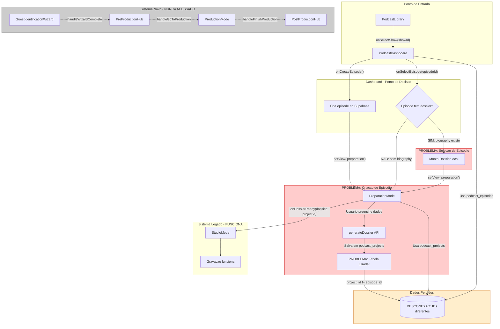
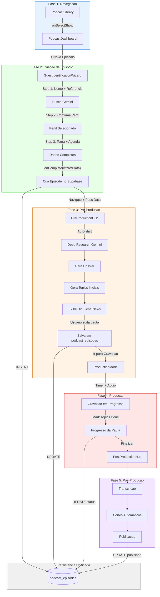
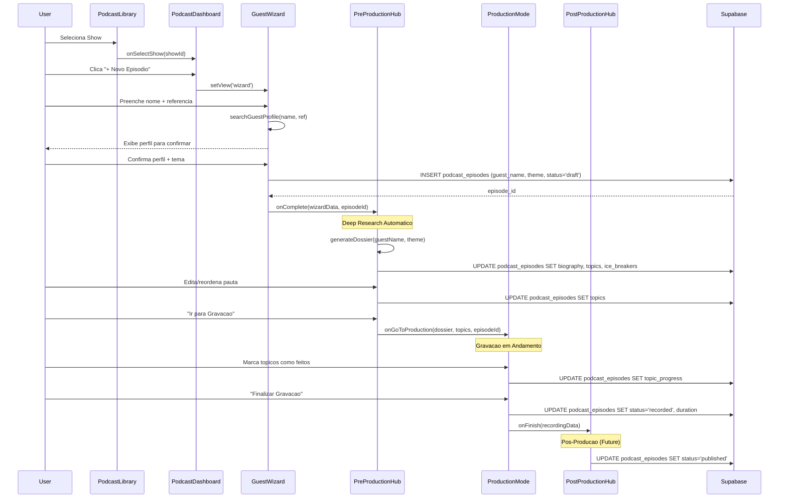
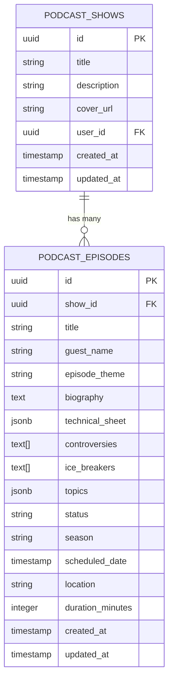

# Diagramas de Arquitetura: Podcast Copilot Flow

**Documento de Arquitetura - Versao 1.0**
**Data: 2025-12-06**
**Status: Analise Completa**

---

## SUMARIO EXECUTIVO

### O Problema Central

O fluxo atual do Podcast Copilot possui **dois sistemas paralelos desconectados**:

1. **Sistema Legado** (`PreparationMode` -> `StudioMode`): Funcional mas limitado
2. **Sistema Novo** (`Wizard` -> `PreProductionHub` -> `ProductionMode` -> `PostProductionHub`): Parcialmente implementado, **nunca acessado**

O resultado: apos criar um episodio, o usuario **nunca chega** aos novos componentes.

---

## 1. DIAGRAMA DO FLUXO ATUAL (QUEBRADO)

### 1.1 Fluxo Visual em Mermaid



### 1.2 Descricao Textual dos Pontos de Quebra

```
PONTO DE QUEBRA #1: Tabelas Desconectadas
==========================================
PodcastDashboard.tsx (linha 61):
  -> Consulta: podcast_episodes
  -> Cria em: podcast_episodes (show_id, title, status)

PreparationMode.tsx (linha 157):
  -> Cria em: podcast_projects (via createProject)
  -> Usa ID: project.id (diferente de episode_id!)

Resultado: Episode existe em uma tabela, dados em outra.
           Nenhuma foreign key conecta os dois.


PONTO DE QUEBRA #2: View 'wizard' Nunca Acessada
================================================
PodcastCopilotView.tsx (linha 125):
  handleCreateEpisode -> setView('preparation')  // Vai para LEGADO

Para acessar o wizard, seria necessario:
  handleCreateEpisode -> setView('wizard')       // NUNCA ACONTECE

O wizard existe no render (linha 248) mas:
  - Nenhum handler chama setView('wizard')
  - E um componente orfao


PONTO DE QUEBRA #3: Condicoes Impossiveis
=========================================
PodcastCopilotView.tsx (linha 258):
  if (view === 'preproduction' && currentGuestData && currentProjectId)

Problema:
  - currentGuestData so e setado em handleWizardComplete
  - handleWizardComplete so e chamado pelo Wizard
  - Wizard nunca e acessado
  - Logo: currentGuestData SEMPRE e null
  - Condicao NUNCA e true


PONTO DE QUEBRA #4: Topics Vazios em Production
===============================================
PodcastCopilotView.tsx (linha 56):
  const [currentTopics, setCurrentTopics] = useState<Topic[]>([]);

ProductionMode (linha 273) recebe:
  topics={currentTopics}  // SEMPRE []

Problema:
  - currentTopics nunca e populado
  - ProductionMode renderiza lista vazia
  - setCurrentTopics nunca e chamado em nenhum lugar
```

### 1.3 Matriz de Estado por View

| View | currentShowId | currentEpisodeId | currentProjectId | currentGuestData | currentDossier | currentTopics |
|------|--------------|------------------|------------------|------------------|----------------|---------------|
| library | null | null | null | null | null | [] |
| dashboard | SET | null | null | null | null | [] |
| preparation | SET | SET | SET (= episodeId) | null | null | [] |
| **wizard** | SET | SET | SET | **null** | null | [] |
| **preproduction** | SET | SET | SET | **REQUIRED** | null | [] |
| **production** | SET | SET | SET | ? | **REQUIRED** | **ALWAYS []** |
| studio (legado) | SET | SET | SET | null | SET | [] |

**Legenda:**
- SET = Valor definido
- REQUIRED = Precisa ter valor para view renderizar
- **Negrito** = Problema identificado

---

## 2. DIAGRAMA DO FLUXO PROPOSTO (CORRETO)

### 2.1 Arquitetura Corrigida



### 2.2 Fluxo de Dados Detalhado



### 2.3 Estados e Transicoes Validas

```
Estado: LIBRARY
  Dados: nenhum
  Transicoes:
    -> DASHBOARD (via onSelectShow)

Estado: DASHBOARD
  Dados: showId, showTitle
  Transicoes:
    -> WIZARD (via onCreateEpisode) [NOVO]
    -> PREPRODUCTION (via onSelectEpisode, se episodio tem dados)
    -> LIBRARY (via onBack)

Estado: WIZARD
  Dados: showId (herdado)
  Coleta: guestName, guestReference, profile, theme, schedule
  Transicoes:
    -> PREPRODUCTION (via onComplete, cria episode)
    -> DASHBOARD (via onCancel)

Estado: PREPRODUCTION
  Dados: episodeId, guestData, dossier (gerado), topics (gerados)
  Transicoes:
    -> PRODUCTION (via onGoToProduction, salva dados)
    -> DASHBOARD (via onBack)

Estado: PRODUCTION
  Dados: episodeId, dossier, topics (com progresso)
  Transicoes:
    -> POSTPRODUCTION (via onFinish)
    -> PREPRODUCTION (via onBack)

Estado: POSTPRODUCTION
  Dados: episodeId, dossier, recordingDuration
  Transicoes:
    -> DASHBOARD (via onBack, fluxo completo)
```

---

## 3. DIAGRAMA DE DADOS

### 3.1 Modelo de Dados por Componente



### 3.2 Estrutura de Dados em Cada Etapa

```typescript
// ===============================
// WIZARD OUTPUT -> Episode Creation
// ===============================
interface WizardOutput {
    guestName: string;           // "Eduardo Paes"
    guestReference: string;      // "Prefeito do Rio"
    confirmedProfile: {
        name: string;
        fullName?: string;       // "Eduardo da Costa Paes"
        title?: string;          // "Politico brasileiro"
        summary?: string;        // "Prefeito do Rio desde..."
    };
    theme: string;               // "Gestao Publica" ou vazio (auto)
    themeMode: 'auto' | 'manual';
    season: string;              // "1"
    location: string;            // "Radio Tupi"
    scheduledDate?: string;      // "2025-01-15"
    scheduledTime?: string;      // "14:00"
}

// Transformacao para INSERT:
const episodeInsert = {
    show_id: currentShowId,
    title: `${wizardOutput.confirmedProfile.fullName} - ${wizardOutput.theme || 'Tema Auto'}`,
    guest_name: wizardOutput.guestName,
    episode_theme: wizardOutput.theme,
    status: 'draft',
    season: wizardOutput.season,
    scheduled_date: `${wizardOutput.scheduledDate}T${wizardOutput.scheduledTime}:00`,
    location: wizardOutput.location
};

// ===============================
// PRE-PRODUCTION -> Dossier Generation
// ===============================
interface Dossier {
    guestName: string;
    episodeTheme: string;
    biography: string;           // Texto longo da IA
    technicalSheet?: {
        fullName?: string;
        birthInfo?: { date, city, state };
        education?: Array<{ degree, institution }>;
        careerHighlights?: Array<{ title, organization }>;
        // ... mais campos
    };
    controversies: string[];     // Lista de polemicas
    suggestedTopics: string[];   // Topicos gerados pela IA
    iceBreakers: string[];       // Perguntas iniciais
}

// Transformacao para UPDATE:
const episodeUpdate = {
    biography: dossier.biography,
    technical_sheet: dossier.technicalSheet,
    controversies: dossier.controversies,
    ice_breakers: dossier.iceBreakers,
    topics: topics.map(t => ({
        id: t.id,
        text: t.text,
        categoryId: t.categoryId,
        order: t.order,
        completed: false
    }))
};

// ===============================
// PRODUCTION -> Topics Progress
// ===============================
interface TopicProgress {
    id: string;
    text: string;
    categoryId: string;          // 'geral' | 'quebra-gelo' | 'patrocinador'
    order: number;
    completed: boolean;          // Marcado durante gravacao
    completedAt?: timestamp;     // Quando foi marcado
    sponsorScript?: string;      // Script para leitura
}

// Update durante gravacao:
const productionUpdate = {
    topics: topics,              // Array atualizado
    status: 'in_production',
    updated_at: new Date()
};

// ===============================
// POST-PRODUCTION -> Final Data
// ===============================
const postProductionUpdate = {
    status: 'recorded',
    duration_minutes: Math.floor(recordingDuration / 60),
    updated_at: new Date()
};
```

### 3.3 Fluxo de Dados Unificado

```
                    +------------------+
                    |  podcast_shows   |
                    |  (id, title...)  |
                    +--------+---------+
                             |
                             | show_id (FK)
                             v
+--------------------------- podcast_episodes ---------------------------+
|                                                                        |
|  WIZARD cria:              PRE-PROD adiciona:      PROD atualiza:      |
|  - show_id                 - biography             - topics[].completed|
|  - title                   - technical_sheet       - status            |
|  - guest_name              - controversies                             |
|  - episode_theme           - ice_breakers          POST-PROD finaliza: |
|  - status='draft'          - topics[]              - duration_minutes  |
|  - season                                          - status='recorded' |
|  - scheduled_date                                                      |
|  - location                                                            |
|                                                                        |
+------------------------------------------------------------------------+
```

---

## 4. MAPA DE COMPONENTES

### 4.1 Componentes Atuais e Status

| Componente | Arquivo | Status | Acao |
|------------|---------|--------|------|
| `PodcastCopilotView` | `src/views/PodcastCopilotView.tsx` | Orquestrador | **MODIFICAR** - Corrigir navegacao |
| `PodcastLibrary` | `src/modules/podcast/views/PodcastLibrary.tsx` | OK | Manter |
| `PodcastDashboard` | `src/modules/podcast/views/PodcastDashboard.tsx` | OK | Manter |
| `GuestIdentificationWizard` | `src/modules/podcast/components/GuestIdentificationWizard.tsx` | Orfao | **CONECTAR** |
| `PreProductionHub` | `src/modules/podcast/views/PreProductionHub.tsx` | Orfao | **CONECTAR** + modificar |
| `ProductionMode` | `src/modules/podcast/views/ProductionMode.tsx` | Orfao | **CONECTAR** |
| `PostProductionHub` | `src/modules/podcast/views/PostProductionHub.tsx` | Orfao | **CONECTAR** |
| `PreparationMode` | `src/modules/podcast/views/PreparationMode.tsx` | Legado | **DEPRECAR** |
| `StudioMode` | `src/modules/podcast/views/StudioMode.tsx` | Legado | **DEPRECAR** |

### 4.2 Hierarquia de Componentes Corrigida

```
App
 |
 +-- PodcastCopilotView (Orquestrador de Estado)
      |
      +-- [view='library']
      |    +-- PodcastLibrary
      |         +-- CreatePodcastDialog
      |
      +-- [view='dashboard']
      |    +-- PodcastDashboard
      |
      +-- [view='wizard']  <<<< NOVO CAMINHO
      |    +-- GuestIdentificationWizard
      |         +-- Step1: Nome + Referencia
      |         +-- Step2: Confirmar Perfil
      |         +-- Step3: Tema + Agendamento
      |
      +-- [view='preproduction']
      |    +-- PreProductionHub
      |         +-- PautaPanel (DnD Topics)
      |         +-- ResearchPanel (Bio/Ficha/News)
      |         +-- ChatPanel (Aica Chat)
      |         +-- SourcesDialog
      |
      +-- [view='production']
      |    +-- ProductionMode
      |         +-- TopicProgressList
      |         +-- CoHostPanel
      |         +-- ChatPanel
      |         +-- AudioControls
      |    +-- TeleprompterWindow (overlay)
      |
      +-- [view='postproduction']
           +-- PostProductionHub
                +-- SuccessMessage
                +-- FeatureCards (Coming Soon)

      +-- [DEPRECADO: view='preparation']
      |    +-- StudioLayout
      |         +-- PreparationMode
      |
      +-- [DEPRECADO: view='studio']
           +-- StudioLayout
                +-- StudioMode
```

### 4.3 Responsabilidades de Cada Componente

```
PodcastCopilotView
==================
- Gerencia estado global de navegacao (view)
- Mantem IDs correntes (showId, episodeId)
- Mantem dados em transito (guestData, dossier, topics)
- Roteia para componentes baseado em view
- Nao faz chamadas diretas ao Supabase (delega)

GuestIdentificationWizard
=========================
- Coleta nome e referencia do convidado
- Chama API Gemini para buscar perfil
- Permite confirmacao/correcao do perfil
- Coleta tema, temporada, local, agenda
- Retorna dados completos via onComplete
- NAO cria episode (deixa para orquestrador)

PreProductionHub
================
- Recebe guestData e episodeId
- Inicia Deep Research automaticamente
- Exibe/edita dossier em tabs (Bio/Ficha/News)
- Gerencia pauta com DnD entre categorias
- Chat contextual com Aica
- Salva alteracoes no Supabase
- Navega para Production com dados completos

ProductionMode
==============
- Recebe dossier, topics, episodeId
- Timer de gravacao
- Lista de topicos com progresso
- Controles de audio (mic, pause)
- Teleprompter em janela separada
- Co-Host Aica (futuro)
- Salva progresso periodicamente

PostProductionHub
=================
- Exibe resumo da gravacao
- Cards de features futuras
- Link para dashboard
- (Futuro: transcricao, cortes, publicacao)
```

---

## 5. CONTRATOS DE INTERFACE

### 5.1 PodcastCopilotView (Estado Global)

```typescript
// Estado interno do orquestrador
interface PodcastCopilotState {
    // Navegacao
    view: PodcastView;

    // IDs - Persistem entre views
    currentShowId: string | null;
    currentShowTitle: string;
    currentEpisodeId: string | null;

    // Dados em transito - Passados entre views
    currentGuestData: GuestData | null;
    currentDossier: Dossier | null;
    currentTopics: Topic[];
    recordingDuration: number;

    // UI State
    showTeleprompter: boolean;
    teleprompterIndex: number;
}

type PodcastView =
    | 'library'
    | 'dashboard'
    | 'wizard'
    | 'preproduction'
    | 'production'
    | 'postproduction';

interface GuestData {
    name: string;
    fullName?: string;
    title?: string;
    theme?: string;
    season?: string;
    location?: string;
    scheduledDate?: string;
    scheduledTime?: string;
}
```

### 5.2 GuestIdentificationWizard

```typescript
interface GuestIdentificationWizardProps {
    // Contexto
    showId: string;                    // NOVO: Para criar episode

    // Callbacks
    onComplete: (data: WizardData, episodeId: string) => void;  // MODIFICADO
    onCancel: () => void;
}

interface WizardData {
    guestName: string;
    guestReference: string;
    confirmedProfile: GuestProfile | null;
    theme: string;
    themeMode: 'auto' | 'manual';
    season: string;
    location: string;
    scheduledDate: string;
    scheduledTime: string;
}

// Wizard DEVE:
// 1. Coletar dados do convidado
// 2. Buscar perfil via Gemini
// 3. Criar episode no Supabase
// 4. Retornar episodeId junto com dados
```

### 5.3 PreProductionHub

```typescript
interface PreProductionHubProps {
    // Dados de entrada
    guestData: GuestData;              // Do Wizard
    episodeId: string;                 // RENOMEADO de projectId
    showId: string;                    // NOVO: Contexto

    // Callbacks
    onGoToProduction: (dossier: Dossier, topics: Topic[], episodeId: string) => void;
    onBack: () => void;
}

// PreProductionHub DEVE:
// 1. Iniciar Deep Research automaticamente
// 2. Gerar dossier e topics
// 3. Salvar em podcast_episodes (nao podcast_projects)
// 4. Permitir edicao de pauta
// 5. Passar topics junto com dossier ao sair
```

### 5.4 ProductionMode

```typescript
interface ProductionModeProps {
    // Dados de entrada
    dossier: Dossier;
    topics: Topic[];                   // NOVO: Recebe topics populados
    episodeId: string;                 // RENOMEADO de projectId

    // Callbacks
    onBack: () => void;
    onOpenTeleprompter: () => void;
    onFinish: (recordingData: RecordingData) => void;  // MODIFICADO
}

interface RecordingData {
    duration: number;                  // Segundos
    topicsCompleted: number;
    topicsTotal: number;
}

// ProductionMode DEVE:
// 1. Receber topics ja populados (nao array vazio)
// 2. Permitir marcar topicos como feitos
// 3. Manter timer de gravacao
// 4. Salvar progresso periodicamente
// 5. Retornar dados da gravacao ao finalizar
```

### 5.5 PostProductionHub

```typescript
interface PostProductionHubProps {
    // Dados de entrada
    dossier: Dossier;
    episodeId: string;                 // RENOMEADO de projectId
    recordingDuration: number;

    // Callbacks
    onBack: () => void;                // Volta para Dashboard
    onPublish?: () => void;            // FUTURO
}

// PostProductionHub DEVE:
// 1. Exibir resumo da gravacao
// 2. Atualizar status do episode para 'recorded'
// 3. (Futuro) Iniciar transcricao, cortes, etc.
```

---

## 6. PLANO DE IMPLEMENTACAO

### 6.1 Mudancas Necessarias

```
ARQUIVO: src/views/PodcastCopilotView.tsx
==========================================

MUDANCA 1: handleCreateEpisode deve ir para Wizard
- ANTES:  setView('preparation')
- DEPOIS: setView('wizard')

MUDANCA 2: handleWizardComplete deve receber episodeId
- ANTES:  Wizard nao cria episode
- DEPOIS: Wizard cria e passa episodeId

MUDANCA 3: handleGoToProduction deve receber topics
- ANTES:  handleGoToProduction(dossier, projectId)
- DEPOIS: handleGoToProduction(dossier, topics, episodeId)

MUDANCA 4: currentTopics deve ser populado
- ANTES:  Nunca setado
- DEPOIS: Setado em handleGoToProduction

MUDANCA 5: Remover sistema legado
- ANTES:  Views 'preparation' e 'studio' existem
- DEPOIS: Removidas ou redirecionadas


ARQUIVO: src/modules/podcast/components/GuestIdentificationWizard.tsx
=====================================================================

MUDANCA 1: Receber showId nas props
MUDANCA 2: Criar episode no Supabase antes de onComplete
MUDANCA 3: Passar episodeId no callback


ARQUIVO: src/modules/podcast/views/PreProductionHub.tsx
=======================================================

MUDANCA 1: Renomear projectId para episodeId
MUDANCA 2: Salvar em podcast_episodes (nao podcast_projects)
MUDANCA 3: Passar topics no callback onGoToProduction


ARQUIVO: src/modules/podcast/views/ProductionMode.tsx
=====================================================

MUDANCA 1: Usar topics recebidos (nao initialTopics vazio)
MUDANCA 2: Renomear projectId para episodeId
MUDANCA 3: Retornar dados de gravacao em onFinish
```

### 6.2 Ordem de Execucao

```
FASE 1: Conectar Wizard (30 min)
- Modificar handleCreateEpisode
- Adicionar showId ao Wizard
- Wizard cria episode e retorna ID

FASE 2: Conectar PreProductionHub (45 min)
- Modificar handleWizardComplete
- Atualizar props do PreProductionHub
- Salvar em podcast_episodes

FASE 3: Conectar ProductionMode (30 min)
- Modificar handleGoToProduction
- Popular currentTopics
- Atualizar props do ProductionMode

FASE 4: Conectar PostProductionHub (15 min)
- Modificar handleFinishProduction
- Passar recordingDuration

FASE 5: Deprecar Sistema Legado (15 min)
- Remover ou redirecionar 'preparation'
- Remover ou redirecionar 'studio'

FASE 6: Testes E2E (30 min)
- Fluxo completo: Library -> Dashboard -> Wizard -> PreProd -> Prod -> PostProd
- Verificar persistencia no Supabase
```

---

## 7. VALIDACAO

### 7.1 Checklist de Sucesso

```
[ ] Usuario cria novo episodio -> Vai para Wizard (nao Preparation)
[ ] Wizard completa -> Episode existe em podcast_episodes
[ ] PreProductionHub recebe dados -> Deep Research inicia
[ ] Dossier e salvo em podcast_episodes.biography
[ ] Topics sao salvos em podcast_episodes.topics (JSONB)
[ ] ProductionMode recebe topics populados
[ ] Timer de gravacao funciona
[ ] Marcar topics atualiza estado
[ ] PostProductionHub exibe duracao
[ ] Voltar para Dashboard mostra episode atualizado
[ ] Selecionar episode existente -> Vai para PreProductionHub com dados
```

### 7.2 Queries de Verificacao

```sql
-- Verificar episode criado pelo Wizard
SELECT id, show_id, title, guest_name, status, created_at
FROM podcast_episodes
WHERE show_id = '<show_id>'
ORDER BY created_at DESC
LIMIT 1;

-- Verificar dados do PreProductionHub foram salvos
SELECT id, biography IS NOT NULL as has_bio,
       jsonb_array_length(topics) as topic_count,
       array_length(ice_breakers, 1) as icebreaker_count
FROM podcast_episodes
WHERE id = '<episode_id>';

-- Verificar progresso de producao
SELECT id, status, duration_minutes,
       (SELECT count(*) FROM jsonb_array_elements(topics) t
        WHERE (t->>'completed')::boolean = true) as topics_done
FROM podcast_episodes
WHERE id = '<episode_id>';
```

---

## 8. CONCLUSAO

Este documento mapeia completamente:

1. **O problema**: Dois sistemas paralelos, o novo nunca acessado
2. **A causa raiz**: Navegacao hardcoded para sistema legado
3. **A solucao**: Conectar os novos componentes corretamente
4. **Os contratos**: Interfaces claras entre componentes
5. **O plano**: Ordem de execucao com estimativas

A implementacao requer **modificacoes cirurgicas** em 4-5 arquivos, sem necessidade de criar novos componentes. O sistema novo ja existe e esta funcional - apenas precisa ser conectado.

---

*Documento gerado pelo Master Architect Agent - Aica Life OS*
