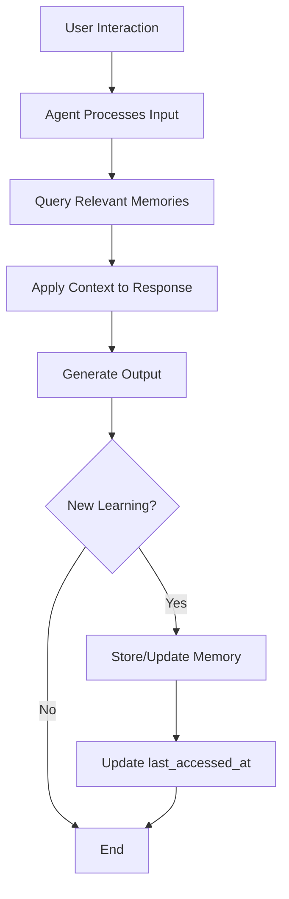

# User Memory System - Agent Learning Architecture

## Overview

The **user_memory** table implements a Mem0-style memory system that allows AI agents to learn and remember facts, preferences, insights, and patterns about users across all modules. This creates personalized, context-aware interactions that improve over time.

## Architecture

### Database Schema

**Table:** `user_memory`

| Column | Type | Description |
|--------|------|-------------|
| `id` | UUID | Primary key |
| `user_id` | UUID | Owner (references auth.users) |
| `category` | TEXT | Type: profile, preference, fact, insight, pattern |
| `module` | TEXT | Context: atlas, journey, studio, captacao, finance, connections (NULL = global) |
| `key` | TEXT | Semantic identifier (e.g., "communication_style") |
| `value` | JSONB | Structured memory data |
| `confidence` | FLOAT | Certainty level (0-1) |
| `source` | TEXT | Origin: explicit, inferred, observed |
| `created_at` | TIMESTAMPTZ | Creation timestamp |
| `updated_at` | TIMESTAMPTZ | Last modification |
| `last_accessed_at` | TIMESTAMPTZ | Last retrieval by agent |

### Unique Constraint
`UNIQUE(user_id, category, key, module)` - Ensures one memory per key per context.

### Memory Categories

| Category | Purpose | Examples |
|----------|---------|----------|
| **profile** | Demographic/static info | name, location, occupation, timezone |
| **preference** | User choices/settings | communication_style, notification_preferences, theme |
| **fact** | Observed truths | emotional_triggers, work_hours, team_members |
| **insight** | AI-derived conclusions | productivity_patterns, stress_indicators, correlation_findings |
| **pattern** | Behavioral trends | peak_hours, procrastination_triggers, success_factors |

### Memory Sources

| Source | Meaning | Trust Level | Examples |
|--------|---------|-------------|----------|
| **explicit** | User stated directly | 1.0 (highest) | "I prefer informal communication" |
| **inferred** | LLM deduced from context | 0.7-0.95 | Detected tone preference from messages |
| **observed** | System tracked behavior | 0.8-1.0 | Logged productivity peaks |

## Usage Patterns

### 1. Storing Memories

#### Global Preference
```sql
INSERT INTO user_memory (user_id, category, module, key, value, source, confidence)
VALUES (
  auth.uid(),
  'preference',
  NULL,  -- Global
  'communication_style',
  '{"tone": "informal", "language": "pt-BR", "emoji_usage": "moderate"}'::jsonb,
  'explicit',
  1.0
);
```

#### Module-Specific Fact
```sql
INSERT INTO user_memory (user_id, category, module, key, value, source, confidence)
VALUES (
  auth.uid(),
  'fact',
  'journey',
  'emotional_trigger',
  '{"trigger": "tight_deadlines", "emotion": "anxious", "frequency": "high", "last_occurrence": "2026-02-04"}'::jsonb,
  'inferred',
  0.87
);
```

#### Observed Pattern
```sql
INSERT INTO user_memory (user_id, category, module, key, value, source, confidence)
VALUES (
  auth.uid(),
  'pattern',
  'atlas',
  'productivity_peak',
  '{"best_hours": ["09:00", "10:00", "11:00"], "worst_hours": ["14:00", "15:00"], "confidence_interval": 0.92, "sample_size": 60}'::jsonb,
  'observed',
  0.95
);
```

### 2. Querying Memories

#### Get High-Confidence Patterns
```sql
SELECT key, value, confidence, last_accessed_at
FROM user_memory
WHERE user_id = auth.uid()
  AND category = 'pattern'
  AND confidence >= 0.8
ORDER BY confidence DESC;
```

#### Get Module Preferences
```sql
SELECT key, value
FROM user_memory
WHERE user_id = auth.uid()
  AND category = 'preference'
  AND module = 'studio';
```

#### Search JSONB Values
```sql
-- Find all memories mentioning "deadlines"
SELECT key, value, category, module
FROM user_memory
WHERE user_id = auth.uid()
  AND value @> '{"trigger": "deadlines"}'::jsonb;

-- Find productivity scores above threshold
SELECT key, value
FROM user_memory
WHERE user_id = auth.uid()
  AND value->>'productivity_score' > '80';
```

#### Get Recently Used Context
```sql
-- What the agent recently accessed (useful for context continuity)
SELECT key, value, category, module
FROM user_memory
WHERE user_id = auth.uid()
ORDER BY last_accessed_at DESC
LIMIT 10;
```

### 3. Updating Memories

#### Update Value and Confidence
```sql
UPDATE user_memory
SET value = value || '{"updated_field": "new_value"}'::jsonb,
    confidence = 0.92,
    updated_at = NOW()
WHERE user_id = auth.uid()
  AND key = 'emotional_trigger'
  AND module = 'journey';
```

#### Track Access (for agent context)
```sql
SELECT update_user_memory_last_accessed(memory_id);
-- Call this after retrieving memories to track usage
```

### 4. Deleting Memories

#### Remove Outdated Memories
```sql
DELETE FROM user_memory
WHERE user_id = auth.uid()
  AND confidence < 0.5;  -- Low confidence
```

#### Remove Module Memories
```sql
DELETE FROM user_memory
WHERE user_id = auth.uid()
  AND module = 'atlas';
```

## Integration with Agents

### Agent Workflow



### Example: Coordinator Agent Using Memory

```python
# Pseudocode for agent memory integration

# 1. Load user context
user_preferences = query_memory(
    user_id=user_id,
    category='preference',
    module=None  # Global preferences
)

# 2. Load module-specific patterns
atlas_patterns = query_memory(
    user_id=user_id,
    category='pattern',
    module='atlas',
    min_confidence=0.8
)

# 3. Generate personalized response
response = gemini.generate_content(
    prompt=f"""
    User preferences: {user_preferences}
    Known patterns: {atlas_patterns}

    Generate a personalized task recommendation considering:
    - Their communication style
    - Their productivity peak hours
    - Their stress triggers
    """
)

# 4. Store new insight
if new_insight_detected(response):
    store_memory(
        user_id=user_id,
        category='insight',
        module='atlas',
        key='task_recommendation_success',
        value={
            'insight': 'User completes 40% more tasks when recommended in morning',
            'sample_size': 15,
            'correlation': 0.82
        },
        source='observed',
        confidence=0.85
    )

# 5. Update access tracking
update_last_accessed([pref.id for pref in user_preferences])
```

## Memory Lifecycle Management

### Confidence Decay (Recommended Implementation)

Older memories should decay in confidence unless reinforced:

```python
# Edge Function or scheduled job
def decay_memory_confidence():
    """
    Reduce confidence of old memories that haven't been accessed.
    Run daily via cron.
    """
    supabase.rpc('decay_old_memories', {
        'days_threshold': 90,
        'decay_factor': 0.05
    })

# SQL function:
CREATE OR REPLACE FUNCTION decay_old_memories(
    days_threshold INT,
    decay_factor FLOAT
)
RETURNS VOID AS $$
BEGIN
    UPDATE user_memory
    SET confidence = GREATEST(confidence - decay_factor, 0.0),
        updated_at = NOW()
    WHERE last_accessed_at < NOW() - (days_threshold || ' days')::INTERVAL
      AND confidence > 0.0;
END;
$$ LANGUAGE plpgsql;
```

### Confidence Reinforcement

When a memory proves useful, increase confidence:

```python
def reinforce_memory(memory_id: str, increment: float = 0.05):
    """
    Increase confidence when memory is validated by user or system.
    """
    supabase.rpc('reinforce_memory', {
        'memory_id': memory_id,
        'increment': increment
    })

# SQL function:
CREATE OR REPLACE FUNCTION reinforce_memory(
    memory_id UUID,
    increment FLOAT
)
RETURNS VOID AS $$
BEGIN
    UPDATE user_memory
    SET confidence = LEAST(confidence + increment, 1.0),
        last_accessed_at = NOW(),
        updated_at = NOW()
    WHERE id = memory_id;
END;
$$ LANGUAGE plpgsql;
```

## Performance Considerations

### Indexes

The table includes optimized indexes for:

1. **User-based queries:** `idx_user_memory_user_id`
2. **Category filtering:** `idx_user_memory_category`
3. **Module filtering:** `idx_user_memory_module` (partial index, non-NULL only)
4. **Key lookup:** `idx_user_memory_key`
5. **JSONB search:** `idx_user_memory_value` (GIN index)
6. **Recent access:** `idx_user_memory_last_accessed`
7. **High confidence:** `idx_user_memory_confidence` (partial index, confidence >= 0.7)

### Query Optimization Tips

```sql
-- GOOD: Uses index efficiently
SELECT * FROM user_memory
WHERE user_id = auth.uid()
  AND category = 'pattern'
  AND confidence >= 0.8;

-- GOOD: Uses GIN index for JSONB search
SELECT * FROM user_memory
WHERE user_id = auth.uid()
  AND value @> '{"trigger": "deadlines"}'::jsonb;

-- BAD: Full JSONB scan (avoid if possible)
SELECT * FROM user_memory
WHERE value::text LIKE '%deadline%';
```

## Privacy & Security

### RLS Policies

The table enforces strict Row-Level Security:

1. **Users can only access their own memories**
2. **Service role (agents) can bypass for automation**
3. **No cross-user memory access** (LGPD/GDPR compliant)

### Data Retention

Recommended retention policy:

```sql
-- Delete memories older than 2 years
DELETE FROM user_memory
WHERE created_at < NOW() - INTERVAL '2 years';

-- Or implement soft-delete with flag
ALTER TABLE user_memory ADD COLUMN IF NOT EXISTS is_archived BOOLEAN DEFAULT FALSE;

UPDATE user_memory
SET is_archived = TRUE
WHERE created_at < NOW() - INTERVAL '2 years';
```

### Export for GDPR Compliance

```sql
-- Export all user memories as JSON
SELECT jsonb_agg(
    jsonb_build_object(
        'category', category,
        'module', module,
        'key', key,
        'value', value,
        'confidence', confidence,
        'source', source,
        'created_at', created_at
    )
) AS user_memories
FROM user_memory
WHERE user_id = auth.uid();
```

## Integration Examples

### 1. Atlas Module - Task Prioritization

```python
# Load productivity patterns
patterns = supabase.table('user_memory').select('*').eq('user_id', user_id).eq('module', 'atlas').eq('category', 'pattern').gte('confidence', 0.8).execute()

# Use in task suggestion
best_hours = patterns.data[0]['value']['best_hours']
recommendation = f"Schedule high-focus tasks between {best_hours[0]} and {best_hours[-1]}"
```

### 2. Journey Module - Emotional Context

```python
# Load emotional triggers
triggers = supabase.table('user_memory').select('*').eq('user_id', user_id).eq('module', 'journey').eq('key', 'emotional_trigger').execute()

# Adjust mood check-in prompts
if 'deadlines' in triggers.data[0]['value']['trigger']:
    prompt = "Como você está lidando com os prazos hoje?"
```

### 3. Studio Module - Guest Selection

```python
# Load guest preferences
prefs = supabase.table('user_memory').select('*').eq('user_id', user_id).eq('module', 'studio').eq('category', 'preference').execute()

# Filter guest suggestions
min_followers = prefs.data[0]['value']['min_follower_count']
preferred_topics = prefs.data[0]['value']['preferred_topics']
```

## Future Enhancements

### 1. Memory Clustering
Group related memories to discover meta-patterns:
```python
# Use embeddings to cluster similar memories
# Requires adding embedding column (VECTOR type)
```

### 2. Cross-User Aggregation (Privacy-Preserving)
Analyze anonymized patterns across users:
```sql
-- Example: Most common productivity peaks
SELECT value->>'best_hours' AS peak_hours, COUNT(*)
FROM user_memory
WHERE category = 'pattern'
  AND key = 'productivity_peak'
GROUP BY peak_hours;
```

### 3. Memory Graph
Build relationships between memories:
```jsonb
{
  "related_memories": ["uuid1", "uuid2"],
  "causes": ["uuid3"],
  "effects": ["uuid4"]
}
```

### 4. Confidence Auto-Calibration
ML model to predict optimal confidence levels based on:
- Memory age
- Access frequency
- User validation rate
- Prediction accuracy

## Migration Details

**File:** `supabase/migrations/20260205000001_create_user_memory_table.sql`

**Includes:**
- ✅ Table creation with standard columns (id, created_at, updated_at)
- ✅ Row-Level Security policies
- ✅ Performance indexes (including GIN for JSONB)
- ✅ updated_at trigger
- ✅ Helper function for last_accessed_at tracking
- ✅ Comprehensive documentation comments
- ✅ Example usage queries

**Safe to apply:** No data loss risk, creates new table only.

## Testing Checklist

- [ ] Table created successfully
- [ ] RLS policies prevent cross-user access
- [ ] Unique constraint enforces key uniqueness
- [ ] JSONB queries use GIN index (check EXPLAIN)
- [ ] updated_at trigger fires on UPDATE
- [ ] last_accessed_at helper function works
- [ ] Confidence CHECK constraints enforced (0-1 range)
- [ ] Category/Source ENUM constraints enforced
- [ ] Service role can bypass RLS

## References

- **Task #35:** User Memory Table specification
- **Mem0 Architecture:** https://mem0.ai/
- **PostgreSQL JSONB:** https://www.postgresql.org/docs/current/datatype-json.html
- **pgvector (future):** https://github.com/pgvector/pgvector

---

**Maintainers:** Backend Architect Agent + Lucas Boscacci
**Last Updated:** 2026-02-05
