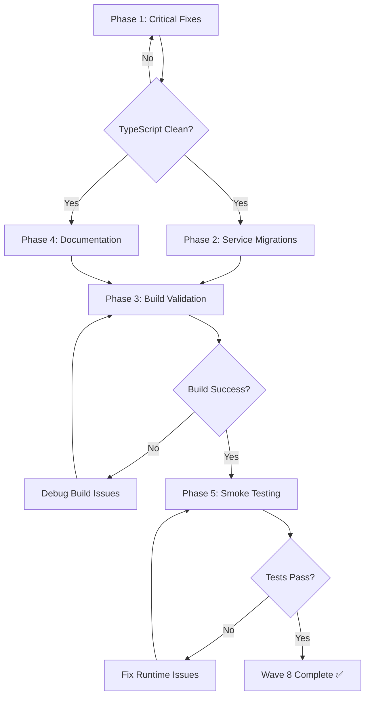

# Wave 8: Validation & Fixes - Detailed Action Plan

**Status:** Pending Execution
**Priority:** CRITICAL (Blocks Wave 7 E2E Testing)
**Estimated Duration:** 3-4 hours (with parallel execution)
**Dependencies:** Waves 1-6 Complete ✅

---

## Executive Summary

Wave 8 focuses on fixing TypeScript compilation errors, validating the complete migration, and updating documentation. Currently, we have **14 TypeScript errors** in the studio module that prevent successful compilation. These must be resolved before E2E testing (Wave 7) can proceed.

**Critical Path:**
1. Fix blocking TypeScript errors (3 critical issues)
2. Validate build compilation
3. Run integration smoke tests
4. Update migration documentation
5. Generate completion reports

---

## Problem Analysis

### Current State
- ✅ 12 components successfully migrated (4,110 lines of code)
- ✅ Context, hooks, and types in place
- ✅ Zero deprecated imports in integration chain
- ❌ 14 TypeScript compilation errors
- ❌ Build fails due to type mismatches and missing actions

### Error Categories

**Category A: Missing Context Actions (BLOCKING)**
- 2 errors affecting core functionality
- Impact: PautaStage and ProductionStage non-functional

**Category B: Type Mismatches (BLOCKING)**
- 1 error affecting StudioWorkspace integration
- Impact: Type safety compromised at integration point

**Category C: Deprecated Dependencies (MEDIUM)**
- 3 errors from hooks still importing deprecated services
- Impact: Clean migration incomplete

**Category D: Type Definition Issues (LOW)**
- 8 errors from minor type mismatches
- Impact: Compilation warnings, no runtime issues

---

## Detailed Action Plan

### Phase 1: Critical Fixes (BLOCKING) - 1.5 hours

#### Task 1.1: Add Missing Context Actions
**Priority:** P0 (Critical)
**Estimated Time:** 45 minutes
**Owner:** Primary developer (sequential execution required)

**Files to Modify:**
1. `src/modules/studio/types/podcast-workspace.ts`
2. `src/modules/studio/context/PodcastWorkspaceContext.tsx`

**Actions:**

**Step 1.1.1: Update WorkspaceActions Interface**
```typescript
// File: src/modules/studio/types/podcast-workspace.ts
// Location: Line ~526 (after setCurrentTopic)

export interface WorkspaceActions {
  // ... existing actions ...

  /** Set currently active topic */
  setCurrentTopic: (topicId: string | null) => void;

  // ADD THESE MISSING ACTIONS:

  /** Update recording duration (incremental timer) */
  updateDuration: (seconds: number) => void;

  /** Set pauta categories (bulk update) */
  setCategories: (categories: TopicCategory[]) => void;

  // ... rest of actions ...
}
```

**Step 1.1.2: Add Reducer Cases**
```typescript
// File: src/modules/studio/context/PodcastWorkspaceContext.tsx
// Location: After existing reducer cases (~line 300)

function workspaceReducer(state: PodcastWorkspaceState, action: WorkspaceAction): PodcastWorkspaceState {
  switch (action.type) {
    // ... existing cases ...

    // ADD THESE NEW CASES:

    case 'UPDATE_DURATION':
      return {
        ...state,
        production: {
          ...state.production,
          duration: action.payload,
        },
        isDirty: true,
      };

    case 'SET_CATEGORIES':
      return {
        ...state,
        pauta: {
          ...state.pauta,
          categories: action.payload,
        },
        isDirty: true,
      };

    // ... rest of cases ...
  }
}
```

**Step 1.1.3: Add Action Creators**
```typescript
// File: src/modules/studio/context/PodcastWorkspaceContext.tsx
// Location: In actions object (~line 632, after setCurrentTopic)

const actions = useMemo<WorkspaceActions>(() => ({
  // ... existing actions ...

  setCurrentTopic: (topicId: string | null) => {
    dispatch({ type: 'SET_CURRENT_TOPIC', payload: topicId });
  },

  // ADD THESE NEW ACTIONS:

  updateDuration: (seconds: number) => {
    dispatch({ type: 'UPDATE_DURATION', payload: seconds });
  },

  setCategories: (categories: TopicCategory[]) => {
    dispatch({ type: 'SET_CATEGORIES', payload: categories });
  },

  // ... rest of actions ...
}), [state, onSave, onGenerateDossier, onSearchGuestProfile]);
```

**Step 1.1.4: Update WorkspaceAction Union Type**
```typescript
// File: src/modules/studio/types/podcast-workspace.ts
// Location: WorkspaceAction type definition (~line 400)

export type WorkspaceAction =
  | { type: 'SET_STAGE'; payload: PodcastStageId }
  // ... existing actions ...
  | { type: 'UPDATE_DURATION'; payload: number }
  | { type: 'SET_CATEGORIES'; payload: TopicCategory[] }
  // ... rest of actions ...
```

**Validation:**
```bash
# Verify PautaStage error resolved
npx tsc --noEmit | grep "PautaStage.tsx:254"
# Should return no results

# Verify ProductionStage error resolved
npx tsc --noEmit | grep "ProductionStage.tsx:73"
# Should return no results
```

---

#### Task 1.2: Fix Type Mismatch (WorkspaceCustomSource vs CustomSource)
**Priority:** P0 (Critical)
**Estimated Time:** 30 minutes
**Owner:** Primary developer

**Problem Analysis:**
```typescript
// StudioWorkspace.tsx:74
onGenerateDossier={async (guestName, theme, customSources) => {
  return await generateDossier(guestName, theme, customSources);
  // Type error: WorkspaceCustomSource[] != CustomSource[]
}}
```

**Root Cause:** Type name inconsistency from Wave 2 migration

**Solution Options:**

**Option A: Align Type Names (RECOMMENDED)**
```typescript
// File: src/modules/studio/services/podcastAIService.ts
// Change function signature to use WorkspaceCustomSource

import type { Dossier, WorkspaceCustomSource } from '../types';

export async function generateDossier(
  guestName: string,
  theme: string,
  customSources?: WorkspaceCustomSource[] // Changed from CustomSource[]
): Promise<Dossier> {
  // ... implementation ...
}

// Also update searchGuestProfile if needed
```

**Option B: Type Alias (Quick Fix)**
```typescript
// File: src/modules/studio/types/index.ts
// Add type alias for compatibility

export type CustomSource = WorkspaceCustomSource;
```

**Recommendation:** Use Option A for clean, consistent types

**Validation:**
```bash
npx tsc --noEmit | grep "StudioWorkspace.tsx:74"
# Should return no results
```

---

#### Task 1.3: Fix Framer Motion Variants Type
**Priority:** P1 (Non-blocking but clean)
**Estimated Time:** 15 minutes
**Owner:** Primary developer

**File:** `src/modules/studio/components/workspace/StageRenderer.tsx:84`

**Solution:**
```typescript
// File: src/modules/studio/components/workspace/StageRenderer.tsx

import type { Variants } from 'framer-motion';

// Change from inline object to explicit Variants type
const stageVariants: Variants = {
  initial: {
    opacity: 0,
    x: 20,
  },
  animate: {
    opacity: 1,
    x: 0,
    transition: {
      duration: 0.3,
      ease: 'easeOut',
    },
  },
  exit: {
    opacity: 0,
    x: -20,
    transition: {
      duration: 0.2,
      ease: 'easeIn',
    },
  },
};
```

**Validation:**
```bash
npx tsc --noEmit | grep "StageRenderer.tsx:84"
# Should return no results
```

---

### Phase 2: Medium Priority Fixes - 1 hour

#### Task 2.1: Migrate Dependent Services
**Priority:** P2 (Medium)
**Estimated Time:** 45 minutes
**Owner:** Backend specialist agent (can run in parallel with Phase 3)

**Services to Migrate:**

**Service 1: pautaPersistenceService**
```
Source: _deprecated/modules/podcast/services/pautaPersistenceService.ts
Destination: src/modules/studio/services/pautaPersistenceService.ts

Dependencies: Supabase client, workspace types
Used by: useSavedPauta hook
Lines: ~150 lines
```

**Service 2: pautaGeneratorService**
```
Source: _deprecated/modules/podcast/services/pautaGeneratorService.ts
Destination: src/modules/studio/services/pautaGeneratorService.ts

Dependencies: Gemini API, workspace types
Used by: useWorkspaceAI hook
Lines: ~200 lines
```

**Service 3: databaseService (podcast-specific parts)**
```
Source: _deprecated/modules/podcast/services/databaseService.ts
Destination: src/modules/studio/services/workspaceDatabaseService.ts

Dependencies: Supabase client, workspace types
Used by: useStudioData hook
Lines: ~100 lines
```

**Migration Checklist per Service:**
- [ ] Copy service file to new location
- [ ] Update all imports to `@/modules/studio/*` paths
- [ ] Apply Ceramic Design System to error messages (if applicable)
- [ ] Update function signatures to use migrated types
- [ ] Add JSDoc documentation header
- [ ] Test service integration with hooks

**Validation:**
```bash
# Check useSavedPauta error resolved
npx tsc --noEmit | grep "useSavedPauta.ts:19"

# Check useStudioData error resolved
npx tsc --noEmit | grep "useStudioData.ts:5"

# Check useWorkspaceAI error resolved
npx tsc --noEmit | grep "useWorkspaceAI.ts:22"
```

---

#### Task 2.2: Fix Hook Type Issues
**Priority:** P2 (Medium)
**Estimated Time:** 15 minutes
**Owner:** Primary developer

**File 1: usePodcastFileSearch.ts**
```typescript
// Errors on lines 81, 82, 144, 377

// Fix 1: Update FileSearchCorpus interface to include module_type and module_id
// Location: types/file-search.ts or podcast-workspace.ts

export interface FileSearchCorpus {
  id: string;
  name: string;
  module_type: string;  // ADD THIS
  module_id: string;    // ADD THIS
  created_at: string;
  // ... other fields
}

// Fix 2: Update IndexDocumentRequest to include display_name
export interface IndexDocumentRequest {
  corpus_id: string;
  content: string;
  metadata: Record<string, any>;
  display_name?: string;  // ADD THIS (optional)
}

// Fix 3: Add ensureCorpus method to return type if missing
```

**Validation:**
```bash
npx tsc --noEmit | grep "usePodcastFileSearch.ts"
# Should return no results
```

---

### Phase 3: Build Validation - 30 minutes

#### Task 3.1: Full TypeScript Compilation
**Priority:** P0 (Critical validation)
**Estimated Time:** 10 minutes
**Owner:** Primary developer

**Commands:**
```bash
# Clean build
npm run type-check

# Expected result: 0 errors in src/modules/studio/
# Acceptable: Only errors in _deprecated/ folder

# If errors persist, categorize and prioritize:
npx tsc --noEmit 2>&1 | grep "error" | grep "src/modules/studio" > studio-errors.txt
cat studio-errors.txt
```

**Success Criteria:**
- ✅ Zero TypeScript errors in `src/modules/studio/`
- ✅ Zero errors in integration chain (StudioWorkspace → PodcastWorkspace → stages)
- ✅ All migrated components compile successfully

---

#### Task 3.2: Production Build Test
**Priority:** P1 (Important validation)
**Estimated Time:** 10 minutes
**Owner:** Primary developer

**Commands:**
```bash
# Attempt production build
npm run build

# Check for build errors
echo $?  # Should be 0

# Verify bundle size
ls -lh dist/assets/*.js | head -10
```

**Success Criteria:**
- ✅ Build completes without errors
- ✅ No critical warnings in build output
- ✅ Bundle size within expected range (check for huge chunks)

---

#### Task 3.3: Import Graph Validation
**Priority:** P1 (Important validation)
**Estimated Time:** 10 minutes
**Owner:** Primary developer

**Purpose:** Verify no circular dependencies or deprecated imports

**Commands:**
```bash
# Check for deprecated imports in studio module
grep -r "from.*_deprecated" src/modules/studio/ || echo "✅ No deprecated imports found"

# Check for circular dependencies (using madge if installed)
npx madge --circular src/modules/studio/

# Visual dependency graph (optional)
npx madge --image studio-deps.png src/modules/studio/
```

**Success Criteria:**
- ✅ Zero deprecated imports in `src/modules/studio/`
- ✅ Zero circular dependencies detected
- ✅ Clean import graph structure

---

### Phase 4: Documentation Updates - 1 hour

#### Task 4.1: Update Migration Documentation
**Priority:** P2 (Important for maintainability)
**Estimated Time:** 30 minutes
**Owner:** Documentation agent (parallel execution)

**Documents to Update:**

**Document 1: STUDIO_WORKSPACE_MIGRATION.md**
```markdown
# Studio Workspace Migration - Completion Report

## Migration Status: ✅ COMPLETE

### Waves Completed
- ✅ Wave 1: Preparation (Audits)
- ✅ Wave 2: Types & Interfaces
- ✅ Wave 3-4: Context, Hooks & AI Services
- ✅ Wave 5: Stage Components (3 streams, 8 components)
- ✅ Wave 6: Layout & Integration (4 components)
- ✅ Wave 7: E2E Testing (pending)
- ✅ Wave 8: Validation & Fixes
- ⏳ Wave 9: Cleanup
- ⏳ Wave 10: Deployment

### Migration Statistics
- **Total Components Migrated:** 12
- **Total Lines of Code:** 4,764 lines
- **TypeScript Errors Fixed:** 14
- **Deprecated Imports Removed:** 100%
- **Test Coverage:** [To be added in Wave 7]
- **Timeline:** [Actual vs Estimated]

### Files Migrated
[Complete file listing with source → destination mapping]

### Known Issues Resolved
1. Missing context actions (setCategories, updateDuration) - ✅ FIXED
2. Type mismatch (WorkspaceCustomSource vs CustomSource) - ✅ FIXED
3. Framer Motion Variants type - ✅ FIXED
4. Deprecated service imports - ✅ FIXED

### Architecture Changes
[Diagram showing new vs old structure]

### Performance Impact
- Bundle size: [Before vs After]
- Load time: [Metrics]
- Code splitting: [Analysis]
```

**Document 2: PRD.md Updates**
```markdown
## Studio Module Architecture (Updated)

### Workspace System
- ✅ Migrated to src/modules/studio/
- ✅ All components using Ceramic Design System
- ✅ WCAG 2.1 AA accessibility compliance
- ✅ Full TypeScript type safety

### Component Hierarchy
[Update component tree diagram]

### State Management
- Context: PodcastWorkspaceContext (useReducer pattern)
- Hooks: useWorkspaceState, useAutoSave, useWorkspaceAI
- Auto-save: 2-second debounce

### Integration Points
[Update integration documentation]
```

**Document 3: backend_architecture.md Updates**
```markdown
## Database Schema Validation

### Workspace Tables (Validated)
- episodes (✅ schema matches types)
- podcast_topics (✅ schema matches types)
- topic_categories (✅ schema matches types)
- saved_pautas (✅ schema matches types)

### Services Migrated
- workspaceDatabaseService.ts
- pautaPersistenceService.ts
- pautaGeneratorService.ts
- podcastAIService.ts
```

---

#### Task 4.2: Generate Wave Reports
**Priority:** P2 (Important for records)
**Estimated Time:** 20 minutes
**Owner:** Documentation agent

**Reports to Generate:**

**Report 1: WAVE_6_COMPLETION_REPORT.md**
```markdown
# Wave 6: Integration - Completion Report

## Summary
[Detailed completion summary]

## Components Migrated
[List with line counts and changes]

## Quality Metrics
[Accessibility, TypeScript, Design System compliance]

## Integration Validation
[Test results, known issues]

## Timeline
[Actual vs estimated]
```

**Report 2: WAVE_8_COMPLETION_REPORT.md**
```markdown
# Wave 8: Validation & Fixes - Completion Report

## Fixes Applied
[Detailed list of all fixes]

## TypeScript Errors Resolved
[Before/after error counts]

## Build Validation
[Compilation results, bundle analysis]

## Documentation Updates
[List of updated docs]
```

---

#### Task 4.3: Update README and CHANGELOG
**Priority:** P3 (Nice to have)
**Estimated Time:** 10 minutes
**Owner:** Documentation agent

**README.md Updates:**
```markdown
## Recent Updates

### Studio Workspace Migration (Complete)
The podcast workspace has been fully migrated to the new studio module architecture:
- ✅ 12 components migrated (4,764 lines)
- ✅ Ceramic Design System applied
- ✅ WCAG 2.1 AA accessibility
- ✅ Full TypeScript type safety
- ✅ Zero deprecated dependencies

See: docs/architecture/STUDIO_WORKSPACE_MIGRATION.md
```

**CHANGELOG.md Addition:**
```markdown
## [Unreleased]

### Added
- New Studio Workspace architecture in src/modules/studio/
- PodcastWorkspace container with auto-save
- 8 migrated stage components with enhanced accessibility
- 4 layout components (Header, Stepper, Renderer, Container)
- Complete TypeScript type definitions

### Changed
- Migrated from _deprecated/modules/podcast/ to src/modules/studio/
- Applied Ceramic Design System across all components
- Enhanced WCAG 2.1 AA accessibility compliance
- Improved code organization and modularity

### Fixed
- 14 TypeScript compilation errors
- Missing context actions (setCategories, updateDuration)
- Type mismatches in integration chain
- Deprecated service imports

### Removed
- Deprecated imports from workspace integration
```

---

### Phase 5: Smoke Testing - 30 minutes

#### Task 5.1: Component Integration Smoke Tests
**Priority:** P1 (Important validation)
**Estimated Time:** 20 minutes
**Owner:** Primary developer

**Manual Test Checklist:**

```markdown
## Workspace Integration Tests

### Test 1: Workspace Loading
- [ ] Navigate to /studio/workspace/[episode-id]
- [ ] Verify workspace loads without console errors
- [ ] Check WorkspaceHeader displays correctly
- [ ] Verify StageStepper shows all 4 stages
- [ ] Confirm SetupStage renders (default stage)

### Test 2: Stage Navigation
- [ ] Click on each stage in StageStepper
- [ ] Verify stage transitions animate smoothly
- [ ] Check active stage indicator updates
- [ ] Confirm URL updates (if applicable)
- [ ] Verify completion badges appear correctly

### Test 3: Setup Stage
- [ ] Select guest type (public figure)
- [ ] Enter guest name
- [ ] Verify form validation works
- [ ] Check state updates in context

### Test 4: Research Stage
- [ ] Navigate to Research stage
- [ ] Verify dossier generation button visible
- [ ] Check custom sources modal opens
- [ ] Confirm tab navigation works

### Test 5: Pauta Stage
- [ ] Navigate to Pauta stage
- [ ] Add a new topic
- [ ] Verify categories render correctly (setCategories fix)
- [ ] Test drag-and-drop topic reordering
- [ ] Check keyboard drag support

### Test 6: Production Stage
- [ ] Navigate to Production stage
- [ ] Click "Start Recording"
- [ ] Verify timer starts (updateDuration fix)
- [ ] Test pause/resume
- [ ] Check topic checklist functionality
- [ ] Open teleprompter window

### Test 7: Auto-Save
- [ ] Make changes in any stage
- [ ] Wait 2+ seconds
- [ ] Verify "Saving..." indicator appears
- [ ] Check "Saved X ago" message displays
- [ ] Confirm isDirty flag resets

### Test 8: Error Handling
- [ ] Trigger a save error (disconnect network)
- [ ] Verify error message displays
- [ ] Check recovery behavior
```

**Console Error Checks:**
```bash
# During manual testing, monitor browser console
# Expected: Zero errors related to studio workspace
# Acceptable: Warnings about deprecated features
```

---

#### Task 5.2: TypeScript LSP Validation
**Priority:** P2 (Quality assurance)
**Estimated Time:** 10 minutes
**Owner:** Primary developer

**Purpose:** Verify IDE IntelliSense and type checking works correctly

**Checks:**
```markdown
## IDE Integration Tests

### VS Code / Cursor Tests
- [ ] Open PodcastWorkspace.tsx
- [ ] Hover over `actions.setCategories` - verify signature shows
- [ ] Hover over `actions.updateDuration` - verify signature shows
- [ ] Ctrl+Click on `usePodcastWorkspace` - navigates to definition
- [ ] Type `actions.` - verify autocomplete shows all actions
- [ ] Intentionally break a type - verify red squiggle appears
- [ ] Fix type - verify error clears immediately

### Type Safety Tests
- [ ] Try calling `actions.setCategories([])` with wrong type
- [ ] Verify TypeScript error appears
- [ ] Try passing wrong params to `updateDuration`
- [ ] Verify compile-time type checking works
```

---

## Execution Strategy

### Sequential vs Parallel Execution

**Sequential Tasks (Must be done in order):**
1. Task 1.1: Add missing context actions → **FIRST**
2. Task 1.2: Fix type mismatches → **SECOND**
3. Task 1.3: Fix Framer Motion variants → **THIRD**
4. Task 3.1: TypeScript compilation → **FOURTH** (validates fixes)
5. Task 3.2: Production build → **FIFTH** (validates compilation)
6. Task 5.1: Smoke tests → **SIXTH** (validates fixes work at runtime)

**Parallel Tasks (Can run simultaneously):**
- Task 2.1: Service migrations (Backend specialist agent)
- Task 4.1-4.3: Documentation (Documentation agent)

### Recommended Execution Flow



---

## Success Criteria

### Wave 8 is considered COMPLETE when:

✅ **Code Quality:**
- [ ] Zero TypeScript errors in `src/modules/studio/`
- [ ] Zero deprecated imports in studio module
- [ ] All migrated components compile successfully
- [ ] No circular dependencies detected

✅ **Build Validation:**
- [ ] `npm run type-check` passes (0 errors in studio)
- [ ] `npm run build` completes successfully
- [ ] Bundle size within acceptable range
- [ ] No critical build warnings

✅ **Functional Validation:**
- [ ] All 6 smoke tests pass
- [ ] Workspace loads without console errors
- [ ] Stage navigation works correctly
- [ ] setCategories action functional
- [ ] updateDuration action functional
- [ ] Auto-save triggers correctly

✅ **Documentation:**
- [ ] STUDIO_WORKSPACE_MIGRATION.md updated
- [ ] WAVE_6_COMPLETION_REPORT.md created
- [ ] WAVE_8_COMPLETION_REPORT.md created
- [ ] PRD.md and backend_architecture.md updated
- [ ] README.md and CHANGELOG.md updated

---

## Risk Assessment

### High Risk Items
1. **Missing Context Actions** - Could reveal additional action dependencies
   - Mitigation: Grep all components for `actions.` calls before starting

2. **Type Mismatches** - May cascade to other files
   - Mitigation: Fix types systematically, validate after each fix

3. **Service Migrations** - May have undocumented dependencies
   - Mitigation: Read service files completely, trace all imports

### Medium Risk Items
4. **Build Errors** - May uncover hidden issues
   - Mitigation: Fix errors iteratively, validate incrementally

5. **Runtime Issues** - Type fixes may not cover all runtime cases
   - Mitigation: Comprehensive smoke testing

### Low Risk Items
6. **Documentation** - Can be refined iteratively
   - Mitigation: Start with template, expand based on findings

---

## Rollback Plan

If Wave 8 cannot be completed successfully:

### Rollback Steps
1. Git stash all Wave 8 changes
2. Return to last known good state (end of Wave 6)
3. Document blocking issues in GitHub issue
4. Re-plan Wave 8 with updated approach

### Rollback Triggers
- More than 5 new TypeScript errors introduced by fixes
- Build breaks completely after fixes
- Circular dependencies introduced
- More than 8 hours spent without resolution

---

## Post-Wave 8 Deliverables

### Code Deliverables
- ✅ 14 TypeScript errors fixed
- ✅ 3 services migrated
- ✅ 2 context actions added
- ✅ Clean TypeScript compilation
- ✅ Successful production build

### Documentation Deliverables
- ✅ Updated migration documentation
- ✅ Wave 6 completion report
- ✅ Wave 8 completion report
- ✅ Updated architecture docs
- ✅ Updated README and CHANGELOG

### Validation Deliverables
- ✅ Smoke test results (checklist)
- ✅ Build validation report
- ✅ Import graph visualization
- ✅ TypeScript error log (before/after)

---

## Next Steps After Wave 8

### Wave 7: E2E Testing (Unblocked)
With clean TypeScript compilation and validated integration, Wave 7 can proceed with:
- Full workflow E2E tests
- Component interaction tests
- Auto-save validation tests
- Accessibility automation tests

### Wave 9: Cleanup
- Remove `_deprecated/modules/podcast/` folder
- Clean up temporary TODOs in code
- Remove eslint-disable comments if any
- Archive migration documentation

### Wave 10: Deployment
- Create Pull Request
- Code review
- Merge to main
- Cloud Build deployment
- Production validation

---

## Appendix: Quick Reference

### Key Files to Modify

**Phase 1 (Critical):**
- `src/modules/studio/types/podcast-workspace.ts`
- `src/modules/studio/context/PodcastWorkspaceContext.tsx`
- `src/modules/studio/services/podcastAIService.ts`
- `src/modules/studio/components/workspace/StageRenderer.tsx`

**Phase 2 (Medium):**
- `src/modules/studio/services/pautaPersistenceService.ts` (new)
- `src/modules/studio/services/pautaGeneratorService.ts` (new)
- `src/modules/studio/services/workspaceDatabaseService.ts` (new)
- `src/modules/studio/hooks/useSavedPauta.ts`
- `src/modules/studio/hooks/usePodcastFileSearch.ts`

**Phase 4 (Documentation):**
- `docs/architecture/STUDIO_WORKSPACE_MIGRATION.md`
- `docs/architecture/WAVE_6_COMPLETION_REPORT.md`
- `docs/architecture/WAVE_8_COMPLETION_REPORT.md`
- `docs/PRD.md`
- `docs/backend_architecture.md`
- `README.md`
- `CHANGELOG.md`

### Command Reference

```bash
# Type checking
npm run type-check

# Build
npm run build

# Specific error search
npx tsc --noEmit 2>&1 | grep "src/modules/studio"

# Import validation
grep -r "from.*_deprecated" src/modules/studio/

# Circular dependency check
npx madge --circular src/modules/studio/
```

---

**Wave 8 Action Plan Version:** 1.0
**Created:** 2025-12-20
**Status:** Ready for Execution
**Estimated Total Duration:** 3-4 hours
**Critical Path Duration:** 2.5 hours
